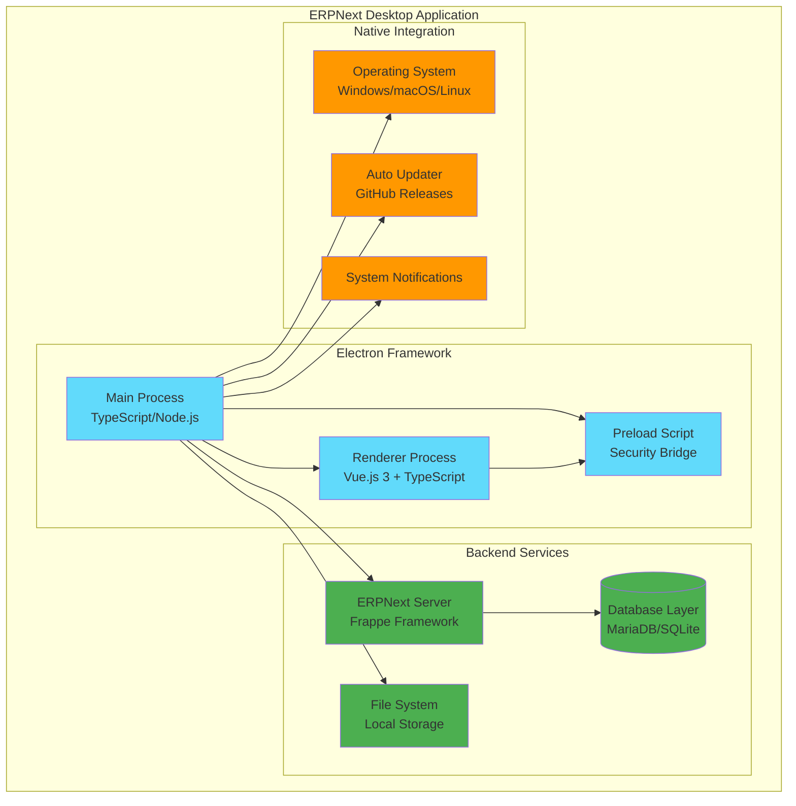
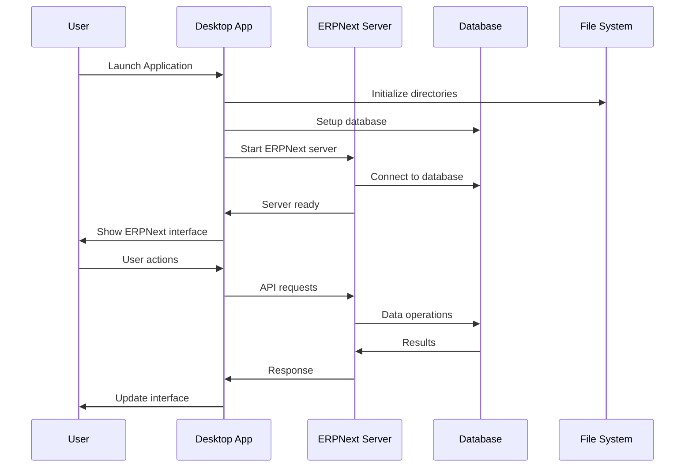
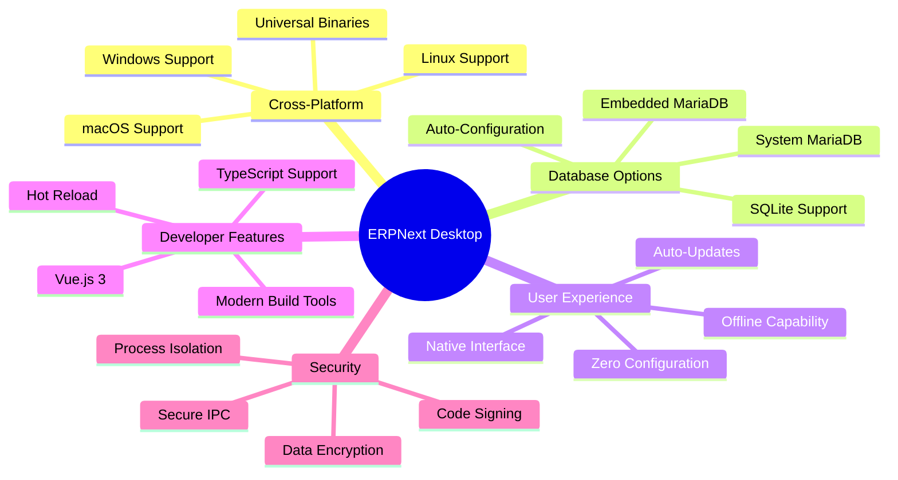
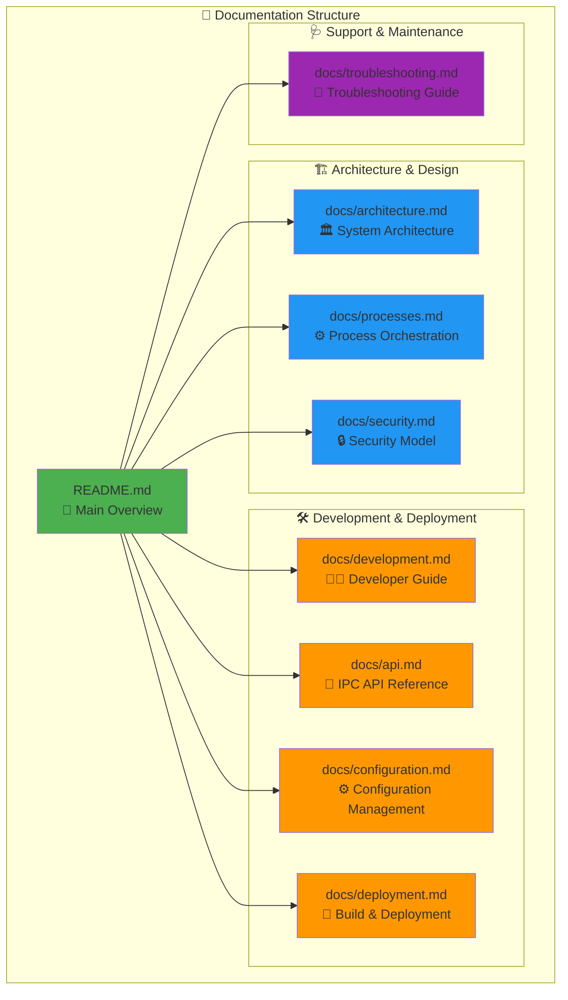
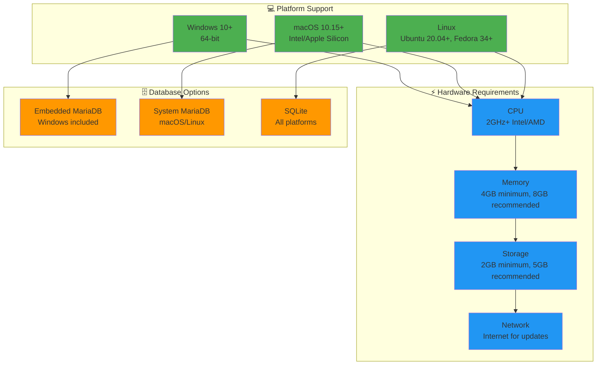
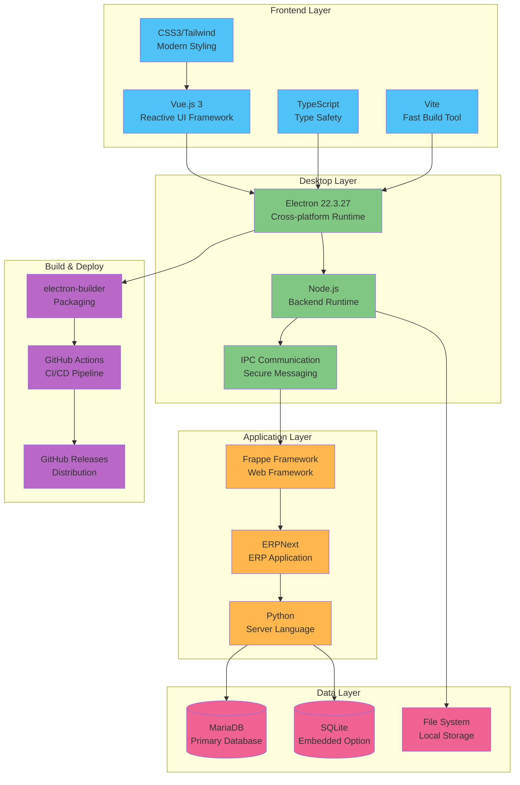

# ERPNext Desktop


## Overview

ERPNext Desktop is a comprehensive Electron-based desktop application that provides a native experience for running ERPNext ERP system locally. Built with modern technologies and designed for cross-platform compatibility, it eliminates the need for complex server setup while maintaining full ERPNext functionality.

## System Architecture



## Application Flow



### Key Features



- **🖥️ Cross-platform Support**: Native applications for Windows, macOS, and Linux
- **💾 Flexible Database Options**: Built-in MariaDB, system MariaDB, or SQLite support  
- **📦 Simple Installation**: User-friendly installers with auto-update capability
- **🔄 Zero Configuration**: Automatic setup and configuration management
- **⚡ Native Performance**: Optimized desktop experience with offline capability
- **🌐 Full ERPNext Functionality**: Complete ERP system with all modules
- **🔒 Enterprise Security**: Secure local deployment with data protection
- **🛠️ Developer Friendly**: Modern development stack with TypeScript and Vue.js

## Documentation

### 📚 Comprehensive Technical Documentation

This project includes extensive technical documentation with visual diagrams and detailed architecture analysis:



#### 🎯 Quick Navigation

| Document | Description | Key Features |
|----------|-------------|--------------|
| **[Architecture](docs/architecture.md)** | Complete system architecture with mermaid diagrams | Process flows, security model, database design |
| **[Process Orchestration](docs/processes.md)** | Detailed process communication and workflows | Startup sequences, IPC patterns, error handling |
| **[Security Model](docs/security.md)** | Comprehensive security analysis | Sandboxing, encryption, code signing |
| **[Developer Guide](docs/development.md)** | Complete development setup and guidelines | Environment setup, coding standards, testing |
| **[IPC API Reference](docs/api.md)** | Full API documentation with examples | Type definitions, usage patterns, error handling |
| **[Configuration](docs/configuration.md)** | Configuration management system | Settings schema, validation, migration |
| **[Build & Deployment](docs/deployment.md)** | Build pipeline and distribution | CI/CD, cross-platform builds, releases |
| **[Troubleshooting](docs/troubleshooting.md)** | Comprehensive troubleshooting guide | Common issues, diagnostics, recovery |

#### 🎨 Visual Documentation Features

- **Mermaid Diagrams**: Architecture flows, sequence diagrams, state machines
- **PlantUML Sequences**: Detailed process communication patterns  
- **Mind Maps**: Feature organization and system relationships
- **ER Diagrams**: Database schema and relationships
- **Network Diagrams**: System integrations and data flows

#### 🔍 Documentation Highlights

- **Complete Architecture Analysis**: Multi-process architecture, security boundaries, performance considerations
- **Developer-Friendly**: Setup guides, coding standards, API references with TypeScript definitions
- **Operational Excellence**: Deployment automation, monitoring, troubleshooting procedures
- **Security-First**: Detailed security model, threat analysis, mitigation strategies


## System Requirements



### Platform-Specific Requirements

| Platform | Minimum | Recommended | Database |
|----------|---------|-------------|----------|
| **Windows** | Windows 10 64-bit, 4GB RAM, 2GB storage | Windows 11, 8GB RAM, 5GB storage | Embedded MariaDB |
| **macOS** | macOS 10.15+, 4GB RAM, 2GB storage | Latest macOS, 8GB RAM, 5GB storage | Homebrew MariaDB |
| **Linux** | Ubuntu 20.04+, 4GB RAM, 2GB storage | Latest LTS, 8GB RAM, 5GB storage | Package Manager MariaDB |

### Windows
- Windows 10 or later (64-bit)
- 4GB RAM (8GB recommended)
- 2GB free disk space (5GB recommended)
- Intel/AMD processor (2GHz or faster)

### macOS
- macOS 10.15 (Catalina) or later
- 4GB RAM (8GB recommended)
- 2GB free disk space (5GB recommended)
- Intel or Apple Silicon processor

### Linux
- Ubuntu 20.04, Fedora 34, or equivalent modern distributions
- 4GB RAM (8GB recommended)
- 2GB free disk space (5GB recommended)
- Intel/AMD processor (2GHz or faster)

## Technology Stack



## Development Setup

- Node.js v20.18.1 or later
- Yarn package manager
- Git

### Setting Up Development Environment

1. **Clone the repository**

```bash
git clone https://github.com/Zone-Enterprise/erpnextfact.git
cd erpnextfact
```

2. **Install dependencies**

```bash
cd desktop
yarn install
```

3. **Start the development server**

```bash
yarn dev
```

This will start the Electron application in development mode with hot reloading.

### Project Structure

```
desktop/
├── assets/            # Application assets (icons, images, etc.)
├── build/             # Build-related files and scripts
│   └── scripts/       # Build scripts
├── config/            # Configuration files
├── main/              # Main process code
├── src/               # Renderer process code (Vue.js)
├── main.ts            # Main entry point for Electron
├── package.json       # Project dependencies and scripts
├── tsconfig.json      # TypeScript configuration
└── vite.config.ts     # Vite configuration
```

## Building Instructions

### Building for All Platforms

From the repository root:

```bash
./build-desktop.sh --all
```

### Platform-Specific Builds

#### Windows

```bash
./build-desktop.sh --windows
# or
cd desktop && yarn build --win
```

#### macOS

```bash
./build-desktop.sh --mac
# or
cd desktop && yarn build --mac
```

#### Linux

```bash
./build-desktop.sh --linux
# or
cd desktop && yarn build --linux
```

### Build Options

- `--dir`: Build unpacked directory only (no installers)
- `--clean`: Clean build directories before building

## Release Process

ERPNext Desktop provides an automated pipeline for generating signed installers for
Windows (`.exe` and portable `.zip`), macOS (`.dmg`/`.zip`), and Linux
(`.deb`, `.rpm`, `AppImage`).  
Releases are built and uploaded to the **GitHub Releases** page of the repository.

### 1. Automatic Release (Recommended)

1. Bump the version and tag the commit **desktop-vX.Y.Z** (for example
   `desktop-v1.2.3`).  
   The helper script below automates this.
2. Push the tag to GitHub.  
3. GitHub Actions workflow **desktop-release.yml** is triggered and will:
   - Build the desktop application on Windows, macOS and Linux runners.  
   - Upload all generated installers as workflow artifacts.  
   - Create/Update a GitHub Release with the generated binaries and a changelog.

You can monitor progress in the repository’s *Actions* tab.

### 2. Manual Release Script

Inside the `desktop/scripts` folder there is a helper script:

```bash
cd desktop/scripts
./release.sh 1.2.3        # replace with desired version
```

The script will:

• Update the version in `desktop/package.json`  
• Commit the change  
• Create and push the `desktop-v1.2.3` tag – triggering the workflow above  

If the push fails (e.g. due to missing permissions) the script tells you the exact
`git push` command to run manually.

### 3. Manual Workflow Dispatch

If you need to rebuild an existing tag or run a release without pushing a tag:

1. Go to *Actions → ERPNext Desktop Release*.  
2. Click **Run workflow**.  
3. Select the branch (usually `droid/erpnext-desktop-installer`) and type the
   version (without the `desktop-v` prefix).  

### 4. Code Signing

Binaries are signed automatically **only** if the required certificates are
available as repository secrets:

• `WINDOWS_CERTIFICATE` & `WINDOWS_CERT_PASSWORD` for Windows signing  
• `APPLE_CERTIFICATE` & `APPLE_CERT_PASSWORD` for macOS notarisation  

Replace the placeholder icon files (`build/icon.*`, `build/icons/*.png`) with
real icons before cutting a production release.

### 5. Release Availability

Successful builds appear under the *Releases* section:

```text
https://github.com/Zone-Enterprise/erpnextfact/releases
```

Download the installer that matches your operating system.

### 6. Troubleshooting Release Builds

• **Workflow fails on “Prepare server bundle”** – Ensure `frappe-bench` and the
  required apps exist or commit a pre-built `server-bundle.zip`.  
• **Codesign step fails** – Check that the signing certificates are correctly
  uploaded and that passwords (if any) are set in repository secrets.  
• **macOS notarisation timeout** – Apple’s servers can be slow; re-run the job.  
• **Artifacts missing** – Verify the build produced files in `desktop/dist/`
  and that the glob patterns in the workflow match the filenames.  

## Architecture Overview

ERPNext Desktop is built on several key technologies:

1. **Electron**: Provides the cross-platform desktop application framework
2. **Vue.js**: Powers the frontend user interface
3. **TypeScript**: Ensures type safety throughout the application
4. **SQLite/MariaDB**: Database options for storing ERPNext data
5. **Node.js**: Runs the server-side components

The application architecture consists of:

- **Main Process**: Handles application lifecycle, window management, and native OS integration
- **Renderer Process**: Manages the user interface using Vue.js
- **Server Process**: Runs the ERPNext server in the background
- **Database Process**: Manages the embedded database (MariaDB or SQLite)

Communication between processes is handled via Electron's IPC (Inter-Process Communication) mechanism, with a secure preload script exposing only necessary APIs to the renderer process.

## Configuration Options

ERPNext Desktop can be configured through the application settings or by editing the configuration files directly.

### Application Settings

The following settings can be configured through the UI:

- **Database Type**: Choose between MariaDB or SQLite
- **Server Port**: Configure the port for the ERPNext server
- **Auto-start Server**: Whether to start the server automatically on application launch
- **Update Channel**: Choose between stable, beta, or alpha update channels
- **Auto-check Updates**: Enable/disable automatic update checking

### Advanced Configuration

Advanced users can modify configuration files located in:

- Windows: `%APPDATA%\erpnext-desktop\config\`
- macOS: `~/Library/Application Support/erpnext-desktop/config/`
- Linux: `~/.config/erpnext-desktop/config/`

## Troubleshooting Guide

### Common Issues

#### Application Won't Start

1. **Check logs**: 
   - Windows: `%APPDATA%\erpnext-desktop\logs\`
   - macOS: `~/Library/Application Support/erpnext-desktop/logs/`
   - Linux: `~/.config/erpnext-desktop/logs/`

2. **Verify database**: Ensure your database is not corrupted.

3. **Reset application**: 
   - Windows: Delete `%APPDATA%\erpnext-desktop\`
   - macOS: Delete `~/Library/Application Support/erpnext-desktop/`
   - Linux: Delete `~/.config/erpnext-desktop/`

#### Server Won't Start

1. Check if the port is already in use by another application
2. Verify that your system meets the minimum requirements
3. Check server logs for specific error messages

#### Database Connection Issues

1. For MariaDB, verify that the service is running
2. For SQLite, check file permissions on the database file
3. Try switching to a different database type in the settings

### Getting Help

If you encounter issues not covered in this guide:

1. Check the [GitHub Issues](https://github.com/Zone-Enterprise/erpnextfact/issues) for similar problems
2. Create a new issue with detailed information about your problem
3. Include logs and system information when reporting issues

## License

ERPNext Desktop is licensed under the GNU General Public License v3.0 (GPL-3.0).

## Contributing

Contributions are welcome! Please see our [Contributing Guidelines](../CONTRIBUTING.md) for more information.
