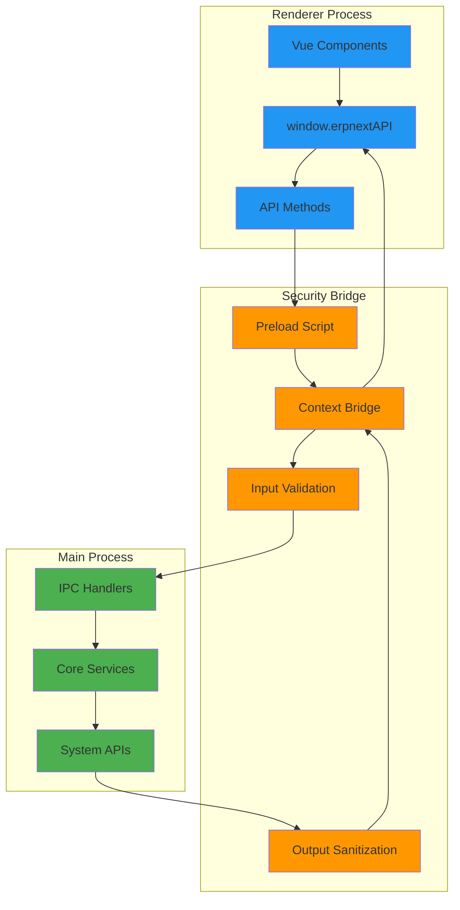

# IPC API Documentation

## Overview

This document provides comprehensive documentation for the Inter-Process Communication (IPC) API between the renderer and main processes in ERPNext Desktop. The API is exposed through a secure context bridge and provides controlled access to system functionality.

## API Architecture



## API Surface Overview

```typescript
// Global API interface exposed to renderer
interface ERPNextAPI {
  // Server management
  server: {
    checkStatus(): Promise<boolean>;
    restart(): Promise<boolean>;
    getInfo(): Promise<ServerInfo>;
    getLogs(): Promise<string[]>;
  };
  
  // Configuration management
  config: {
    getSettings(): Promise<StoreSchema>;
    updateSettings(settings: Partial<StoreSchema>): Promise<boolean>;
    updateDatabase(config: DatabaseConfig): Promise<boolean>;
    resetToDefaults(): Promise<boolean>;
  };
  
  // System integration
  system: {
    openExternal(url: string): Promise<boolean>;
    showOpenDialog(options: OpenDialogOptions): Promise<OpenDialogResult>;
    showSaveDialog(options: SaveDialogOptions): Promise<SaveDialogResult>;
    getSystemInfo(): Promise<SystemInfo>;
    restartApp(): Promise<void>;
  };
  
  // File system operations
  files: {
    readFile(path: string): Promise<string>;
    writeFile(path: string, content: string): Promise<boolean>;
    deleteFile(path: string): Promise<boolean>;
    createDirectory(path: string): Promise<boolean>;
    selectDirectory(): Promise<string | null>;
  };
  
  // Database operations
  database: {
    query(sql: string, params?: any[]): Promise<QueryResult>;
    backup(path: string): Promise<boolean>;
    restore(path: string): Promise<boolean>;
    getSchema(): Promise<DatabaseSchema>;
  };
  
  // Logging and debugging
  logger: {
    info(message: string, meta?: any): void;
    warn(message: string, meta?: any): void;
    error(message: string, meta?: any): void;
    debug(message: string, meta?: any): void;
  };
  
  // Event system
  events: {
    on(event: string, callback: Function): void;
    off(event: string, callback: Function): void;
    emit(event: string, data?: any): void;
  };
  
  // Update management
  updater: {
    checkForUpdates(): Promise<UpdateInfo>;
    downloadUpdate(): Promise<boolean>;
    installUpdate(): Promise<void>;
    setAutoUpdate(enabled: boolean): Promise<boolean>;
  };
}
```

## Server Management API

### Server Status Operations

```typescript
interface ServerAPI {
  checkStatus(): Promise<boolean>;
  restart(): Promise<boolean>;
  getInfo(): Promise<ServerInfo>;
  getLogs(): Promise<string[]>;
}

interface ServerInfo {
  isRunning: boolean;
  port: number;
  pid?: number;
  uptime?: number;
  version: string;
  database: {
    type: 'mariadb' | 'sqlite';
    status: 'connected' | 'disconnected' | 'error';
    host?: string;
    port?: number;
  };
  memory: {
    rss: number;
    heapUsed: number;
    heapTotal: number;
  };
}
```

#### Usage Examples

```typescript
// Check if server is running
try {
  const isRunning = await window.erpnextAPI.server.checkStatus();
  if (isRunning) {
    console.log('Server is running');
  } else {
    console.log('Server is not running');
  }
} catch (error) {
  console.error('Failed to check server status:', error);
}

// Get detailed server information
try {
  const serverInfo = await window.erpnextAPI.server.getInfo();
  console.log('Server info:', serverInfo);
  
  // Display server status in UI
  updateServerStatusUI(serverInfo);
} catch (error) {
  console.error('Failed to get server info:', error);
}

// Restart server
try {
  console.log('Restarting server...');
  const success = await window.erpnextAPI.server.restart();
  
  if (success) {
    console.log('Server restarted successfully');
  } else {
    console.error('Failed to restart server');
  }
} catch (error) {
  console.error('Server restart error:', error);
}

// Get server logs
try {
  const logs = await window.erpnextAPI.server.getLogs();
  console.log('Server logs:', logs);
  
  // Display logs in debugging interface
  displayServerLogs(logs);
} catch (error) {
  console.error('Failed to get server logs:', error);
}
```

### IPC Handler Implementation

```typescript
// Main process IPC handlers for server management
export function registerServerHandlers(main: Main): void {
  // Check server status
  ipcMain.handle('server:check-status', async () => {
    return main.serverReady;
  });
  
  // Restart server
  ipcMain.handle('server:restart', async () => {
    try {
      await main.restartServer();
      return true;
    } catch (error) {
      console.error('Server restart failed:', error);
      return false;
    }
  });
  
  // Get server information
  ipcMain.handle('server:get-info', async () => {
    const serverInfo: ServerInfo = {
      isRunning: main.serverReady,
      port: main.serverPort,
      pid: main.serverProcess?.pid,
      uptime: main.serverProcess ? Date.now() - main.serverStartTime : 0,
      version: '16.0.0', // ERPNext version
      database: {
        type: main.databaseType,
        status: main.serverReady ? 'connected' : 'disconnected',
        host: main.databaseType === 'mariadb' ? main.store.get('mariadbConfig.host') : undefined,
        port: main.databaseType === 'mariadb' ? main.store.get('mariadbConfig.port') : undefined
      },
      memory: process.memoryUsage()
    };
    
    return serverInfo;
  });
  
  // Get server logs
  ipcMain.handle('server:get-logs', async () => {
    try {
      const logPath = path.join(main.appDataPath, 'logs', 'server.log');
      if (fs.existsSync(logPath)) {
        const logs = fs.readFileSync(logPath, 'utf8');
        return logs.split('\n').slice(-100); // Return last 100 lines
      }
      return [];
    } catch (error) {
      console.error('Failed to read server logs:', error);
      return [];
    }
  });
}
```

## Configuration Management API

### Settings Operations

```typescript
interface ConfigAPI {
  getSettings(): Promise<StoreSchema>;
  updateSettings(settings: Partial<StoreSchema>): Promise<boolean>;
  updateDatabase(config: DatabaseConfig): Promise<boolean>;
  resetToDefaults(): Promise<boolean>;
}

interface DatabaseConfig {
  type: 'mariadb' | 'sqlite';
  mariadb?: {
    host: string;
    port: number;
    user: string;
    password: string;
    database: string;
  };
  sqlite?: {
    path: string;
  };
}
```

#### Usage Examples

```typescript
// Get current settings
try {
  const settings = await window.erpnextAPI.config.getSettings();
  console.log('Current settings:', settings);
  
  // Populate settings form
  populateSettingsForm(settings);
} catch (error) {
  console.error('Failed to get settings:', error);
}

// Update specific settings
try {
  const newSettings = {
    serverPort: 8080,
    autoStart: true
  };
  
  const success = await window.erpnextAPI.config.updateSettings(newSettings);
  
  if (success) {
    console.log('Settings updated successfully');
  } else {
    console.error('Failed to update settings');
  }
} catch (error) {
  console.error('Settings update error:', error);
}

// Update database configuration
try {
  const dbConfig: DatabaseConfig = {
    type: 'mariadb',
    mariadb: {
      host: 'localhost',
      port: 3306,
      user: 'erpnext',
      password: 'password',
      database: 'erpnext_db'
    }
  };
  
  const success = await window.erpnextAPI.config.updateDatabase(dbConfig);
  
  if (success) {
    console.log('Database configuration updated');
    // Server will restart automatically
  } else {
    console.error('Failed to update database configuration');
  }
} catch (error) {
  console.error('Database config update error:', error);
}

// Reset to default settings
try {
  const success = await window.erpnextAPI.config.resetToDefaults();
  
  if (success) {
    console.log('Settings reset to defaults');
    // Reload settings in UI
    location.reload();
  } else {
    console.error('Failed to reset settings');
  }
} catch (error) {
  console.error('Settings reset error:', error);
}
```

## System Integration API

### System Operations

```typescript
interface SystemAPI {
  openExternal(url: string): Promise<boolean>;
  showOpenDialog(options: OpenDialogOptions): Promise<OpenDialogResult>;
  showSaveDialog(options: SaveDialogOptions): Promise<SaveDialogResult>;
  getSystemInfo(): Promise<SystemInfo>;
  restartApp(): Promise<void>;
}

interface SystemInfo {
  platform: string;
  arch: string;
  version: string;
  appVersion: string;
  electronVersion: string;
  nodeVersion: string;
  memory: {
    total: number;
    available: number;
  };
  cpu: {
    model: string;
    cores: number;
  };
}
```

#### Usage Examples

```typescript
// Open external URL
try {
  const success = await window.erpnextAPI.system.openExternal('https://erpnext.com');
  if (!success) {
    console.error('Failed to open external URL');
  }
} catch (error) {
  console.error('Error opening external URL:', error);
}

// Show file open dialog
try {
  const result = await window.erpnextAPI.system.showOpenDialog({
    title: 'Select Database File',
    filters: [
      { name: 'Database Files', extensions: ['db', 'sqlite'] },
      { name: 'All Files', extensions: ['*'] }
    ],
    properties: ['openFile']
  });
  
  if (!result.canceled && result.filePaths.length > 0) {
    const selectedFile = result.filePaths[0];
    console.log('Selected file:', selectedFile);
    // Process selected file
  }
} catch (error) {
  console.error('File dialog error:', error);
}

// Show save dialog
try {
  const result = await window.erpnextAPI.system.showSaveDialog({
    title: 'Export Data',
    defaultPath: 'erpnext_backup.sql',
    filters: [
      { name: 'SQL Files', extensions: ['sql'] },
      { name: 'All Files', extensions: ['*'] }
    ]
  });
  
  if (!result.canceled && result.filePath) {
    console.log('Save to:', result.filePath);
    // Perform export operation
  }
} catch (error) {
  console.error('Save dialog error:', error);
}

// Get system information
try {
  const systemInfo = await window.erpnextAPI.system.getSystemInfo();
  console.log('System info:', systemInfo);
  
  // Display in about dialog
  updateAboutDialog(systemInfo);
} catch (error) {
  console.error('Failed to get system info:', error);
}

// Restart application
try {
  if (confirm('Are you sure you want to restart the application?')) {
    await window.erpnextAPI.system.restartApp();
  }
} catch (error) {
  console.error('App restart error:', error);
}
```

## File System API

### File Operations

```typescript
interface FilesAPI {
  readFile(path: string): Promise<string>;
  writeFile(path: string, content: string): Promise<boolean>;
  deleteFile(path: string): Promise<boolean>;
  createDirectory(path: string): Promise<boolean>;
  selectDirectory(): Promise<string | null>;
}
```

#### Usage Examples

```typescript
// Read configuration file
try {
  const configPath = './config/app.json';
  const configContent = await window.erpnextAPI.files.readFile(configPath);
  const config = JSON.parse(configContent);
  console.log('Configuration:', config);
} catch (error) {
  console.error('Failed to read config file:', error);
}

// Write log file
try {
  const logContent = `${new Date().toISOString()}: Application started\n`;
  const success = await window.erpnextAPI.files.writeFile('./logs/app.log', logContent);
  
  if (success) {
    console.log('Log entry written');
  }
} catch (error) {
  console.error('Failed to write log:', error);
}

// Create backup directory
try {
  const success = await window.erpnextAPI.files.createDirectory('./backups');
  
  if (success) {
    console.log('Backup directory created');
  }
} catch (error) {
  console.error('Failed to create directory:', error);
}

// Select directory for data export
try {
  const selectedPath = await window.erpnextAPI.files.selectDirectory();
  
  if (selectedPath) {
    console.log('Export directory:', selectedPath);
    // Proceed with export
  } else {
    console.log('No directory selected');
  }
} catch (error) {
  console.error('Directory selection error:', error);
}
```

## Database API

### Database Operations

```typescript
interface DatabaseAPI {
  query(sql: string, params?: any[]): Promise<QueryResult>;
  backup(path: string): Promise<boolean>;
  restore(path: string): Promise<boolean>;
  getSchema(): Promise<DatabaseSchema>;
}

interface QueryResult {
  rows: any[];
  rowCount: number;
  fields: FieldInfo[];
  command: string;
}

interface DatabaseSchema {
  tables: TableInfo[];
  views: ViewInfo[];
  procedures: ProcedureInfo[];
}
```

#### Usage Examples

```typescript
// Execute SQL query
try {
  const result = await window.erpnextAPI.database.query(
    'SELECT name, email FROM tabUser WHERE enabled = ?',
    [1]
  );
  
  console.log('Query result:', result);
  result.rows.forEach(row => {
    console.log(`User: ${row.name} (${row.email})`);
  });
} catch (error) {
  console.error('Database query error:', error);
}

// Create database backup
try {
  const backupPath = './backups/erpnext_backup.sql';
  const success = await window.erpnextAPI.database.backup(backupPath);
  
  if (success) {
    console.log('Database backup created:', backupPath);
  } else {
    console.error('Failed to create backup');
  }
} catch (error) {
  console.error('Backup error:', error);
}

// Restore from backup
try {
  const restorePath = './backups/erpnext_backup.sql';
  
  if (confirm('This will replace all current data. Continue?')) {
    const success = await window.erpnextAPI.database.restore(restorePath);
    
    if (success) {
      console.log('Database restored successfully');
      // Restart application to refresh data
      window.location.reload();
    } else {
      console.error('Failed to restore database');
    }
  }
} catch (error) {
  console.error('Restore error:', error);
}

// Get database schema
try {
  const schema = await window.erpnextAPI.database.getSchema();
  
  console.log('Database schema:', schema);
  console.log(`Tables: ${schema.tables.length}`);
  console.log(`Views: ${schema.views.length}`);
  
  // Display schema in developer tools
  displayDatabaseSchema(schema);
} catch (error) {
  console.error('Failed to get database schema:', error);
}
```

## Event System API

### Event Management

```typescript
interface EventsAPI {
  on(event: string, callback: Function): void;
  off(event: string, callback: Function): void;
  emit(event: string, data?: any): void;
}

// Available events
type AppEvent = 
  | 'server-started'
  | 'server-stopped'
  | 'server-error'
  | 'database-connected'
  | 'database-disconnected'
  | 'settings-changed'
  | 'update-available'
  | 'update-downloaded'
  | 'app-ready';
```

#### Usage Examples

```typescript
// Listen for server events
window.erpnextAPI.events.on('server-started', (data) => {
  console.log('Server started:', data);
  updateServerStatus('running');
});

window.erpnextAPI.events.on('server-stopped', () => {
  console.log('Server stopped');
  updateServerStatus('stopped');
});

window.erpnextAPI.events.on('server-error', (error) => {
  console.error('Server error:', error);
  showErrorNotification('Server error occurred');
});

// Listen for database events
window.erpnextAPI.events.on('database-connected', (dbInfo) => {
  console.log('Database connected:', dbInfo);
  updateDatabaseStatus('connected');
});

window.erpnextAPI.events.on('database-disconnected', () => {
  console.log('Database disconnected');
  updateDatabaseStatus('disconnected');
});

// Listen for settings changes
window.erpnextAPI.events.on('settings-changed', (newSettings) => {
  console.log('Settings changed:', newSettings);
  refreshSettingsUI(newSettings);
});

// Listen for update events
window.erpnextAPI.events.on('update-available', (updateInfo) => {
  console.log('Update available:', updateInfo);
  showUpdateNotification(updateInfo);
});

window.erpnextAPI.events.on('update-downloaded', () => {
  console.log('Update downloaded');
  showInstallUpdateDialog();
});

// Remove event listeners (cleanup)
function cleanup() {
  window.erpnextAPI.events.off('server-started', handleServerStarted);
  window.erpnextAPI.events.off('server-stopped', handleServerStopped);
  // ... other cleanup
}

// Emit custom events (if needed)
window.erpnextAPI.events.emit('user-action', {
  action: 'settings-opened',
  timestamp: Date.now()
});
```

## Logging API

### Logging Operations

```typescript
interface LoggerAPI {
  info(message: string, meta?: any): void;
  warn(message: string, meta?: any): void;
  error(message: string, meta?: any): void;
  debug(message: string, meta?: any): void;
}
```

#### Usage Examples

```typescript
// Log application events
window.erpnextAPI.logger.info('User logged in', {
  userId: 'admin',
  timestamp: Date.now()
});

// Log warnings
window.erpnextAPI.logger.warn('Server response time high', {
  responseTime: 2500,
  endpoint: '/api/resource/User'
});

// Log errors with context
try {
  // Some operation that might fail
  await riskyOperation();
} catch (error) {
  window.erpnextAPI.logger.error('Operation failed', {
    error: error.message,
    stack: error.stack,
    context: 'user-settings-update'
  });
}

// Debug logging (only in development)
window.erpnextAPI.logger.debug('Component mounted', {
  component: 'SettingsDialog',
  props: { visible: true }
});
```

## Error Handling Patterns

### API Error Handling

```typescript
// Centralized API error handler
class APIErrorHandler {
  static async handlePromise<T>(
    promise: Promise<T>,
    context?: string
  ): Promise<[T | null, Error | null]> {
    try {
      const result = await promise;
      return [result, null];
    } catch (error) {
      console.error(`API Error in ${context}:`, error);
      
      // Log to main process
      window.erpnextAPI.logger.error('API call failed', {
        context,
        error: error.message
      });
      
      return [null, error as Error];
    }
  }
  
  static showUserError(error: Error, context?: string): void {
    // Show user-friendly error message
    const userMessage = this.getUserMessage(error);
    showNotification(userMessage, 'error');
  }
  
  private static getUserMessage(error: Error): string {
    // Map technical errors to user-friendly messages
    if (error.message.includes('ECONNREFUSED')) {
      return 'Unable to connect to the server. Please restart the application.';
    }
    
    if (error.message.includes('Permission denied')) {
      return 'Permission denied. Please check file permissions.';
    }
    
    return 'An unexpected error occurred. Please try again.';
  }
}

// Usage example
async function updateSettings(newSettings: Partial<StoreSchema>) {
  const [result, error] = await APIErrorHandler.handlePromise(
    window.erpnextAPI.config.updateSettings(newSettings),
    'settings-update'
  );
  
  if (error) {
    APIErrorHandler.showUserError(error, 'settings-update');
    return false;
  }
  
  if (result) {
    showNotification('Settings updated successfully', 'success');
    return true;
  }
  
  return false;
}
```

## Security Considerations

### Input Validation

```typescript
// Security validation patterns
class SecurityValidator {
  static validateURL(url: string): boolean {
    try {
      const parsed = new URL(url);
      return ['http:', 'https:'].includes(parsed.protocol);
    } catch {
      return false;
    }
  }
  
  static sanitizePath(path: string): string {
    // Remove dangerous path components
    return path
      .replace(/\.\./g, '') // Remove parent directory references
      .replace(/[<>:"|?*]/g, '') // Remove invalid filename characters
      .trim();
  }
  
  static validateFileExtension(filename: string, allowedExtensions: string[]): boolean {
    const ext = filename.split('.').pop()?.toLowerCase();
    return ext ? allowedExtensions.includes(ext) : false;
  }
}

// Usage in API calls
async function openExternalLink(url: string) {
  if (!SecurityValidator.validateURL(url)) {
    throw new Error('Invalid URL provided');
  }
  
  return window.erpnextAPI.system.openExternal(url);
}
```

## Performance Optimization

### API Call Optimization

```typescript
// API call caching and debouncing
class APIOptimizer {
  private static cache = new Map<string, { data: any; timestamp: number }>();
  private static debounceTimers = new Map<string, NodeJS.Timeout>();
  
  static async cachedCall<T>(
    key: string,
    apiCall: () => Promise<T>,
    cacheTime = 5000
  ): Promise<T> {
    const cached = this.cache.get(key);
    
    if (cached && Date.now() - cached.timestamp < cacheTime) {
      return cached.data;
    }
    
    const result = await apiCall();
    this.cache.set(key, { data: result, timestamp: Date.now() });
    
    return result;
  }
  
  static debouncedCall<T>(
    key: string,
    apiCall: () => Promise<T>,
    delay = 300
  ): Promise<T> {
    return new Promise((resolve, reject) => {
      // Clear existing timer
      const existingTimer = this.debounceTimers.get(key);
      if (existingTimer) {
        clearTimeout(existingTimer);
      }
      
      // Set new timer
      const timer = setTimeout(async () => {
        try {
          const result = await apiCall();
          resolve(result);
        } catch (error) {
          reject(error);
        }
        
        this.debounceTimers.delete(key);
      }, delay);
      
      this.debounceTimers.set(key, timer);
    });
  }
}

// Usage examples
// Cached server status check
const serverStatus = await APIOptimizer.cachedCall(
  'server-status',
  () => window.erpnextAPI.server.checkStatus(),
  3000 // Cache for 3 seconds
);

// Debounced settings update
const updateResult = await APIOptimizer.debouncedCall(
  'settings-update',
  () => window.erpnextAPI.config.updateSettings(newSettings),
  500 // Debounce for 500ms
);
```

## Summary

The ERPNext Desktop IPC API provides:

1. **Secure Communication**: Context-isolated API bridge with input validation
2. **Comprehensive Functionality**: Server, config, system, file, database, and event APIs
3. **Type Safety**: Full TypeScript definitions for all API methods
4. **Error Handling**: Robust error handling patterns and user feedback
5. **Performance**: Caching and debouncing for optimal performance
6. **Security**: Input validation and sanitization throughout

This API enables safe and efficient communication between the renderer and main processes while maintaining security boundaries.