# ERPNext Desktop Application Architecture

## Overview

ERPNext Desktop is a comprehensive Electron-based desktop application that provides a native experience for running ERPNext ERP system locally. This document provides detailed technical architecture analysis with visual diagrams and orchestration patterns.

## System Architecture Overview

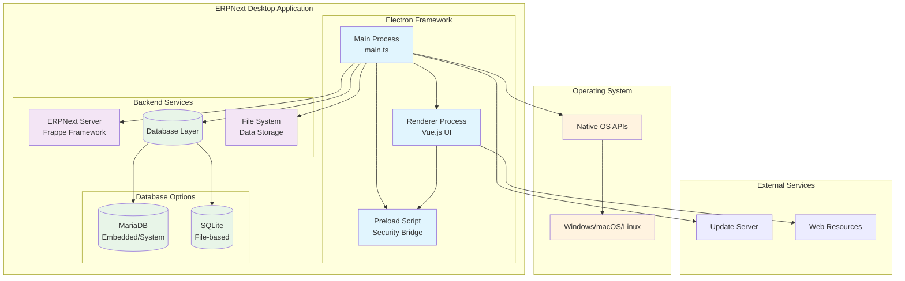

## Process Architecture

### Multi-Process Model

ERPNext Desktop follows Electron's multi-process architecture pattern:

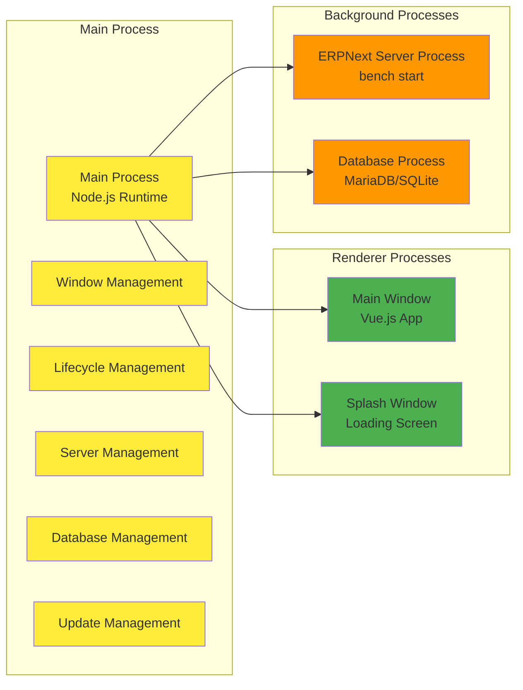

### Inter-Process Communication (IPC)

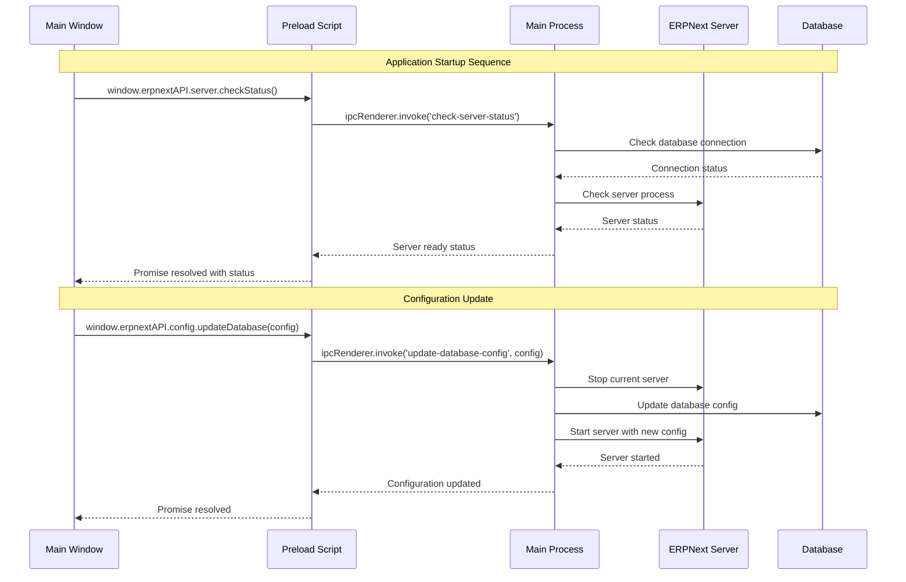

## Component Architecture

### Main Process Components

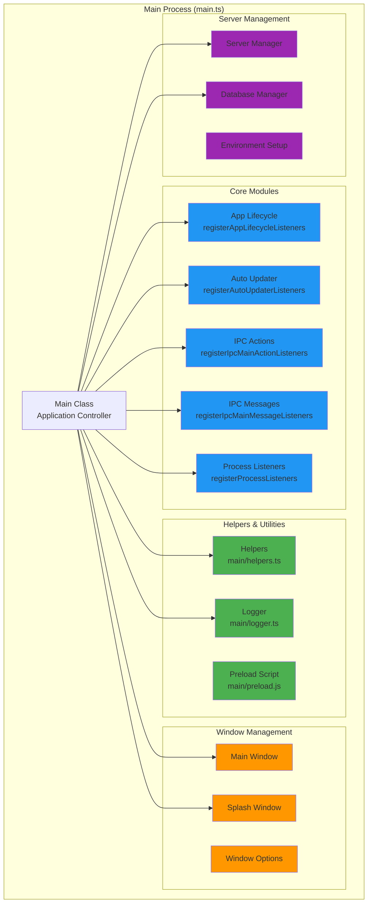

### Database Architecture

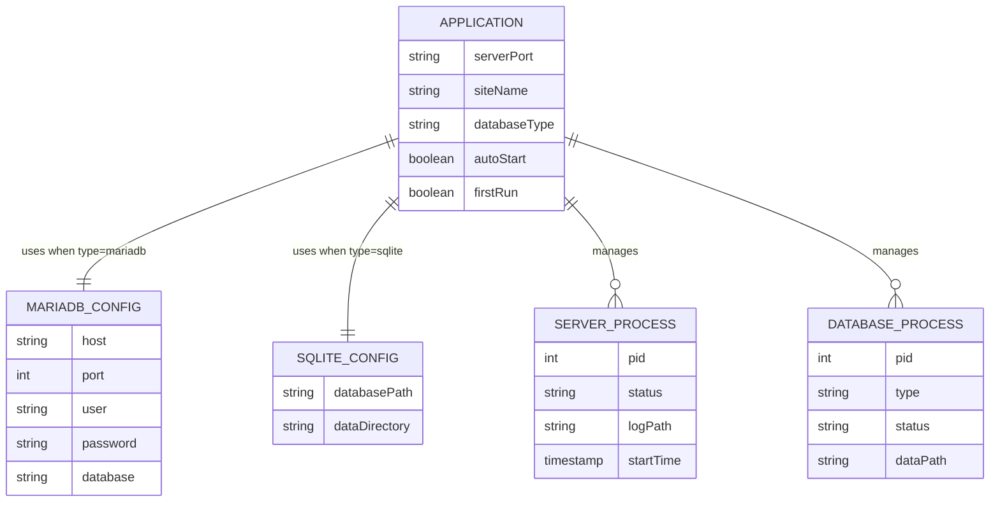

## Security Architecture

### Sandboxing & Context Isolation

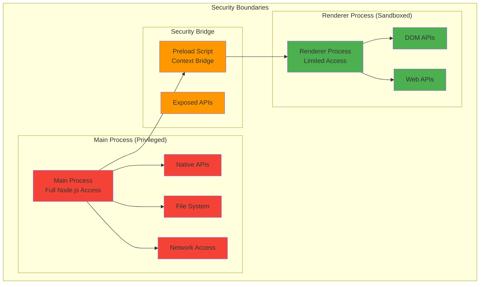

### Content Security Policy

```javascript
// Security configuration in index.html
{
  "default-src": "'self' http://localhost:* https://localhost:*",
  "script-src": "'self' 'unsafe-inline'",
  "style-src": "'self' 'unsafe-inline'", 
  "img-src": "'self' data: http://localhost:* https://localhost:*"
}
```

## Build & Packaging Architecture

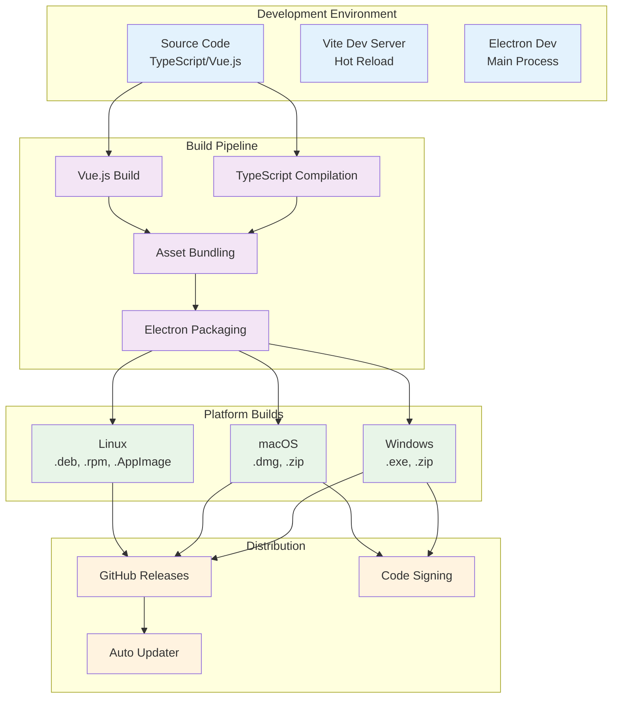

## Server Integration Architecture

### ERPNext/Frappe Integration

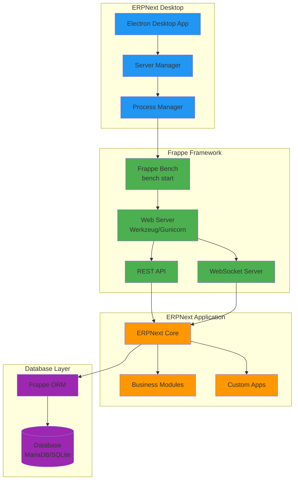

## Performance Architecture

### Resource Management

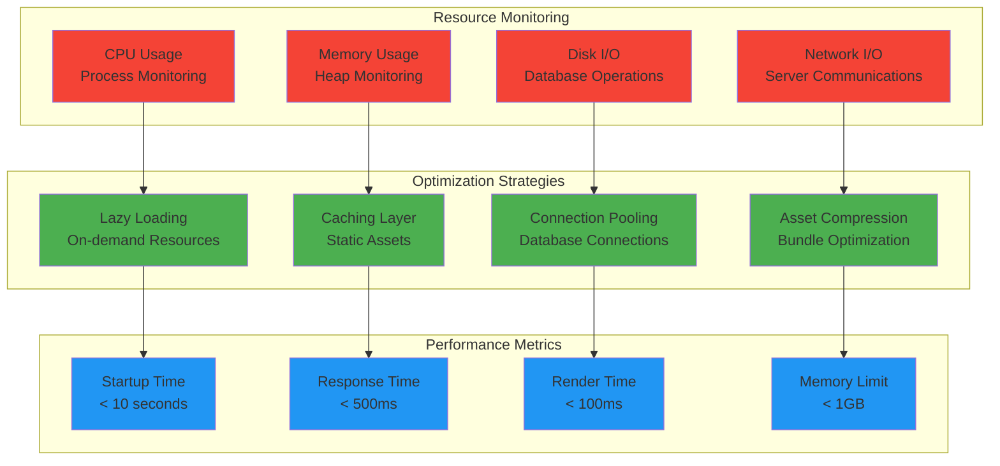

## Configuration Management

### Settings Store Architecture

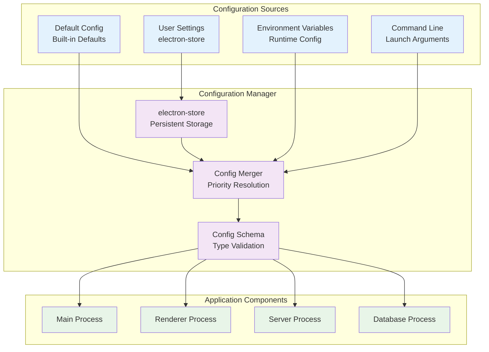

## Error Handling & Recovery

### Error Management Flow

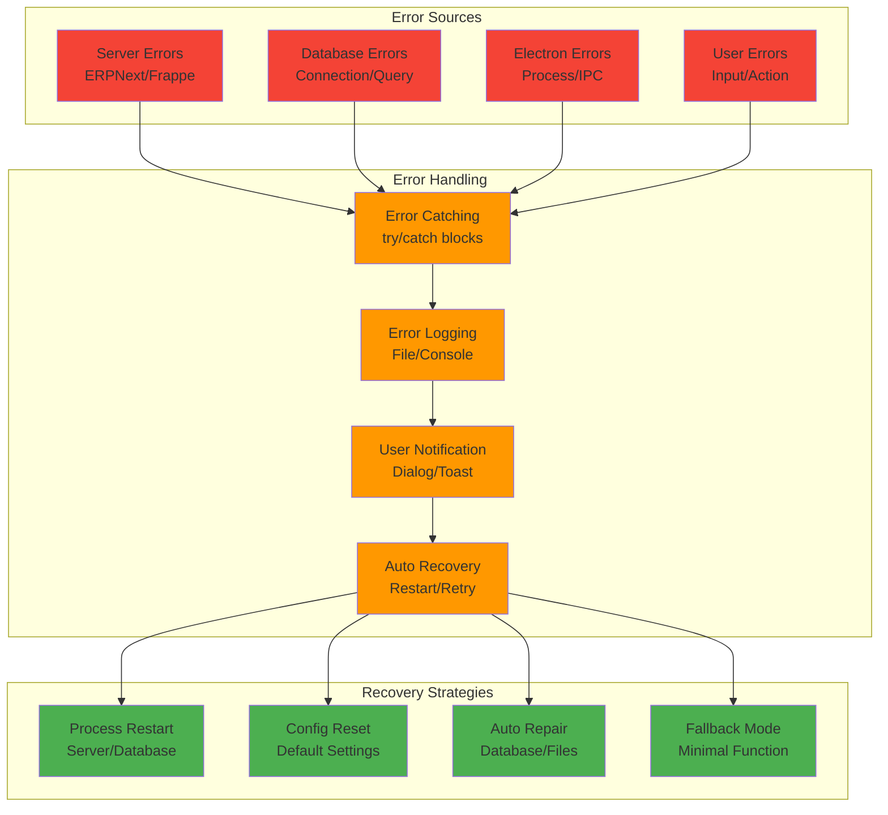

## Auto-Update Architecture

### Update Mechanism

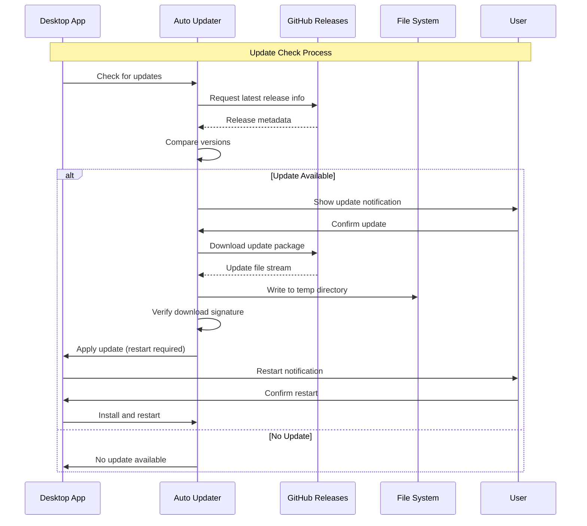

## Cross-Platform Considerations

### Platform-Specific Implementations

```mermaid
graph TB
    subgraph "Windows Implementation"
        WIN_DB[Embedded MariaDB<br/>mysql_install_db.exe]
        WIN_PROC[Process Management<br/>taskkill commands]
        WIN_PATH[File Paths<br/>%APPDATA%]
        WIN_SIGN[Code Signing<br/>Windows Certificate]
    end
    
    subgraph "macOS Implementation"
        MAC_DB[System MariaDB<br/>Homebrew/System]
        MAC_PROC[Process Management<br/>SIGTERM signals]
        MAC_PATH[File Paths<br/>~/Library/Application Support]
        MAC_SIGN[Code Signing<br/>Apple Certificate]
    end
    
    subgraph "Linux Implementation"
        LINUX_DB[System MariaDB<br/>Package Manager]
        LINUX_PROC[Process Management<br/>SIGTERM signals]
        LINUX_PATH[File Paths<br/>~/.config]
        LINUX_SIGN[No Signing<br/>Package Verification]
    end
    
    subgraph "Common Interface"
        DB_MANAGER[Database Manager]
        PROC_MANAGER[Process Manager]
        PATH_MANAGER[Path Manager]
        SIGN_MANAGER[Signing Manager]
    end
    
    WIN_DB --> DB_MANAGER
    MAC_DB --> DB_MANAGER
    LINUX_DB --> DB_MANAGER
    WIN_PROC --> PROC_MANAGER
    MAC_PROC --> PROC_MANAGER
    LINUX_PROC --> PROC_MANAGER
    WIN_PATH --> PATH_MANAGER
    MAC_PATH --> PATH_MANAGER
    LINUX_PATH --> PATH_MANAGER
    WIN_SIGN --> SIGN_MANAGER
    MAC_SIGN --> SIGN_MANAGER
    LINUX_SIGN --> SIGN_MANAGER
    
    classDef windows fill:#0078d4
    classDef macos fill:#007aff
    classDef linux fill:#f57c00
    classDef common fill:#4caf50
    
    class WIN_DB,WIN_PROC,WIN_PATH,WIN_SIGN windows
    class MAC_DB,MAC_PROC,MAC_PATH,MAC_SIGN macos
    class LINUX_DB,LINUX_PROC,LINUX_PATH,LINUX_SIGN linux
    class DB_MANAGER,PROC_MANAGER,PATH_MANAGER,SIGN_MANAGER common
```

## Summary

The ERPNext Desktop Application implements a sophisticated multi-process architecture that provides:

1. **Security**: Through Electron's sandboxing and context isolation
2. **Performance**: Via optimized resource management and caching strategies  
3. **Reliability**: Through comprehensive error handling and auto-recovery
4. **Maintainability**: With modular design and clear separation of concerns
5. **Cross-Platform**: Supporting Windows, macOS, and Linux with platform-specific optimizations

The architecture is designed to provide a native desktop experience while maintaining the full functionality of the ERPNext ERP system in a local environment.