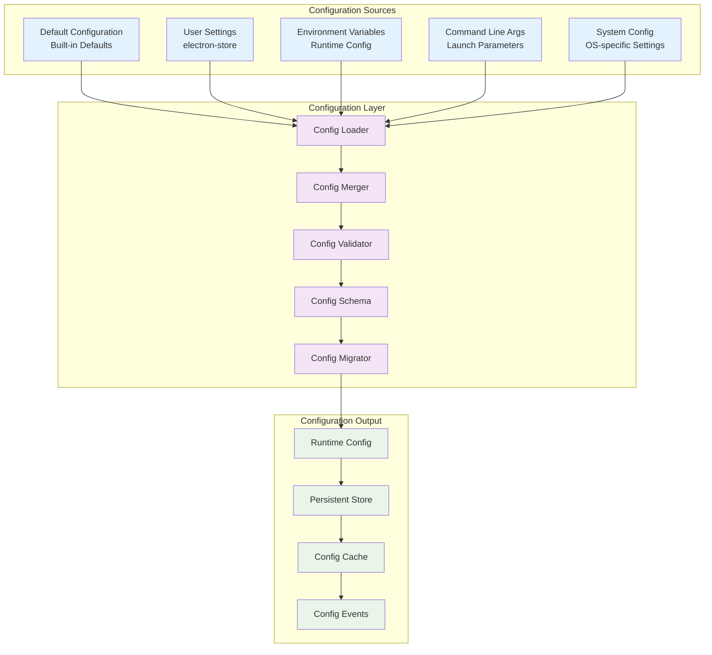

# Configuration Management

## Overview

This document provides comprehensive information about configuration management in ERPNext Desktop, including settings storage, validation, migration, and platform-specific configurations.

## Configuration Architecture



## Configuration Schema

### Primary Configuration Structure

```typescript
interface StoreSchema {
  // Server configuration
  serverPort: number;
  siteName: string;
  autoStart: boolean;
  serverTimeout: number;
  
  // Database configuration
  databaseType: 'mariadb' | 'sqlite';
  mariadbConfig?: MariaDBConfig;
  sqliteConfig?: SQLiteConfig;
  
  // Application settings
  firstRun: boolean;
  theme: 'light' | 'dark' | 'auto';
  language: string;
  windowBounds: WindowBounds;
  
  // Update settings
  autoUpdate: boolean;
  updateChannel: 'stable' | 'beta' | 'alpha';
  checkInterval: number;
  
  // Security settings
  enableLogging: boolean;
  logLevel: 'error' | 'warn' | 'info' | 'debug';
  maxLogFiles: number;
  
  // Developer settings
  devMode: boolean;
  debugMode: boolean;
  verboseLogging: boolean;
}

interface MariaDBConfig {
  host: string;
  port: number;
  user: string;
  password: string;
  database: string;
  connectionTimeout: number;
  acquireTimeout: number;
  reconnect: boolean;
  charset: string;
}

interface SQLiteConfig {
  filename: string;
  busyTimeout: number;
  cacheSize: number;
  journalMode: 'delete' | 'truncate' | 'persist' | 'memory' | 'wal' | 'off';
  synchronous: 'off' | 'normal' | 'full' | 'extra';
}

interface WindowBounds {
  x?: number;
  y?: number;
  width: number;
  height: number;
  maximized: boolean;
  fullscreen: boolean;
}
```

### Configuration Validation Schema

```typescript
import Joi from 'joi';

export const configSchema = Joi.object({
  serverPort: Joi.number()
    .integer()
    .min(1000)
    .max(65535)
    .default(8000)
    .description('Port for the ERPNext server'),
    
  siteName: Joi.string()
    .hostname()
    .default('erpnext.localhost')
    .description('Site name for ERPNext installation'),
    
  autoStart: Joi.boolean()
    .default(true)
    .description('Auto-start server on application launch'),
    
  serverTimeout: Joi.number()
    .integer()
    .min(5000)
    .max(120000)
    .default(30000)
    .description('Server startup timeout in milliseconds'),
    
  databaseType: Joi.string()
    .valid('mariadb', 'sqlite')
    .default('mariadb')
    .description('Database type to use'),
    
  mariadbConfig: Joi.object({
    host: Joi.string()
      .hostname()
      .default('localhost')
      .description('MariaDB host'),
      
    port: Joi.number()
      .integer()
      .min(1000)
      .max(65535)
      .default(3306)
      .description('MariaDB port'),
      
    user: Joi.string()
      .alphanum()
      .default('root')
      .description('MariaDB username'),
      
    password: Joi.string()
      .allow('')
      .default('erpnext')
      .description('MariaDB password'),
      
    database: Joi.string()
      .alphanum()
      .default('erpnext')
      .description('Database name'),
      
    connectionTimeout: Joi.number()
      .integer()
      .min(1000)
      .max(60000)
      .default(10000)
      .description('Connection timeout'),
      
    acquireTimeout: Joi.number()
      .integer()
      .min(1000)
      .max(60000)
      .default(10000)
      .description('Connection acquire timeout'),
      
    reconnect: Joi.boolean()
      .default(true)
      .description('Auto-reconnect on connection loss'),
      
    charset: Joi.string()
      .default('utf8mb4')
      .description('Character set')
  }).when('databaseType', {
    is: 'mariadb',
    then: Joi.required(),
    otherwise: Joi.optional()
  }),
  
  sqliteConfig: Joi.object({
    filename: Joi.string()
      .default('erpnext.db')
      .description('SQLite database filename'),
      
    busyTimeout: Joi.number()
      .integer()
      .min(1000)
      .max(30000)
      .default(5000)
      .description('Busy timeout'),
      
    cacheSize: Joi.number()
      .integer()
      .min(1000)
      .max(100000)
      .default(10000)
      .description('Cache size in pages'),
      
    journalMode: Joi.string()
      .valid('delete', 'truncate', 'persist', 'memory', 'wal', 'off')
      .default('wal')
      .description('Journal mode'),
      
    synchronous: Joi.string()
      .valid('off', 'normal', 'full', 'extra')
      .default('normal')
      .description('Synchronous mode')
  }).when('databaseType', {
    is: 'sqlite',
    then: Joi.required(),
    otherwise: Joi.optional()
  }),
  
  firstRun: Joi.boolean()
    .default(true)
    .description('First run flag'),
    
  theme: Joi.string()
    .valid('light', 'dark', 'auto')
    .default('auto')
    .description('UI theme'),
    
  language: Joi.string()
    .default('en')
    .description('Application language'),
    
  windowBounds: Joi.object({
    x: Joi.number().integer().optional(),
    y: Joi.number().integer().optional(),
    width: Joi.number().integer().min(800).default(1280),
    height: Joi.number().integer().min(600).default(800),
    maximized: Joi.boolean().default(false),
    fullscreen: Joi.boolean().default(false)
  }).default(),
  
  autoUpdate: Joi.boolean()
    .default(true)
    .description('Enable automatic updates'),
    
  updateChannel: Joi.string()
    .valid('stable', 'beta', 'alpha')
    .default('stable')
    .description('Update channel'),
    
  checkInterval: Joi.number()
    .integer()
    .min(3600000)
    .max(86400000)
    .default(14400000)
    .description('Update check interval in milliseconds'),
    
  enableLogging: Joi.boolean()
    .default(true)
    .description('Enable application logging'),
    
  logLevel: Joi.string()
    .valid('error', 'warn', 'info', 'debug')
    .default('info')
    .description('Logging level'),
    
  maxLogFiles: Joi.number()
    .integer()
    .min(1)
    .max(50)
    .default(5)
    .description('Maximum log files to keep'),
    
  devMode: Joi.boolean()
    .default(false)
    .description('Development mode'),
    
  debugMode: Joi.boolean()
    .default(false)
    .description('Debug mode'),
    
  verboseLogging: Joi.boolean()
    .default(false)
    .description('Verbose logging')
});
```

## Configuration Management Implementation

### Configuration Manager Class

```typescript
import Store from 'electron-store';
import { EventEmitter } from 'events';
import { app } from 'electron';
import path from 'path';

export class ConfigurationManager extends EventEmitter {
  private store: Store<StoreSchema>;
  private cache: Map<string, any> = new Map();
  private watchers: Map<string, Function[]> = new Map();
  
  constructor() {
    super();
    
    this.store = new Store<StoreSchema>({
      name: 'config',
      cwd: app.getPath('userData'),
      fileExtension: 'json',
      serialize: JSON.stringify,
      deserialize: JSON.parse,
      clearInvalidConfig: false,
      schema: this.getJoiSchema(),
      defaults: this.getDefaults(),
      migrations: this.getMigrations()
    });
    
    this.initializeCache();
    this.setupWatchers();
  }
  
  // Get configuration value
  get<K extends keyof StoreSchema>(key: K): StoreSchema[K];
  get<T>(key: string): T;
  get(key: string): any {
    // Check cache first
    if (this.cache.has(key)) {
      return this.cache.get(key);
    }
    
    // Get from store
    const value = this.store.get(key);
    
    // Cache the value
    this.cache.set(key, value);
    
    return value;
  }
  
  // Set configuration value
  set<K extends keyof StoreSchema>(key: K, value: StoreSchema[K]): void;
  set<T>(key: string, value: T): void;
  set(key: string, value: any): void {
    // Validate the value
    this.validate(key, value);
    
    // Get old value for comparison
    const oldValue = this.get(key);
    
    // Set in store
    this.store.set(key, value);
    
    // Update cache
    this.cache.set(key, value);
    
    // Emit change event
    this.emit('config-changed', { key, oldValue, newValue: value });
    
    // Notify specific watchers
    this.notifyWatchers(key, value, oldValue);
  }
  
  // Get multiple values
  getAll(): StoreSchema {
    return this.store.store;
  }
  
  // Set multiple values
  setAll(config: Partial<StoreSchema>): void {
    const changes: Array<{ key: string; oldValue: any; newValue: any }> = [];
    
    for (const [key, value] of Object.entries(config)) {
      const oldValue = this.get(key);
      this.validate(key, value);
      
      this.store.set(key, value);
      this.cache.set(key, value);
      
      changes.push({ key, oldValue, newValue: value });
    }
    
    // Emit batch change event
    this.emit('config-batch-changed', changes);
    
    // Notify individual watchers
    changes.forEach(({ key, newValue, oldValue }) => {
      this.notifyWatchers(key, newValue, oldValue);
    });
  }
  
  // Reset to defaults
  reset(): void {
    const oldConfig = this.getAll();
    
    this.store.clear();
    this.cache.clear();
    
    const newConfig = this.getAll();
    
    this.emit('config-reset', { oldConfig, newConfig });
  }
  
  // Watch for changes
  watch<K extends keyof StoreSchema>(
    key: K,
    callback: (newValue: StoreSchema[K], oldValue: StoreSchema[K]) => void
  ): () => void;
  watch(key: string, callback: (newValue: any, oldValue: any) => void): () => void;
  watch(key: string, callback: Function): () => void {
    if (!this.watchers.has(key)) {
      this.watchers.set(key, []);
    }
    
    this.watchers.get(key)!.push(callback);
    
    // Return unwatch function
    return () => {
      const callbacks = this.watchers.get(key);
      if (callbacks) {
        const index = callbacks.indexOf(callback);
        if (index > -1) {
          callbacks.splice(index, 1);
        }
      }
    };
  }
  
  // Validate configuration value
  private validate(key: string, value: any): void {
    const schema = this.getValidationSchema(key);
    
    if (schema) {
      const { error } = schema.validate(value);
      if (error) {
        throw new Error(`Configuration validation failed for ${key}: ${error.message}`);
      }
    }
  }
  
  // Initialize cache
  private initializeCache(): void {
    const config = this.store.store;
    for (const [key, value] of Object.entries(config)) {
      this.cache.set(key, value);
    }
  }
  
  // Setup configuration watchers
  private setupWatchers(): void {
    this.store.onDidChange((newValue, oldValue) => {
      // Update cache
      this.cache.clear();
      this.initializeCache();
      
      // Emit global change event
      this.emit('store-changed', { newValue, oldValue });
    });
  }
  
  // Notify watchers for specific key
  private notifyWatchers(key: string, newValue: any, oldValue: any): void {
    const callbacks = this.watchers.get(key);
    if (callbacks) {
      callbacks.forEach(callback => {
        try {
          callback(newValue, oldValue);
        } catch (error) {
          console.error(`Error in config watcher for ${key}:`, error);
        }
      });
    }
  }
  
  // Get default configuration
  private getDefaults(): StoreSchema {
    return {
      serverPort: 8000,
      siteName: 'erpnext.localhost',
      autoStart: true,
      serverTimeout: 30000,
      databaseType: 'mariadb',
      mariadbConfig: {
        host: 'localhost',
        port: 3306,
        user: 'root',
        password: 'erpnext',
        database: 'erpnext',
        connectionTimeout: 10000,
        acquireTimeout: 10000,
        reconnect: true,
        charset: 'utf8mb4'
      },
      sqliteConfig: {
        filename: 'erpnext.db',
        busyTimeout: 5000,
        cacheSize: 10000,
        journalMode: 'wal',
        synchronous: 'normal'
      },
      firstRun: true,
      theme: 'auto',
      language: 'en',
      windowBounds: {
        width: 1280,
        height: 800,
        maximized: false,
        fullscreen: false
      },
      autoUpdate: true,
      updateChannel: 'stable',
      checkInterval: 14400000, // 4 hours
      enableLogging: true,
      logLevel: 'info',
      maxLogFiles: 5,
      devMode: false,
      debugMode: false,
      verboseLogging: false
    };
  }
  
  // Get Joi schema for validation
  private getJoiSchema(): any {
    return configSchema;
  }
  
  // Get validation schema for specific key
  private getValidationSchema(key: string): any {
    // Return specific schema for the key
    return configSchema.extract(key);
  }
  
  // Get migration rules
  private getMigrations(): Record<string, (store: Store<StoreSchema>) => void> {
    return {
      '>=1.0.0': (store) => {
        // Migration for version 1.0.0 and above
        if (!store.has('windowBounds')) {
          store.set('windowBounds', {
            width: 1280,
            height: 800,
            maximized: false,
            fullscreen: false
          });
        }
      },
      
      '>=1.1.0': (store) => {
        // Migration for version 1.1.0 and above
        if (!store.has('updateChannel')) {
          store.set('updateChannel', 'stable');
        }
        
        if (!store.has('checkInterval')) {
          store.set('checkInterval', 14400000);
        }
      },
      
      '>=1.2.0': (store) => {
        // Migration for version 1.2.0 and above
        const dbType = store.get('databaseType');
        
        if (dbType === 'mariadb' && !store.has('mariadbConfig')) {
          store.set('mariadbConfig', {
            host: 'localhost',
            port: 3306,
            user: 'root',
            password: 'erpnext',
            database: 'erpnext',
            connectionTimeout: 10000,
            acquireTimeout: 10000,
            reconnect: true,
            charset: 'utf8mb4'
          });
        }
        
        if (dbType === 'sqlite' && !store.has('sqliteConfig')) {
          store.set('sqliteConfig', {
            filename: 'erpnext.db',
            busyTimeout: 5000,
            cacheSize: 10000,
            journalMode: 'wal',
            synchronous: 'normal'
          });
        }
      }
    };
  }
}
```

## Platform-Specific Configuration

### Cross-Platform Path Management

```typescript
export class PlatformConfig {
  static getDataDirectory(): string {
    switch (process.platform) {
      case 'win32':
        return path.join(process.env.APPDATA || '', 'erpnext-desktop');
      case 'darwin':
        return path.join(process.env.HOME || '', 'Library', 'Application Support', 'erpnext-desktop');
      case 'linux':
        return path.join(process.env.HOME || '', '.config', 'erpnext-desktop');
      default:
        return path.join(process.env.HOME || '', '.erpnext-desktop');
    }
  }
  
  static getLogDirectory(): string {
    const dataDir = this.getDataDirectory();
    return path.join(dataDir, 'logs');
  }
  
  static getDatabaseDirectory(): string {
    const dataDir = this.getDataDirectory();
    return path.join(dataDir, 'database');
  }
  
  static getBackupDirectory(): string {
    const dataDir = this.getDataDirectory();
    return path.join(dataDir, 'backups');
  }
  
  static getTempDirectory(): string {
    const dataDir = this.getDataDirectory();
    return path.join(dataDir, 'temp');
  }
  
  static getPlatformDefaults(): Partial<StoreSchema> {
    const common: Partial<StoreSchema> = {
      serverPort: 8000,
      databaseType: 'mariadb'
    };
    
    switch (process.platform) {
      case 'win32':
        return {
          ...common,
          // Windows can use embedded MariaDB
          mariadbConfig: {
            host: 'localhost',
            port: 3306,
            user: 'root',
            password: '',
            database: 'erpnext',
            connectionTimeout: 10000,
            acquireTimeout: 10000,
            reconnect: true,
            charset: 'utf8mb4'
          }
        };
        
      case 'darwin':
        return {
          ...common,
          // macOS users typically install MariaDB via Homebrew
          mariadbConfig: {
            host: 'localhost',
            port: 3306,
            user: 'root',
            password: '',
            database: 'erpnext',
            connectionTimeout: 10000,
            acquireTimeout: 10000,
            reconnect: true,
            charset: 'utf8mb4'
          }
        };
        
      case 'linux':
        return {
          ...common,
          // Linux might prefer SQLite for simplicity
          databaseType: 'sqlite',
          sqliteConfig: {
            filename: 'erpnext.db',
            busyTimeout: 5000,
            cacheSize: 10000,
            journalMode: 'wal',
            synchronous: 'normal'
          }
        };
        
      default:
        return common;
    }
  }
}
```

## Environment-Specific Configuration

### Environment Configuration Loading

```typescript
export class EnvironmentConfig {
  static loadEnvironmentOverrides(): Partial<StoreSchema> {
    const overrides: Partial<StoreSchema> = {};
    
    // Server configuration
    if (process.env.ERPNEXT_SERVER_PORT) {
      const port = parseInt(process.env.ERPNEXT_SERVER_PORT, 10);
      if (port >= 1000 && port <= 65535) {
        overrides.serverPort = port;
      }
    }
    
    if (process.env.ERPNEXT_SITE_NAME) {
      overrides.siteName = process.env.ERPNEXT_SITE_NAME;
    }
    
    if (process.env.ERPNEXT_AUTO_START) {
      overrides.autoStart = process.env.ERPNEXT_AUTO_START === 'true';
    }
    
    // Database configuration
    if (process.env.ERPNEXT_DB_TYPE) {
      const dbType = process.env.ERPNEXT_DB_TYPE;
      if (dbType === 'mariadb' || dbType === 'sqlite') {
        overrides.databaseType = dbType;
      }
    }
    
    // MariaDB configuration
    if (process.env.ERPNEXT_DB_HOST || 
        process.env.ERPNEXT_DB_PORT || 
        process.env.ERPNEXT_DB_USER || 
        process.env.ERPNEXT_DB_PASSWORD || 
        process.env.ERPNEXT_DB_NAME) {
      
      overrides.mariadbConfig = {
        host: process.env.ERPNEXT_DB_HOST || 'localhost',
        port: parseInt(process.env.ERPNEXT_DB_PORT || '3306', 10),
        user: process.env.ERPNEXT_DB_USER || 'root',
        password: process.env.ERPNEXT_DB_PASSWORD || '',
        database: process.env.ERPNEXT_DB_NAME || 'erpnext',
        connectionTimeout: 10000,
        acquireTimeout: 10000,
        reconnect: true,
        charset: 'utf8mb4'
      };
    }
    
    // Development settings
    if (process.env.NODE_ENV === 'development') {
      overrides.devMode = true;
      overrides.debugMode = true;
      overrides.verboseLogging = true;
      overrides.logLevel = 'debug';
    }
    
    // Logging configuration
    if (process.env.ERPNEXT_LOG_LEVEL) {
      const logLevel = process.env.ERPNEXT_LOG_LEVEL;
      if (['error', 'warn', 'info', 'debug'].includes(logLevel)) {
        overrides.logLevel = logLevel as any;
      }
    }
    
    if (process.env.ERPNEXT_DISABLE_LOGGING) {
      overrides.enableLogging = process.env.ERPNEXT_DISABLE_LOGGING !== 'true';
    }
    
    // Update configuration
    if (process.env.ERPNEXT_UPDATE_CHANNEL) {
      const channel = process.env.ERPNEXT_UPDATE_CHANNEL;
      if (['stable', 'beta', 'alpha'].includes(channel)) {
        overrides.updateChannel = channel as any;
      }
    }
    
    if (process.env.ERPNEXT_DISABLE_AUTO_UPDATE) {
      overrides.autoUpdate = process.env.ERPNEXT_DISABLE_AUTO_UPDATE !== 'true';
    }
    
    // Theme configuration
    if (process.env.ERPNEXT_THEME) {
      const theme = process.env.ERPNEXT_THEME;
      if (['light', 'dark', 'auto'].includes(theme)) {
        overrides.theme = theme as any;
      }
    }
    
    return overrides;
  }
  
  static getEnvironmentInfo(): Record<string, string> {
    return {
      NODE_ENV: process.env.NODE_ENV || 'production',
      ELECTRON_ENV: process.env.ELECTRON_ENV || 'production',
      PLATFORM: process.platform,
      ARCH: process.arch,
      HOME: process.env.HOME || process.env.USERPROFILE || '',
      PATH: process.env.PATH || '',
      USER: process.env.USER || process.env.USERNAME || 'unknown'
    };
  }
}
```

## Configuration UI Components

### Settings Panel Implementation

```vue
<template>
  <div class="settings-panel">
    <header class="settings-header">
      <h2>Settings</h2>
      <div class="settings-actions">
        <button @click="resetToDefaults" class="btn btn-secondary">
          Reset to Defaults
        </button>
        <button @click="saveSettings" :disabled="!hasChanges" class="btn btn-primary">
          Save Changes
        </button>
      </div>
    </header>
    
    <div class="settings-content">
      <div class="settings-section">
        <h3>Server Configuration</h3>
        
        <div class="form-group">
          <label for="serverPort">Server Port</label>
          <input
            id="serverPort"
            v-model.number="settings.serverPort"
            type="number"
            min="1000"
            max="65535"
            class="form-control"
            :class="{ 'is-invalid': !isPortValid }"
          />
          <div v-if="!isPortValid" class="invalid-feedback">
            Port must be between 1000 and 65535
          </div>
        </div>
        
        <div class="form-group">
          <label for="siteName">Site Name</label>
          <input
            id="siteName"
            v-model="settings.siteName"
            type="text"
            class="form-control"
            :class="{ 'is-invalid': !isSiteNameValid }"
          />
          <div v-if="!isSiteNameValid" class="invalid-feedback">
            Please enter a valid site name
          </div>
        </div>
        
        <div class="form-group">
          <label class="checkbox-label">
            <input
              v-model="settings.autoStart"
              type="checkbox"
              class="checkbox"
            />
            Auto-start server on application launch
          </label>
        </div>
      </div>
      
      <div class="settings-section">
        <h3>Database Configuration</h3>
        
        <div class="form-group">
          <label>Database Type</label>
          <div class="radio-group">
            <label class="radio-label">
              <input
                v-model="settings.databaseType"
                type="radio"
                value="mariadb"
                class="radio"
              />
              MariaDB
            </label>
            <label class="radio-label">
              <input
                v-model="settings.databaseType"
                type="radio"
                value="sqlite"
                class="radio"
              />
              SQLite
            </label>
          </div>
        </div>
        
        <div v-if="settings.databaseType === 'mariadb'" class="database-config">
          <h4>MariaDB Configuration</h4>
          
          <div class="form-row">
            <div class="form-group">
              <label for="dbHost">Host</label>
              <input
                id="dbHost"
                v-model="settings.mariadbConfig.host"
                type="text"
                class="form-control"
              />
            </div>
            
            <div class="form-group">
              <label for="dbPort">Port</label>
              <input
                id="dbPort"
                v-model.number="settings.mariadbConfig.port"
                type="number"
                min="1000"
                max="65535"
                class="form-control"
              />
            </div>
          </div>
          
          <div class="form-row">
            <div class="form-group">
              <label for="dbUser">Username</label>
              <input
                id="dbUser"
                v-model="settings.mariadbConfig.user"
                type="text"
                class="form-control"
              />
            </div>
            
            <div class="form-group">
              <label for="dbPassword">Password</label>
              <input
                id="dbPassword"
                v-model="settings.mariadbConfig.password"
                type="password"
                class="form-control"
              />
            </div>
          </div>
          
          <div class="form-group">
            <label for="dbName">Database Name</label>
            <input
              id="dbName"
              v-model="settings.mariadbConfig.database"
              type="text"
              class="form-control"
            />
          </div>
          
          <button @click="testDatabaseConnection" class="btn btn-secondary">
            Test Connection
          </button>
        </div>
        
        <div v-if="settings.databaseType === 'sqlite'" class="database-config">
          <h4>SQLite Configuration</h4>
          
          <div class="form-group">
            <label for="sqliteFile">Database File</label>
            <div class="file-input-group">
              <input
                id="sqliteFile"
                v-model="settings.sqliteConfig.filename"
                type="text"
                class="form-control"
                readonly
              />
              <button @click="selectSQLiteFile" class="btn btn-secondary">
                Browse
              </button>
            </div>
          </div>
        </div>
      </div>
      
      <div class="settings-section">
        <h3>Application Settings</h3>
        
        <div class="form-group">
          <label>Theme</label>
          <select v-model="settings.theme" class="form-control">
            <option value="auto">Auto (System)</option>
            <option value="light">Light</option>
            <option value="dark">Dark</option>
          </select>
        </div>
        
        <div class="form-group">
          <label>Language</label>
          <select v-model="settings.language" class="form-control">
            <option value="en">English</option>
            <option value="es">Español</option>
            <option value="fr">Français</option>
            <option value="de">Deutsch</option>
          </select>
        </div>
      </div>
      
      <div class="settings-section">
        <h3>Update Settings</h3>
        
        <div class="form-group">
          <label class="checkbox-label">
            <input
              v-model="settings.autoUpdate"
              type="checkbox"
              class="checkbox"
            />
            Enable automatic updates
          </label>
        </div>
        
        <div class="form-group">
          <label>Update Channel</label>
          <select v-model="settings.updateChannel" class="form-control">
            <option value="stable">Stable</option>
            <option value="beta">Beta</option>
            <option value="alpha">Alpha</option>
          </select>
        </div>
      </div>
    </div>
  </div>
</template>

<script setup lang="ts">
import { ref, computed, onMounted, watch } from 'vue';
import type { StoreSchema } from '../types/store';

// Reactive state
const settings = ref<StoreSchema>({} as StoreSchema);
const originalSettings = ref<StoreSchema>({} as StoreSchema);
const loading = ref(true);

// Computed properties
const hasChanges = computed(() => {
  return JSON.stringify(settings.value) !== JSON.stringify(originalSettings.value);
});

const isPortValid = computed(() => {
  return settings.value.serverPort >= 1000 && settings.value.serverPort <= 65535;
});

const isSiteNameValid = computed(() => {
  return settings.value.siteName && settings.value.siteName.length > 0;
});

// Methods
const loadSettings = async () => {
  try {
    loading.value = true;
    const currentSettings = await window.erpnextAPI.config.getSettings();
    settings.value = { ...currentSettings };
    originalSettings.value = { ...currentSettings };
  } catch (error) {
    console.error('Failed to load settings:', error);
  } finally {
    loading.value = false;
  }
};

const saveSettings = async () => {
  try {
    const success = await window.erpnextAPI.config.updateSettings(settings.value);
    
    if (success) {
      originalSettings.value = { ...settings.value };
      showNotification('Settings saved successfully', 'success');
    } else {
      showNotification('Failed to save settings', 'error');
    }
  } catch (error) {
    console.error('Failed to save settings:', error);
    showNotification('Error saving settings', 'error');
  }
};

const resetToDefaults = async () => {
  if (confirm('Are you sure you want to reset all settings to defaults? This cannot be undone.')) {
    try {
      const success = await window.erpnextAPI.config.resetToDefaults();
      
      if (success) {
        await loadSettings();
        showNotification('Settings reset to defaults', 'success');
      } else {
        showNotification('Failed to reset settings', 'error');
      }
    } catch (error) {
      console.error('Failed to reset settings:', error);
      showNotification('Error resetting settings', 'error');
    }
  }
};

const testDatabaseConnection = async () => {
  try {
    const config = {
      type: 'mariadb' as const,
      mariadb: settings.value.mariadbConfig
    };
    
    const success = await window.erpnextAPI.database.testConnection(config);
    
    if (success) {
      showNotification('Database connection successful', 'success');
    } else {
      showNotification('Database connection failed', 'error');
    }
  } catch (error) {
    console.error('Database connection test failed:', error);
    showNotification('Database connection test failed', 'error');
  }
};

const selectSQLiteFile = async () => {
  try {
    const result = await window.erpnextAPI.system.showSaveDialog({
      title: 'Select SQLite Database File',
      defaultPath: 'erpnext.db',
      filters: [
        { name: 'Database Files', extensions: ['db', 'sqlite'] },
        { name: 'All Files', extensions: ['*'] }
      ]
    });
    
    if (!result.canceled && result.filePath) {
      settings.value.sqliteConfig!.filename = result.filePath;
    }
  } catch (error) {
    console.error('File selection failed:', error);
  }
};

const showNotification = (message: string, type: 'success' | 'error') => {
  // Implement notification system
  console.log(`${type}: ${message}`);
};

// Lifecycle
onMounted(() => {
  loadSettings();
});

// Watch for theme changes
watch(() => settings.value.theme, (newTheme) => {
  if (newTheme) {
    document.documentElement.setAttribute('data-theme', newTheme);
  }
});
</script>

<style scoped>
.settings-panel {
  max-width: 800px;
  margin: 0 auto;
  padding: 20px;
}

.settings-header {
  display: flex;
  justify-content: space-between;
  align-items: center;
  margin-bottom: 30px;
  border-bottom: 1px solid #eee;
  padding-bottom: 20px;
}

.settings-actions {
  display: flex;
  gap: 10px;
}

.settings-section {
  margin-bottom: 40px;
}

.settings-section h3 {
  margin-bottom: 20px;
  color: #333;
  border-bottom: 1px solid #eee;
  padding-bottom: 10px;
}

.settings-section h4 {
  margin: 20px 0 15px;
  color: #666;
}

.form-group {
  margin-bottom: 20px;
}

.form-row {
  display: flex;
  gap: 20px;
}

.form-row .form-group {
  flex: 1;
}

.form-control {
  width: 100%;
  padding: 8px 12px;
  border: 1px solid #ddd;
  border-radius: 4px;
  font-size: 14px;
}

.form-control.is-invalid {
  border-color: #dc3545;
}

.invalid-feedback {
  color: #dc3545;
  font-size: 12px;
  margin-top: 4px;
}

.checkbox-label,
.radio-label {
  display: flex;
  align-items: center;
  gap: 8px;
  cursor: pointer;
}

.radio-group {
  display: flex;
  gap: 20px;
}

.file-input-group {
  display: flex;
  gap: 10px;
}

.file-input-group .form-control {
  flex: 1;
}

.btn {
  padding: 8px 16px;
  border: none;
  border-radius: 4px;
  font-size: 14px;
  cursor: pointer;
  transition: background-color 0.2s;
}

.btn-primary {
  background-color: #007bff;
  color: white;
}

.btn-primary:hover:not(:disabled) {
  background-color: #0056b3;
}

.btn-secondary {
  background-color: #6c757d;
  color: white;
}

.btn-secondary:hover {
  background-color: #545b62;
}

.btn:disabled {
  opacity: 0.6;
  cursor: not-allowed;
}

.database-config {
  background: #f8f9fa;
  padding: 20px;
  border-radius: 4px;
  margin-top: 15px;
}
</style>
```

## Configuration Utilities

### Configuration Backup and Restore

```typescript
export class ConfigBackup {
  static async createBackup(configManager: ConfigurationManager): Promise<string> {
    const config = configManager.getAll();
    const timestamp = new Date().toISOString().replace(/[:.]/g, '-');
    const backupName = `config-backup-${timestamp}.json`;
    
    const backupData = {
      version: '1.0.0',
      timestamp: new Date().toISOString(),
      config: config,
      platform: process.platform,
      appVersion: app.getVersion()
    };
    
    const backupPath = path.join(PlatformConfig.getBackupDirectory(), backupName);
    
    // Ensure backup directory exists
    await fs.promises.mkdir(path.dirname(backupPath), { recursive: true });
    
    // Write backup file
    await fs.promises.writeFile(backupPath, JSON.stringify(backupData, null, 2));
    
    return backupPath;
  }
  
  static async restoreBackup(
    configManager: ConfigurationManager,
    backupPath: string
  ): Promise<boolean> {
    try {
      const backupContent = await fs.promises.readFile(backupPath, 'utf8');
      const backupData = JSON.parse(backupContent);
      
      // Validate backup format
      if (!backupData.config || !backupData.version) {
        throw new Error('Invalid backup file format');
      }
      
      // Validate configuration
      const { error } = configSchema.validate(backupData.config);
      if (error) {
        throw new Error(`Invalid configuration in backup: ${error.message}`);
      }
      
      // Restore configuration
      configManager.setAll(backupData.config);
      
      return true;
    } catch (error) {
      console.error('Failed to restore backup:', error);
      return false;
    }
  }
  
  static async listBackups(): Promise<string[]> {
    const backupDir = PlatformConfig.getBackupDirectory();
    
    try {
      const files = await fs.promises.readdir(backupDir);
      return files
        .filter(file => file.startsWith('config-backup-') && file.endsWith('.json'))
        .sort()
        .reverse(); // Most recent first
    } catch (error) {
      console.error('Failed to list backups:', error);
      return [];
    }
  }
}
```

## Summary

The ERPNext Desktop configuration management system provides:

1. **Comprehensive Schema**: Type-safe configuration with validation
2. **Multi-Source Loading**: Defaults, user settings, environment variables, and CLI args
3. **Platform Adaptation**: Platform-specific defaults and paths
4. **Migration Support**: Automatic configuration migration between versions
5. **UI Integration**: Vue.js components for settings management
6. **Backup/Restore**: Configuration backup and restoration capabilities
7. **Event System**: Change notification and watching capabilities

This system ensures reliable, flexible, and user-friendly configuration management across all supported platforms.