# Build & Deployment Pipeline

## Overview

This document provides comprehensive analysis of the build and deployment pipeline for ERPNext Desktop, including development workflows, production builds, distribution mechanisms, and CI/CD processes.

## Build System Architecture

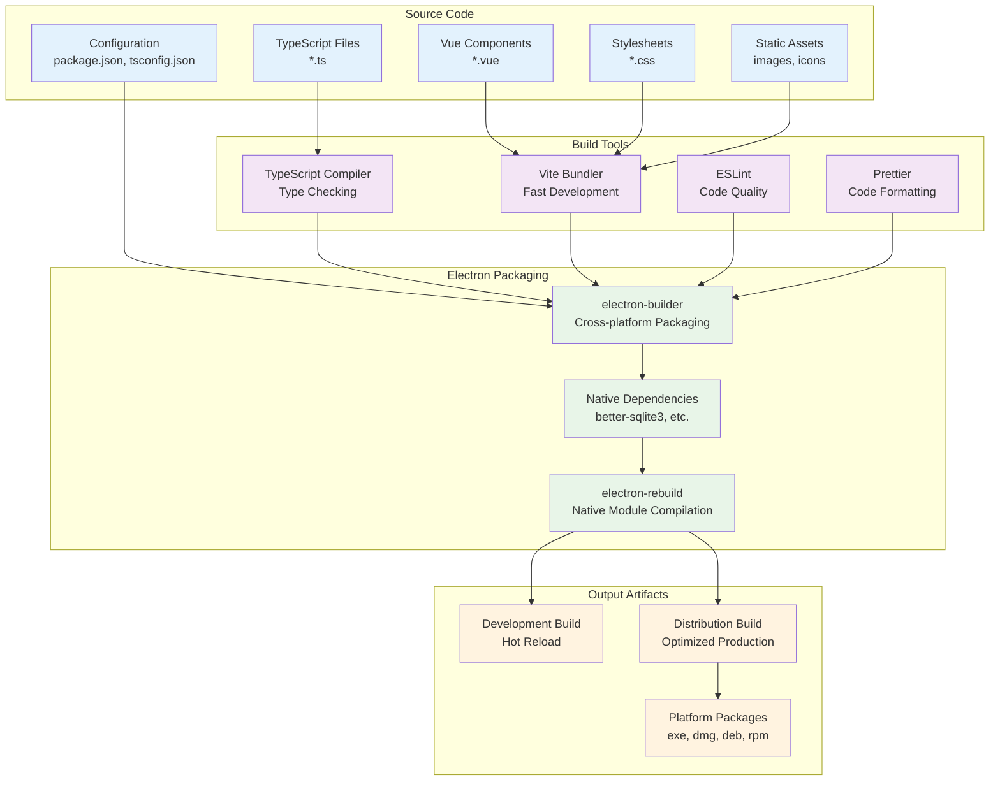

## Development Workflow

### Local Development Process

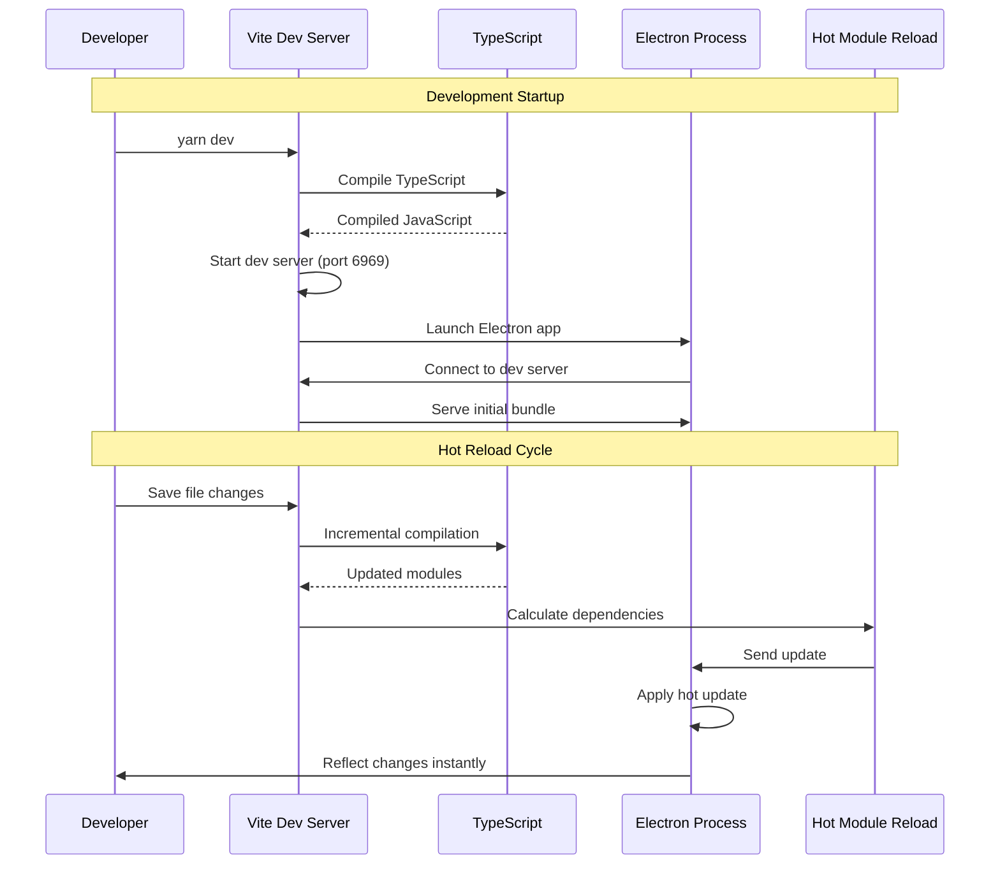

### Development Build Configuration

```javascript
// vite.config.ts - Development configuration
export default defineConfig({
  plugins: [vue()],
  root: path.join(__dirname, 'src'),
  base: './',
  build: {
    outDir: path.join(__dirname, 'dist'),
    emptyOutDir: true,
    rollupOptions: {
      external: ['electron']
    }
  },
  server: {
    port: 6969,
    host: '0.0.0.0',
    strictPort: true
  },
  optimizeDeps: {
    exclude: ['electron']
  }
});
```

## Production Build Pipeline

### Build Process Flow

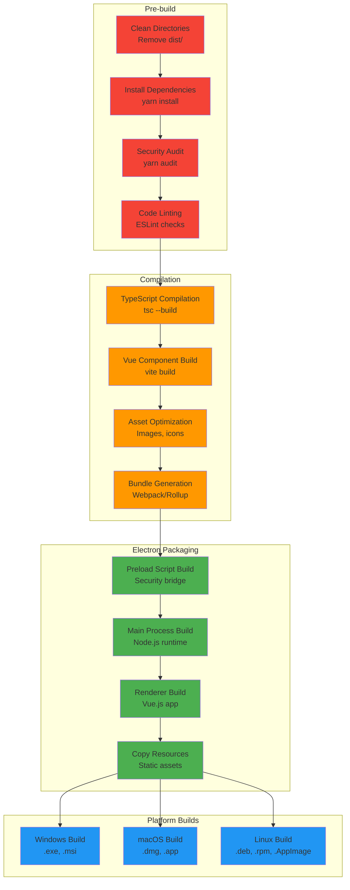

### Build Script Implementation

```javascript
// build/scripts/build.mjs
import { execSync } from 'child_process';
import fs from 'fs-extra';
import chalk from 'chalk';

export class ProductionBuilder {
  constructor(options = {}) {
    this.platform = options.platform || 'current';
    this.clean = options.clean || false;
    this.dir = options.dir || false;
  }

  async build() {
    console.log(chalk.blue('🚀 Starting production build...'));
    
    try {
      if (this.clean) await this.cleanBuild();
      await this.preBuild();
      await this.compileTypeScript();
      await this.buildRenderer();
      await this.packageElectron();
      await this.postBuild();
      
      console.log(chalk.green('✅ Build completed successfully!'));
    } catch (error) {
      console.error(chalk.red('❌ Build failed:'), error.message);
      throw error;
    }
  }

  async cleanBuild() {
    console.log(chalk.yellow('🧹 Cleaning build directories...'));
    await fs.remove('./dist');
    await fs.remove('./build/temp');
  }

  async preBuild() {
    console.log(chalk.blue('🔍 Running pre-build checks...'));
    
    // Security audit
    execSync('yarn audit --level high', { stdio: 'inherit' });
    
    // Linting
    execSync('yarn lint', { stdio: 'inherit' });
    
    // Type checking
    execSync('yarn tsc --noEmit', { stdio: 'inherit' });
  }

  async compileTypeScript() {
    console.log(chalk.blue('🔧 Compiling TypeScript...'));
    execSync('yarn tsc --build', { stdio: 'inherit' });
  }

  async buildRenderer() {
    console.log(chalk.blue('⚡ Building renderer process...'));
    execSync('yarn vite build', { stdio: 'inherit' });
  }

  async packageElectron() {
    console.log(chalk.blue('📦 Packaging Electron application...'));
    
    const platformFlags = {
      'windows': '--win',
      'mac': '--mac',
      'linux': '--linux',
      'all': '--win --mac --linux'
    };
    
    const flag = platformFlags[this.platform] || '';
    const dirFlag = this.dir ? '--dir' : '';
    
    execSync(`yarn electron-builder ${flag} ${dirFlag}`, { 
      stdio: 'inherit' 
    });
  }

  async postBuild() {
    console.log(chalk.blue('✨ Running post-build tasks...'));
    
    // Generate checksums
    await this.generateChecksums();
    
    // Verify signatures
    await this.verifySignatures();
    
    // Create release notes
    await this.generateReleaseNotes();
  }
}
```

## Cross-Platform Build Configuration

### Platform-Specific Configurations

```mermaid
graph TB
    subgraph "Windows Configuration"
        WIN_CERT[Code Signing Certificate<br/>Windows Authenticode]
        WIN_NSIS[NSIS Installer<br/>Windows Setup]
        WIN_PORTABLE[Portable Executable<br/>No Installation]
        WIN_ICON[Windows Icons<br/>.ico format]
    end
    
    subgraph "macOS Configuration"
        MAC_CERT[Apple Certificate<br/>Developer ID]
        MAC_NOTARY[Notarization<br/>Apple Notary Service]
        MAC_DMG[DMG Installer<br/>macOS Disk Image]
        MAC_ICON[macOS Icons<br/>.icns format]
    end
    
    subgraph "Linux Configuration"
        LINUX_DEB[Debian Package<br/>.deb format]
        LINUX_RPM[RPM Package<br/>.rpm format]
        LINUX_APPIMAGE[AppImage<br/>Portable format]
        LINUX_ICON[Linux Icons<br/>.png format]
    end
    
    subgraph "Common Configuration"
        BUILD_CONFIG[electron-builder.json<br/>Base Configuration]
        ASSETS[Shared Assets<br/>Icons, Resources]
        SECURITY[Security Settings<br/>CSP, Permissions]
        METADATA[Application Metadata<br/>Version, Description]
    end
    
    WIN_CERT --> BUILD_CONFIG
    WIN_NSIS --> BUILD_CONFIG
    WIN_PORTABLE --> BUILD_CONFIG
    WIN_ICON --> ASSETS
    MAC_CERT --> BUILD_CONFIG
    MAC_NOTARY --> BUILD_CONFIG
    MAC_DMG --> BUILD_CONFIG
    MAC_ICON --> ASSETS
    LINUX_DEB --> BUILD_CONFIG
    LINUX_RPM --> BUILD_CONFIG
    LINUX_APPIMAGE --> BUILD_CONFIG
    LINUX_ICON --> ASSETS
    BUILD_CONFIG --> SECURITY
    ASSETS --> METADATA
    
    classDef windows fill:#0078d4
    classDef macos fill:#007aff
    classDef linux fill:#f57c00
    classDef common fill:#4caf50
    
    class WIN_CERT,WIN_NSIS,WIN_PORTABLE,WIN_ICON windows
    class MAC_CERT,MAC_NOTARY,MAC_DMG,MAC_ICON macos
    class LINUX_DEB,LINUX_RPM,LINUX_APPIMAGE,LINUX_ICON linux
    class BUILD_CONFIG,ASSETS,SECURITY,METADATA common
```

### electron-builder Configuration

```json
{
  "productName": "ERPNext Desktop",
  "appId": "com.zone-enterprise.erpnext-desktop",
  "directories": {
    "output": "dist",
    "buildResources": "build"
  },
  "files": [
    "dist/**/*",
    "node_modules/**/*",
    "package.json",
    "main.js"
  ],
  "extraResources": [
    {
      "from": "assets",
      "to": "assets",
      "filter": ["**/*"]
    },
    {
      "from": "config",
      "to": "config",
      "filter": ["**/*"]
    }
  ],
  "win": {
    "target": [
      {
        "target": "nsis",
        "arch": ["x64", "ia32"]
      },
      {
        "target": "portable",
        "arch": ["x64"]
      }
    ],
    "icon": "build/icon.ico",
    "publisherName": "Zone Enterprise",
    "signDlls": true,
    "certificateFile": "certificates/windows.p12",
    "certificatePassword": "${WINDOWS_CERT_PASSWORD}"
  },
  "mac": {
    "target": [
      {
        "target": "dmg",
        "arch": ["x64", "arm64"]
      },
      {
        "target": "zip",
        "arch": ["x64", "arm64"]
      }
    ],
    "icon": "build/icon.icns",
    "category": "public.app-category.business",
    "hardenedRuntime": true,
    "gatekeeperAssess": false,
    "entitlements": "build/entitlements.mac.plist",
    "entitlementsInherit": "build/entitlements.mac.plist"
  },
  "linux": {
    "target": [
      {
        "target": "deb",
        "arch": ["x64", "arm64"]
      },
      {
        "target": "rpm",
        "arch": ["x64", "arm64"]
      },
      {
        "target": "AppImage",
        "arch": ["x64"]
      }
    ],
    "icon": "build/icons",
    "category": "Office",
    "desktop": {
      "Comment": "Open Source ERP Desktop Application",
      "Keywords": "ERP;Business;Accounting;CRM;"
    }
  }
}
```

## CI/CD Pipeline

### GitHub Actions Workflow

```mermaid
sequenceDiagram
    participant DEV as Developer
    participant GH as GitHub
    participant RUNNER_WIN as Windows Runner
    participant RUNNER_MAC as macOS Runner
    participant RUNNER_LINUX as Linux Runner
    participant RELEASE as GitHub Releases
    
    Note over DEV,RELEASE: Automated Release Process
    
    DEV->>GH: Push tag desktop-v1.0.0
    GH->>GH: Trigger desktop-release.yml
    
    parallel
        GH->>RUNNER_WIN: Start Windows build
        RUNNER_WIN->>RUNNER_WIN: Build for Windows
        RUNNER_WIN->>RUNNER_WIN: Sign binaries
        RUNNER_WIN->>GH: Upload artifacts
    and
        GH->>RUNNER_MAC: Start macOS build
        RUNNER_MAC->>RUNNER_MAC: Build for macOS
        RUNNER_MAC->>RUNNER_MAC: Notarize app
        RUNNER_MAC->>GH: Upload artifacts
    and
        GH->>RUNNER_LINUX: Start Linux build
        RUNNER_LINUX->>RUNNER_LINUX: Build for Linux
        RUNNER_LINUX->>RUNNER_LINUX: Create packages
        RUNNER_LINUX->>GH: Upload artifacts
    end
    
    GH->>RELEASE: Create GitHub Release
    RELEASE->>RELEASE: Attach all artifacts
    GH->>DEV: Notify release completion
```

### CI/CD Workflow Configuration

```yaml
# .github/workflows/desktop-release.yml
name: ERPNext Desktop Release

on:
  push:
    tags:
      - 'desktop-v*'
  workflow_dispatch:
    inputs:
      version:
        description: 'Release version (without desktop-v prefix)'
        required: true
        type: string

jobs:
  build-windows:
    runs-on: windows-latest
    steps:
      - uses: actions/checkout@v4
      
      - name: Setup Node.js
        uses: actions/setup-node@v4
        with:
          node-version: '20'
          cache: 'yarn'
          cache-dependency-path: 'desktop/yarn.lock'
      
      - name: Install dependencies
        run: |
          cd desktop
          yarn install --frozen-lockfile
      
      - name: Setup certificates
        env:
          WINDOWS_CERTIFICATE: ${{ secrets.WINDOWS_CERTIFICATE }}
          WINDOWS_CERT_PASSWORD: ${{ secrets.WINDOWS_CERT_PASSWORD }}
        run: |
          if ($env:WINDOWS_CERTIFICATE) {
            echo $env:WINDOWS_CERTIFICATE | base64 -d > certificates/windows.p12
          }
      
      - name: Build application
        run: |
          cd desktop
          yarn build --win
        env:
          WINDOWS_CERT_PASSWORD: ${{ secrets.WINDOWS_CERT_PASSWORD }}
      
      - name: Upload artifacts
        uses: actions/upload-artifact@v4
        with:
          name: windows-artifacts
          path: desktop/dist/*.exe
          retention-days: 30

  build-macos:
    runs-on: macos-latest
    steps:
      - uses: actions/checkout@v4
      
      - name: Setup Node.js
        uses: actions/setup-node@v4
        with:
          node-version: '20'
          cache: 'yarn'
          cache-dependency-path: 'desktop/yarn.lock'
      
      - name: Install dependencies
        run: |
          cd desktop
          yarn install --frozen-lockfile
      
      - name: Setup certificates
        env:
          APPLE_CERTIFICATE: ${{ secrets.APPLE_CERTIFICATE }}
          APPLE_CERT_PASSWORD: ${{ secrets.APPLE_CERT_PASSWORD }}
        run: |
          if [ -n "$APPLE_CERTIFICATE" ]; then
            echo "$APPLE_CERTIFICATE" | base64 -d > certificates/apple.p12
            security create-keychain -p "" build.keychain
            security import certificates/apple.p12 -k build.keychain -P "$APPLE_CERT_PASSWORD" -T /usr/bin/codesign
            security list-keychains -s build.keychain
            security default-keychain -s build.keychain
            security unlock-keychain -p "" build.keychain
            security set-key-partition-list -S apple-tool:,apple: -s -k "" build.keychain
          fi
      
      - name: Build application
        run: |
          cd desktop
          yarn build --mac
        env:
          APPLE_ID: ${{ secrets.APPLE_ID }}
          APPLE_ID_PASSWORD: ${{ secrets.APPLE_ID_PASSWORD }}
          APPLE_TEAM_ID: ${{ secrets.APPLE_TEAM_ID }}
      
      - name: Upload artifacts
        uses: actions/upload-artifact@v4
        with:
          name: macos-artifacts
          path: |
            desktop/dist/*.dmg
            desktop/dist/*.zip
          retention-days: 30

  build-linux:
    runs-on: ubuntu-latest
    steps:
      - uses: actions/checkout@v4
      
      - name: Setup Node.js
        uses: actions/setup-node@v4
        with:
          node-version: '20'
          cache: 'yarn'
          cache-dependency-path: 'desktop/yarn.lock'
      
      - name: Install system dependencies
        run: |
          sudo apt-get update
          sudo apt-get install -y libnss3-dev libatk-bridge2.0-dev libgtk-3-dev libxss1
      
      - name: Install dependencies
        run: |
          cd desktop
          yarn install --frozen-lockfile
      
      - name: Build application
        run: |
          cd desktop
          yarn build --linux
      
      - name: Upload artifacts
        uses: actions/upload-artifact@v4
        with:
          name: linux-artifacts
          path: |
            desktop/dist/*.deb
            desktop/dist/*.rpm
            desktop/dist/*.AppImage
          retention-days: 30

  release:
    needs: [build-windows, build-macos, build-linux]
    runs-on: ubuntu-latest
    steps:
      - uses: actions/checkout@v4
      
      - name: Download all artifacts
        uses: actions/download-artifact@v4
        with:
          path: artifacts
      
      - name: Generate checksums
        run: |
          cd artifacts
          find . -name "*.exe" -o -name "*.dmg" -o -name "*.zip" -o -name "*.deb" -o -name "*.rpm" -o -name "*.AppImage" | \
          xargs sha256sum > checksums.txt
      
      - name: Create Release
        uses: softprops/action-gh-release@v1
        with:
          tag_name: ${{ github.ref_name }}
          name: ERPNext Desktop ${{ github.ref_name }}
          body: |
            ## ERPNext Desktop Release ${{ github.ref_name }}
            
            ### Downloads
            - Windows: `.exe` installer or portable `.zip`
            - macOS: `.dmg` installer or `.zip` archive
            - Linux: `.deb`, `.rpm`, or `.AppImage`
            
            ### Checksums
            See `checksums.txt` for file verification.
            
            ### Installation
            Download the appropriate file for your platform and follow the installation instructions.
          files: |
            artifacts/**/*
            artifacts/checksums.txt
          draft: false
          prerelease: false
        env:
          GITHUB_TOKEN: ${{ secrets.GITHUB_TOKEN }}
```

## Code Signing & Security

### Code Signing Process

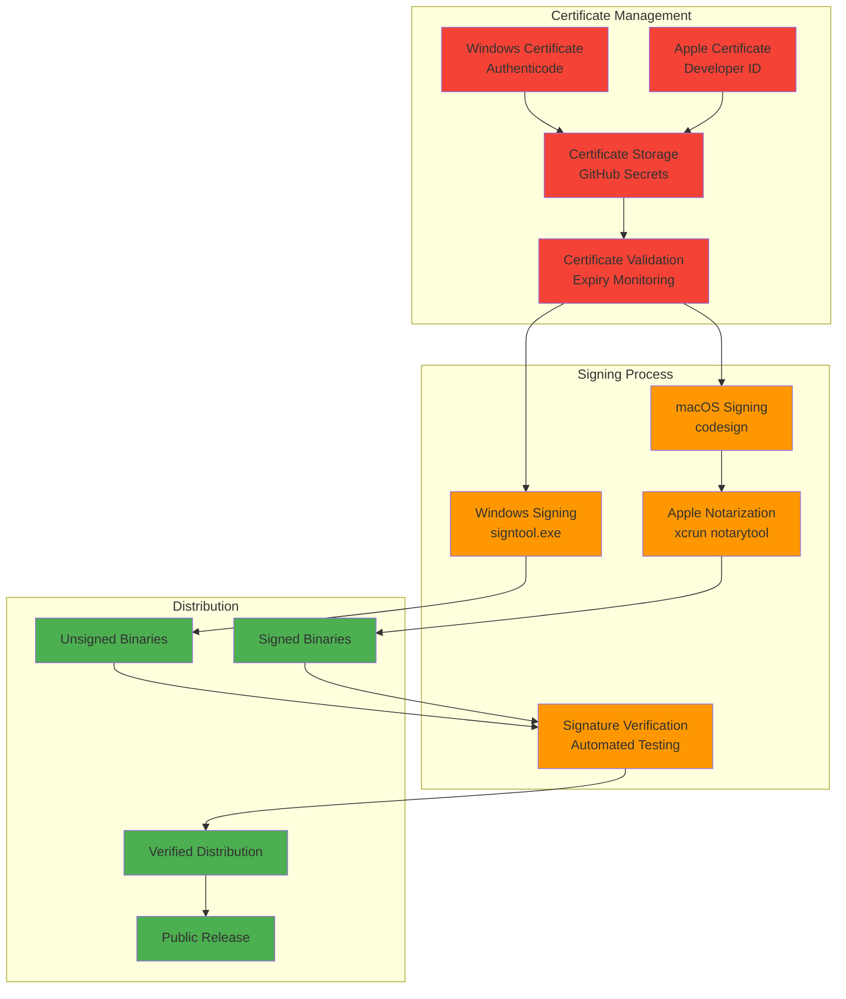

### Security Validation Pipeline

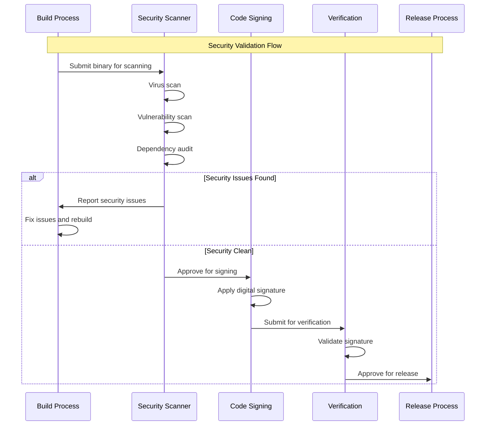

## Asset Management

### Static Asset Pipeline

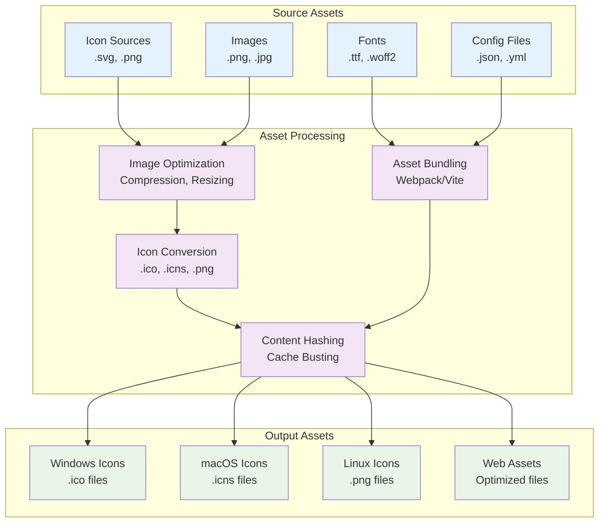

## Performance Optimization

### Build Performance Optimization

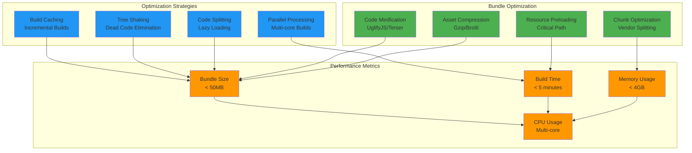

## Distribution Strategy

### Release Channel Management

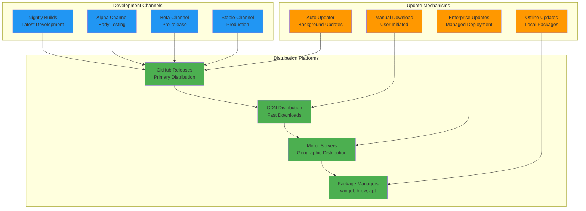

### Global Distribution Network

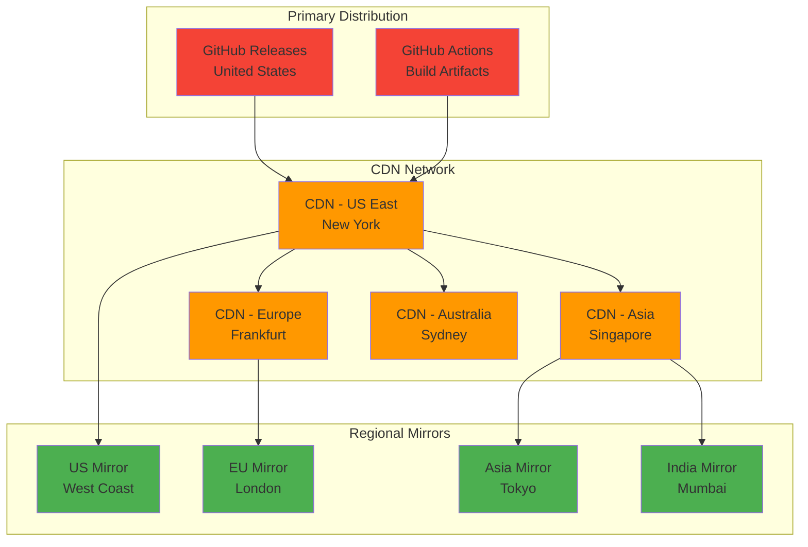

## Quality Assurance

### Automated Testing Pipeline

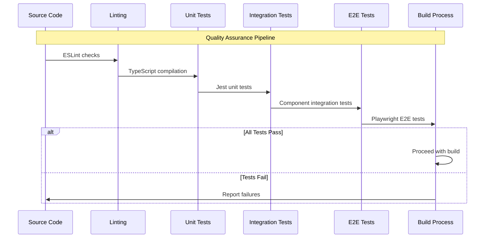

### Release Validation Checklist

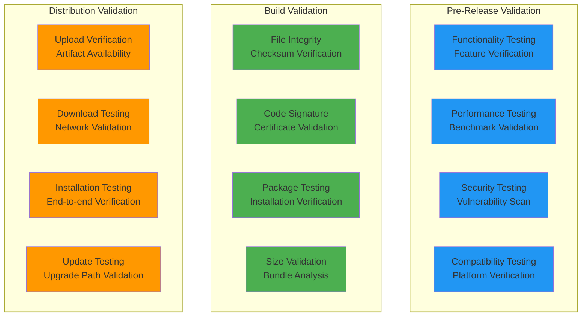

## Monitoring & Analytics

### Build Analytics Dashboard

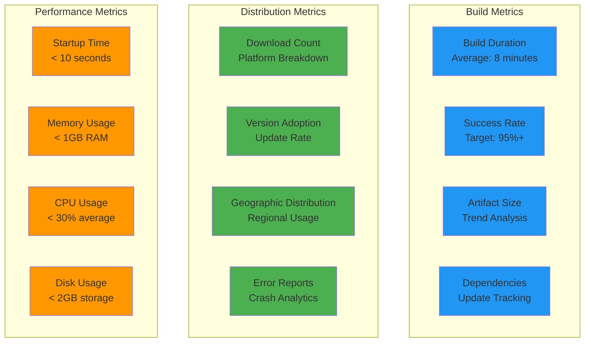

## Summary

The ERPNext Desktop build and deployment pipeline provides:

1. **Automated Builds**: Multi-platform CI/CD with GitHub Actions
2. **Security**: Code signing and vulnerability scanning
3. **Optimization**: Performance-optimized builds with asset compression
4. **Distribution**: Global CDN with multiple release channels
5. **Quality Assurance**: Comprehensive testing and validation
6. **Monitoring**: Real-time analytics and performance tracking

This comprehensive pipeline ensures reliable, secure, and performant distribution of the ERPNext Desktop application across all supported platforms.