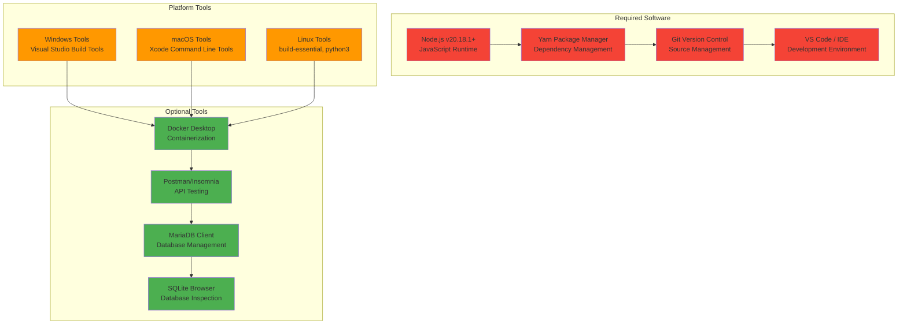
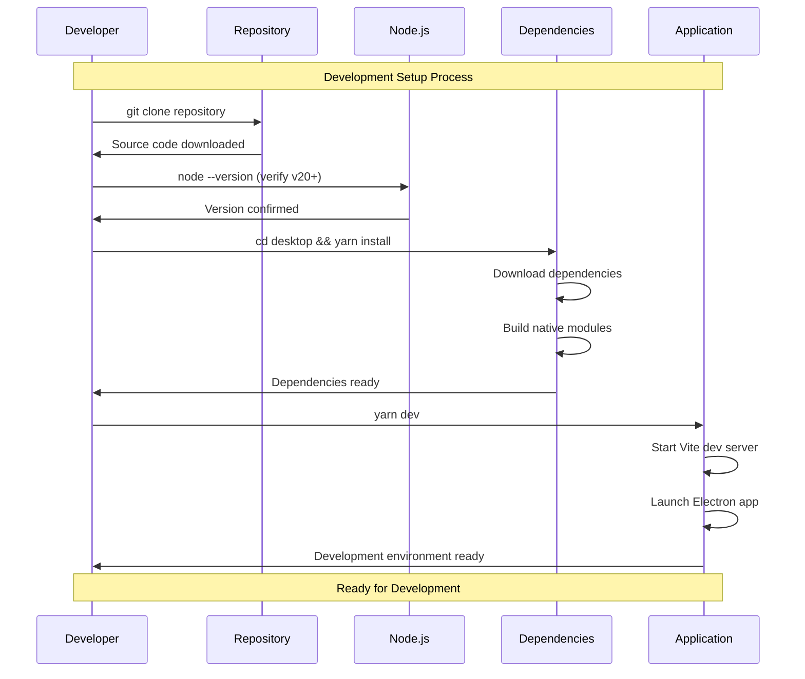
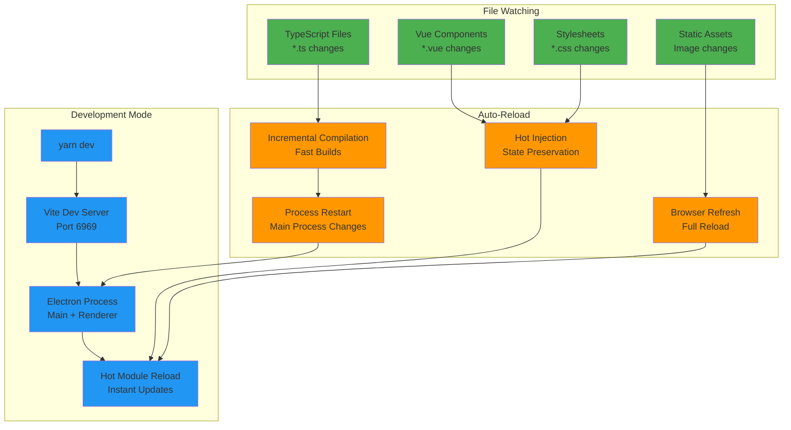
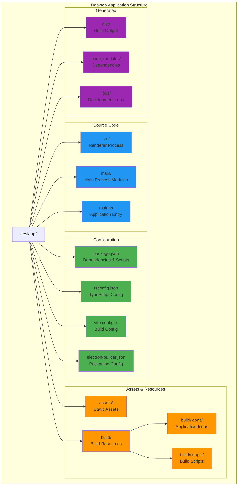
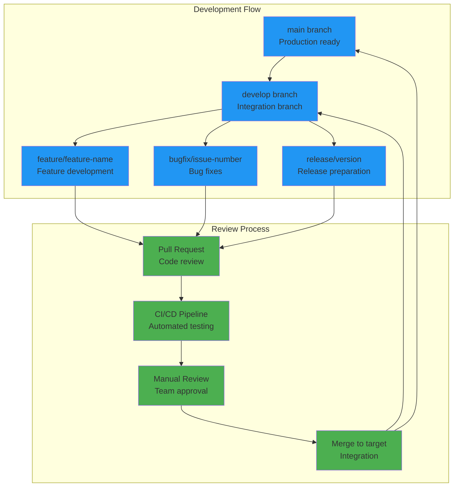

# Developer Guide

## Overview

This comprehensive developer guide provides detailed instructions for setting up, developing, and contributing to the ERPNext Desktop Application. It covers development environment setup, coding standards, debugging techniques, and contribution guidelines.

## Development Environment Setup

### Prerequisites & System Requirements



### Step-by-Step Setup



#### 1. Clone Repository

```bash
# Clone the repository
git clone https://github.com/Zone-Enterprise/erpnextfact.git
cd erpnextfact

# Navigate to desktop directory
cd desktop
```

#### 2. Install Dependencies

```bash
# Install Node.js dependencies
yarn install

# Rebuild native modules for Electron
yarn postinstall
```

#### 3. Development Configuration

```bash
# Create environment configuration (optional)
cp .env.example .env

# Configure development settings
echo "NODE_ENV=development" >> .env
echo "VITE_PORT=6969" >> .env
echo "VITE_HOST=localhost" >> .env
```

### IDE Configuration

#### VS Code Setup

```json
// .vscode/settings.json
{
  "typescript.preferences.importModuleSpecifier": "relative",
  "typescript.suggest.autoImports": true,
  "eslint.validate": ["typescript", "vue"],
  "editor.formatOnSave": true,
  "editor.defaultFormatter": "esbenp.prettier-vscode",
  "files.associations": {
    "*.vue": "vue"
  },
  "vetur.validation.template": false,
  "vetur.validation.script": false,
  "vetur.validation.style": false
}
```

#### Recommended Extensions

```json
// .vscode/extensions.json
{
  "recommendations": [
    "ms-vscode.vscode-typescript-next",
    "vue.volar",
    "esbenp.prettier-vscode",
    "dbaeumer.vscode-eslint",
    "ms-vscode.electron-debug",
    "ms-vscode.vscode-json",
    "bradlc.vscode-tailwindcss"
  ]
}
```

## Development Workflows

### Hot Reload Development



### Development Commands

```bash
# Development server with hot reload
yarn dev

# Build for production (all platforms)
yarn build

# Build for specific platform
yarn build:win    # Windows
yarn build:mac    # macOS  
yarn build:linux  # Linux

# Code quality checks
yarn lint         # ESLint checking
yarn lint:fix     # Auto-fix ESLint issues
yarn format       # Prettier formatting
yarn type-check   # TypeScript validation

# Testing
yarn test         # Run unit tests
yarn test:e2e     # Run end-to-end tests
yarn test:watch   # Watch mode testing

# Development utilities
yarn clean        # Clean build directories
yarn analyze      # Bundle size analysis
yarn deps:update  # Update dependencies
```

## Project Structure Deep Dive

### Directory Organization



### Main Process Architecture

```typescript
// main.ts - Application entry point
export class Main extends EventEmitter {
  // Core properties
  title = 'ERPNext Desktop';
  mainWindow: BrowserWindow | null = null;
  splashWindow: BrowserWindow | null = null;
  
  // Server management
  serverProcess: ChildProcess | null = null;
  mariadbProcess: ChildProcess | null = null;
  serverReady = false;
  
  // Configuration
  store: Store<StoreSchema>;
  serverPort = 8000;
  siteName = 'erpnext.localhost';
  databaseType: 'mariadb' | 'sqlite' = 'mariadb';
  
  constructor() {
    super();
    this.setupLogging();
    this.initializeStore();
    this.registerListeners();
  }
  
  // Lifecycle methods
  async createWindow() { /* Window creation logic */ }
  async startServer() { /* Server startup logic */ }
  async cleanup() { /* Cleanup before exit */ }
}
```

### Renderer Process Structure

```typescript
// src/main.js - Vue.js application
import { createApp } from 'vue';
import { createRouter, createWebHistory } from 'vue-router';
import App from './App.vue';

// Application setup
const app = createApp(App);

// Router configuration
const router = createRouter({
  history: createWebHistory(),
  routes: [
    { path: '/', component: () => import('./views/Dashboard.vue') },
    { path: '/settings', component: () => import('./views/Settings.vue') },
    { path: '/about', component: () => import('./views/About.vue') }
  ]
});

// Global error handling
app.config.errorHandler = (error, instance, info) => {
  console.error('Vue error:', error);
  if (window.erpnextAPI?.logger) {
    window.erpnextAPI.logger.error('Renderer error', { error, info });
  }
};

app.use(router);
app.mount('#app');
```

## Coding Standards & Best Practices

### TypeScript Standards

```typescript
// Type definitions
interface StoreSchema {
  serverPort: number;
  siteName: string;
  databaseType: 'mariadb' | 'sqlite';
  mariadbConfig?: {
    host: string;
    port: number;
    user: string;
    password: string;
  };
  autoStart: boolean;
  firstRun: boolean;
}

// Class implementation with proper typing
export class DatabaseManager {
  private config: StoreSchema;
  private connection: Connection | null = null;

  constructor(config: StoreSchema) {
    this.config = config;
  }

  async connect(): Promise<boolean> {
    try {
      if (this.config.databaseType === 'mariadb') {
        return await this.connectMariaDB();
      } else {
        return await this.connectSQLite();
      }
    } catch (error) {
      console.error('Database connection failed:', error);
      return false;
    }
  }

  private async connectMariaDB(): Promise<boolean> {
    // MariaDB connection implementation
    return true;
  }

  private async connectSQLite(): Promise<boolean> {
    // SQLite connection implementation
    return true;
  }
}
```

### Vue.js Component Standards

```vue
<!-- Component template with proper structure -->
<template>
  <div class="settings-panel">
    <header class="panel-header">
      <h2>{{ title }}</h2>
      <button 
        @click="handleSave" 
        :disabled="!isValid"
        class="btn btn-primary"
      >
        Save Settings
      </button>
    </header>
    
    <form @submit.prevent="handleSubmit" class="settings-form">
      <div class="form-group">
        <label for="serverPort">Server Port</label>
        <input
          id="serverPort"
          v-model.number="settings.serverPort"
          type="number"
          min="1000"
          max="65535"
          class="form-control"
          :class="{ 'is-invalid': !isPortValid }"
        />
        <div v-if="!isPortValid" class="invalid-feedback">
          Port must be between 1000 and 65535
        </div>
      </div>
    </form>
  </div>
</template>

<script setup lang="ts">
import { ref, computed, onMounted } from 'vue';
import type { StoreSchema } from '../types/store';

// Props and emits
interface Props {
  title: string;
  initialSettings?: Partial<StoreSchema>;
}

const props = withDefaults(defineProps<Props>(), {
  title: 'Settings',
  initialSettings: () => ({})
});

const emit = defineEmits<{
  save: [settings: StoreSchema];
  cancel: [];
}>();

// Reactive state
const settings = ref<StoreSchema>({
  serverPort: 8000,
  siteName: 'erpnext.localhost',
  databaseType: 'mariadb',
  autoStart: true,
  firstRun: false,
  ...props.initialSettings
});

// Computed properties
const isPortValid = computed(() => {
  return settings.value.serverPort >= 1000 && settings.value.serverPort <= 65535;
});

const isValid = computed(() => {
  return isPortValid.value && settings.value.siteName.length > 0;
});

// Event handlers
const handleSave = async () => {
  if (!isValid.value) return;
  
  try {
    await window.erpnextAPI.config.updateSettings(settings.value);
    emit('save', settings.value);
  } catch (error) {
    console.error('Failed to save settings:', error);
  }
};

const handleSubmit = () => {
  handleSave();
};

// Lifecycle
onMounted(async () => {
  try {
    const currentSettings = await window.erpnextAPI.config.getSettings();
    Object.assign(settings.value, currentSettings);
  } catch (error) {
    console.error('Failed to load settings:', error);
  }
});
</script>

<style scoped>
.settings-panel {
  max-width: 600px;
  margin: 0 auto;
  padding: 20px;
}

.panel-header {
  display: flex;
  justify-content: space-between;
  align-items: center;
  margin-bottom: 20px;
}

.settings-form {
  display: flex;
  flex-direction: column;
  gap: 16px;
}

.form-group {
  display: flex;
  flex-direction: column;
  gap: 4px;
}

.form-control {
  padding: 8px 12px;
  border: 1px solid #ccc;
  border-radius: 4px;
  font-size: 14px;
}

.form-control.is-invalid {
  border-color: #dc3545;
}

.invalid-feedback {
  color: #dc3545;
  font-size: 12px;
}

.btn {
  padding: 8px 16px;
  border: none;
  border-radius: 4px;
  font-size: 14px;
  cursor: pointer;
  transition: background-color 0.2s;
}

.btn-primary {
  background-color: #007bff;
  color: white;
}

.btn-primary:hover:not(:disabled) {
  background-color: #0056b3;
}

.btn:disabled {
  opacity: 0.6;
  cursor: not-allowed;
}
</style>
```

### Error Handling Patterns

```typescript
// Centralized error handling
export class ErrorHandler {
  static handle(error: Error, context?: string): void {
    // Log error
    console.error(`Error in ${context || 'unknown context'}:`, error);
    
    // Report to main process
    if (window.erpnextAPI?.logger) {
      window.erpnextAPI.logger.error('Application error', {
        message: error.message,
        stack: error.stack,
        context
      });
    }
    
    // Show user notification
    this.showUserNotification(error, context);
  }
  
  private static showUserNotification(error: Error, context?: string): void {
    // User-friendly error messages
    const userMessage = this.getUserFriendlyMessage(error);
    
    if (window.erpnextAPI?.dialog) {
      window.erpnextAPI.dialog.showError('Error', userMessage);
    } else {
      alert(`Error: ${userMessage}`);
    }
  }
  
  private static getUserFriendlyMessage(error: Error): string {
    // Map technical errors to user-friendly messages
    const errorMap: Record<string, string> = {
      'ECONNREFUSED': 'Unable to connect to the server. Please check if the server is running.',
      'ENOTFOUND': 'Network connection error. Please check your internet connection.',
      'EACCES': 'Permission denied. Please run as administrator or check file permissions.',
      'ENOENT': 'File or directory not found. The application may need to be reinstalled.'
    };
    
    for (const [code, message] of Object.entries(errorMap)) {
      if (error.message.includes(code)) {
        return message;
      }
    }
    
    return 'An unexpected error occurred. Please try again or contact support.';
  }
}

// Usage in components
try {
  const result = await window.erpnextAPI.server.restart();
  // Handle success
} catch (error) {
  ErrorHandler.handle(error as Error, 'Server restart');
}
```

## Debugging Techniques

### Main Process Debugging

```typescript
// Enable debugging in main process
if (process.env.NODE_ENV === 'development') {
  // Enable DevTools for main process
  require('electron-debug')({
    showDevTools: true,
    devToolsMode: 'detach'
  });
  
  // Add debugging helpers
  global.debug = {
    mainWindow: () => this.mainWindow,
    serverProcess: () => this.serverProcess,
    store: () => this.store.store,
    logs: () => require('fs').readFileSync(this.logPath, 'utf8')
  };
}
```

### Renderer Process Debugging

```javascript
// Debug helpers in renderer
if (process.env.NODE_ENV === 'development') {
  window.debug = {
    // Vue app instance
    app: app,
    
    // Router instance
    router: router,
    
    // API access
    api: window.erpnextAPI,
    
    // Helper functions
    async testServerConnection() {
      try {
        const status = await window.erpnextAPI.server.checkStatus();
        console.log('Server status:', status);
        return status;
      } catch (error) {
        console.error('Server connection test failed:', error);
        return false;
      }
    },
    
    async getSystemInfo() {
      const info = {
        platform: navigator.platform,
        userAgent: navigator.userAgent,
        memory: (performance as any).memory,
        timing: performance.timing
      };
      console.table(info);
      return info;
    }
  };
}
```

### Logging Configuration

```typescript
// Enhanced logging setup
import winston from 'winston';
import path from 'path';

export function setupLogging(): winston.Logger {
  const logDir = path.join(app.getPath('userData'), 'logs');
  
  // Ensure log directory exists
  if (!fs.existsSync(logDir)) {
    fs.mkdirSync(logDir, { recursive: true });
  }
  
  const logger = winston.createLogger({
    level: process.env.NODE_ENV === 'development' ? 'debug' : 'info',
    format: winston.format.combine(
      winston.format.timestamp(),
      winston.format.errors({ stack: true }),
      winston.format.json()
    ),
    transports: [
      // Console transport for development
      new winston.transports.Console({
        format: winston.format.combine(
          winston.format.colorize(),
          winston.format.simple()
        )
      }),
      
      // File transport for all logs
      new winston.transports.File({
        filename: path.join(logDir, 'application.log'),
        maxsize: 10 * 1024 * 1024, // 10MB
        maxFiles: 5,
        tailable: true
      }),
      
      // Error-only file transport
      new winston.transports.File({
        filename: path.join(logDir, 'errors.log'),
        level: 'error',
        maxsize: 5 * 1024 * 1024, // 5MB
        maxFiles: 3
      })
    ]
  });
  
  return logger;
}
```

## Testing Framework

### Unit Testing Setup

```typescript
// jest.config.js
module.exports = {
  preset: 'ts-jest',
  testEnvironment: 'node',
  roots: ['<rootDir>/src', '<rootDir>/main'],
  testMatch: [
    '**/__tests__/**/*.+(ts|tsx|js)',
    '**/*.(test|spec).+(ts|tsx|js)'
  ],
  transform: {
    '^.+\\.(ts|tsx)$': 'ts-jest'
  },
  collectCoverageFrom: [
    'src/**/*.{ts,tsx}',
    'main/**/*.{ts,tsx}',
    '!**/*.d.ts'
  ],
  coverageReporters: ['text', 'lcov', 'html'],
  setupFilesAfterEnv: ['<rootDir>/tests/setup.ts']
};
```

### Test Examples

```typescript
// main/database.test.ts
import { DatabaseManager } from './database';
import type { StoreSchema } from '../types/store';

describe('DatabaseManager', () => {
  let dbManager: DatabaseManager;
  let mockConfig: StoreSchema;
  
  beforeEach(() => {
    mockConfig = {
      serverPort: 8000,
      siteName: 'test.localhost',
      databaseType: 'sqlite',
      autoStart: true,
      firstRun: false
    };
    
    dbManager = new DatabaseManager(mockConfig);
  });
  
  afterEach(async () => {
    await dbManager.disconnect();
  });
  
  describe('connect', () => {
    it('should connect to SQLite database successfully', async () => {
      const result = await dbManager.connect();
      expect(result).toBe(true);
    });
    
    it('should handle connection errors gracefully', async () => {
      // Mock connection failure
      jest.spyOn(dbManager as any, 'connectSQLite').mockRejectedValue(
        new Error('Connection failed')
      );
      
      const result = await dbManager.connect();
      expect(result).toBe(false);
    });
  });
  
  describe('query execution', () => {
    beforeEach(async () => {
      await dbManager.connect();
    });
    
    it('should execute queries successfully', async () => {
      const result = await dbManager.query('SELECT 1 as test');
      expect(result).toBeDefined();
      expect(result.rows).toHaveLength(1);
      expect(result.rows[0].test).toBe(1);
    });
    
    it('should handle query errors', async () => {
      await expect(
        dbManager.query('INVALID SQL QUERY')
      ).rejects.toThrow();
    });
  });
});
```

### E2E Testing with Playwright

```typescript
// tests/e2e/app.spec.ts
import { test, expect } from '@playwright/test';
import { ElectronApplication, _electron as electron } from 'playwright';

test.describe('ERPNext Desktop App', () => {
  let electronApp: ElectronApplication;
  
  test.beforeAll(async () => {
    electronApp = await electron.launch({
      args: ['./main.js'],
      env: {
        NODE_ENV: 'test'
      }
    });
  });
  
  test.afterAll(async () => {
    await electronApp.close();
  });
  
  test('should launch successfully', async () => {
    const window = await electronApp.firstWindow();
    expect(await window.title()).toBe('ERPNext Desktop');
  });
  
  test('should show splash screen initially', async () => {
    const windows = electronApp.windows();
    expect(windows).toHaveLength(2); // Splash + Main window
    
    // Wait for splash to close
    await electronApp.waitForEvent('window', { 
      predicate: window => window.url().includes('splash') 
    });
  });
  
  test('should load ERPNext interface', async () => {
    const window = await electronApp.firstWindow();
    
    // Wait for server to be ready
    await window.waitForSelector('[data-testid="server-status"][data-status="ready"]', {
      timeout: 30000
    });
    
    // Check if ERPNext interface loads
    await expect(window.locator('.frappe-app')).toBeVisible();
  });
  
  test('should open settings dialog', async () => {
    const window = await electronApp.firstWindow();
    
    // Click settings button
    await window.click('[data-testid="settings-button"]');
    
    // Verify settings dialog opens
    await expect(window.locator('.settings-dialog')).toBeVisible();
  });
});
```

## Performance Optimization

### Bundle Analysis

```typescript
// webpack-bundle-analyzer integration
import { BundleAnalyzerPlugin } from 'webpack-bundle-analyzer';

export function addBundleAnalyzer(config: Configuration): Configuration {
  if (process.env.ANALYZE_BUNDLE) {
    config.plugins?.push(
      new BundleAnalyzerPlugin({
        analyzerMode: 'static',
        openAnalyzer: false,
        reportFilename: 'bundle-report.html'
      })
    );
  }
  
  return config;
}

// Usage: ANALYZE_BUNDLE=true yarn build
```

### Memory Monitoring

```typescript
// Memory usage monitoring
export class MemoryMonitor {
  private intervalId: NodeJS.Timeout | null = null;
  
  start(): void {
    this.intervalId = setInterval(() => {
      const usage = process.memoryUsage();
      const formatted = {
        rss: Math.round(usage.rss / 1024 / 1024) + ' MB',
        heapUsed: Math.round(usage.heapUsed / 1024 / 1024) + ' MB',
        heapTotal: Math.round(usage.heapTotal / 1024 / 1024) + ' MB',
        external: Math.round(usage.external / 1024 / 1024) + ' MB'
      };
      
      console.log('Memory usage:', formatted);
      
      // Alert if memory usage is too high
      if (usage.heapUsed > 500 * 1024 * 1024) { // 500MB
        console.warn('High memory usage detected');
      }
    }, 30000); // Check every 30 seconds
  }
  
  stop(): void {
    if (this.intervalId) {
      clearInterval(this.intervalId);
      this.intervalId = null;
    }
  }
}
```

## Contribution Guidelines

### Git Workflow



### Commit Message Standards

```bash
# Commit message format
<type>(<scope>): <subject>

<body>

<footer>

# Types
feat:     New feature
fix:      Bug fix
docs:     Documentation changes
style:    Code style changes
refactor: Code refactoring
test:     Adding or modifying tests
chore:    Build process or auxiliary tool changes

# Examples
feat(server): add SQLite database support
fix(ui): resolve settings dialog validation issue
docs(api): update IPC communication documentation
test(main): add unit tests for database manager
```

### Pull Request Template

```markdown
## Pull Request Description

### Summary
Brief description of changes made.

### Changes Made
- [ ] Feature implementation
- [ ] Bug fixes
- [ ] Documentation updates
- [ ] Test additions/modifications

### Testing
- [ ] Unit tests pass
- [ ] Integration tests pass
- [ ] E2E tests pass
- [ ] Manual testing completed

### Screenshots/Videos
Include screenshots or videos of UI changes.

### Breaking Changes
List any breaking changes and migration steps.

### Checklist
- [ ] Code follows project standards
- [ ] Tests added for new features
- [ ] Documentation updated
- [ ] PR title follows commit message format
- [ ] All CI checks pass
```

## Summary

This developer guide provides comprehensive information for:

1. **Environment Setup**: Complete development environment configuration
2. **Project Structure**: Detailed codebase organization and architecture
3. **Coding Standards**: TypeScript, Vue.js, and general coding best practices
4. **Debugging**: Tools and techniques for effective debugging
5. **Testing**: Unit, integration, and E2E testing frameworks
6. **Performance**: Optimization techniques and monitoring
7. **Contribution**: Git workflow and collaboration guidelines

Following these guidelines ensures consistent, maintainable, and high-quality code contributions to the ERPNext Desktop project.