# Process Orchestration & Communication

## Overview

This document provides detailed analysis of process orchestration, inter-process communication patterns, and sequential workflows in the ERPNext Desktop Application.

## Application Startup Orchestration

### Complete Startup Sequence

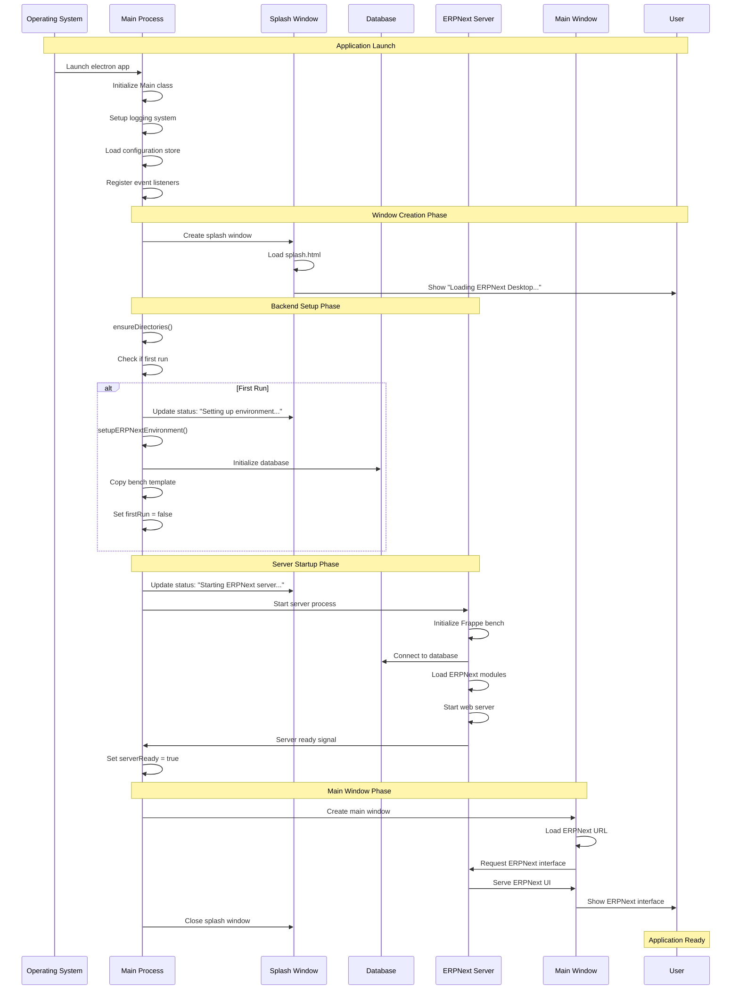
```mermaid
sequenceDiagram
    participant OS as Operating System
    participant MP as Main Process
    participant SP as Splash Window
    participant DB as Database
    participant ES as ERPNext Server
    participant MW as Main Window
    participant USER as User
    
    Note over OS,USER: Application Launch
    
    OS->>MP: Launch electron app
    MP->>MP: Initialize Main class
    MP->>MP: Setup logging system
    MP->>MP: Load configuration store
    MP->>MP: Register event listeners
    
    Note over MP,USER: Window Creation Phase
    
    MP->>SP: Create splash window
    SP->>SP: Load splash.html
    SP->>USER: Show "Loading ERPNext Desktop..."
    
    Note over MP,ES: Backend Setup Phase
    
    MP->>MP: ensureDirectories()
    MP->>MP: Check if first run
    
    alt First Run
        MP->>SP: Update status: "Setting up environment..."
        MP->>MP: setupERPNextEnvironment()
        MP->>DB: Initialize database
        MP->>MP: Copy bench template
        MP->>MP: Set firstRun = false
    end
    
    Note over MP,ES: Server Startup Phase
    
    MP->>SP: Update status: "Starting ERPNext server..."
    MP->>ES: Start server process
    ES->>ES: Initialize Frappe bench
    ES->>DB: Connect to database
    ES->>ES: Load ERPNext modules
    ES->>ES: Start web server
    ES->>MP: Server ready signal
    MP->>MP: Set serverReady = true
    
    Note over MP,MW: Main Window Phase
    
    MP->>MW: Create main window
    MW->>MW: Load ERPNext URL
    MW->>ES: Request ERPNext interface
    ES->>MW: Serve ERPNext UI
    MW->>USER: Show ERPNext interface
    MP->>SP: Close splash window
    
    Note over USER: Application Ready
```

### Database Initialization Sequence

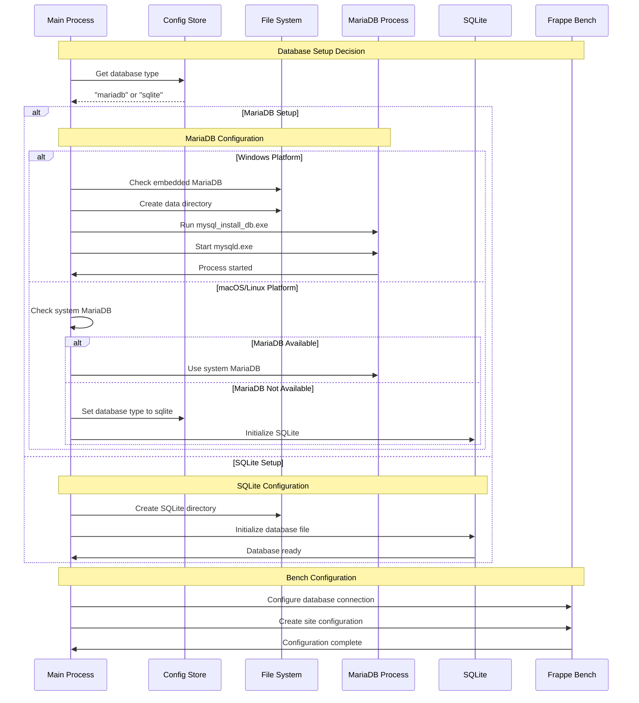
```mermaid
sequenceDiagram
    participant MP as Main Process
    participant STORE as Config Store
    participant FS as File System
    participant MARIADB as MariaDB Process
    participant SQLITE as SQLite
    participant BENCH as Frappe Bench
    
    Note over MP,BENCH: Database Setup Decision
    
    MP->>STORE: Get database type
    STORE-->>MP: "mariadb" or "sqlite"
    
    alt MariaDB Setup
        Note over MP,MARIADB: MariaDB Configuration
        
        alt Windows Platform
            MP->>FS: Check embedded MariaDB
            MP->>FS: Create data directory
            MP->>MARIADB: Run mysql_install_db.exe
            MP->>MARIADB: Start mysqld.exe
            MARIADB->>MP: Process started
        else macOS/Linux Platform
            MP->>MP: Check system MariaDB
            alt MariaDB Available
                MP->>MARIADB: Use system MariaDB
            else MariaDB Not Available
                MP->>STORE: Set database type to sqlite
                MP->>SQLITE: Initialize SQLite
            end
        end
        
    else SQLite Setup
        Note over MP,SQLITE: SQLite Configuration
        
        MP->>FS: Create SQLite directory
        MP->>SQLITE: Initialize database file
        SQLITE->>MP: Database ready
    end
    
    Note over MP,BENCH: Bench Configuration
    
    MP->>BENCH: Configure database connection
    MP->>BENCH: Create site configuration
    BENCH->>MP: Configuration complete
```

## IPC Communication Patterns

### Secure API Exposure Pattern

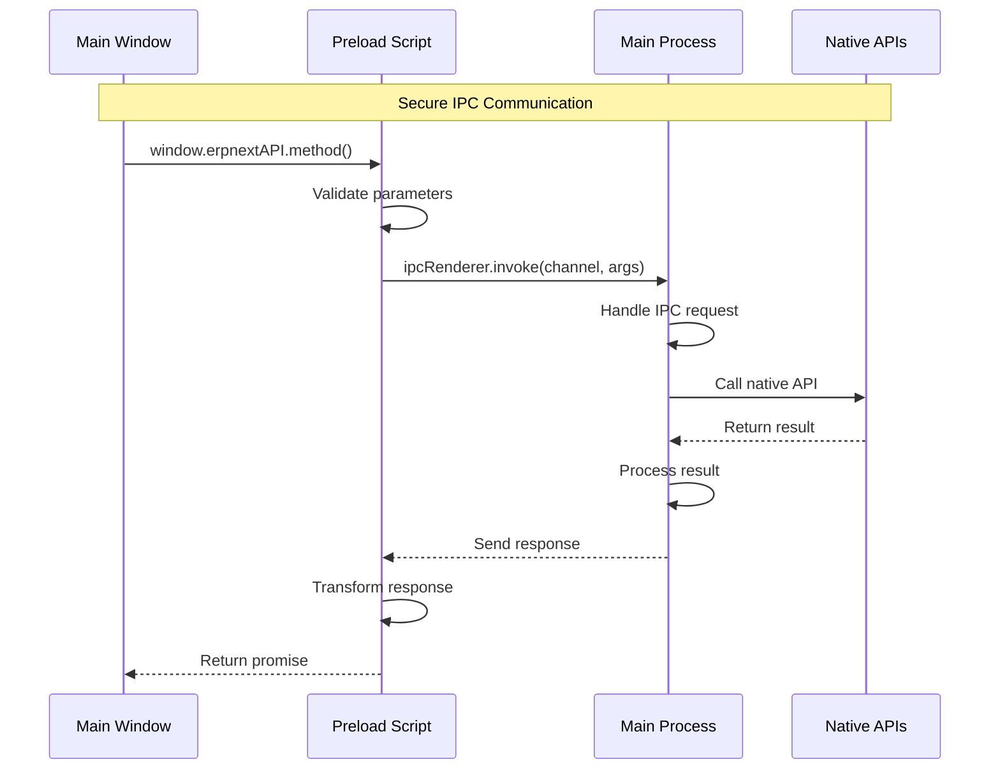
```mermaid
sequenceDiagram
    participant MW as Main Window
    participant PS as Preload Script
    participant MP as Main Process
    participant API as Native APIs
    
    Note over MW,API: Secure IPC Communication
    
    MW->>PS: window.erpnextAPI.method()
    PS->>PS: Validate parameters
    PS->>MP: ipcRenderer.invoke(channel, args)
    MP->>MP: Handle IPC request
    MP->>API: Call native API
    API-->>MP: Return result
    MP->>MP: Process result
    MP-->>PS: Send response
    PS->>PS: Transform response
    PS-->>MW: Return promise
```

### Configuration Management Flow

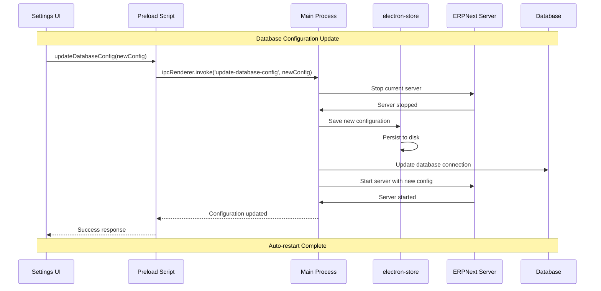
```mermaid
sequenceDiagram
    participant UI as Settings UI
    participant PS as Preload Script
    participant MP as Main Process
    participant STORE as electron-store
    participant SERVER as ERPNext Server
    participant DB as Database
    
    Note over UI,DB: Database Configuration Update
    
    UI->>PS: updateDatabaseConfig(newConfig)
    PS->>MP: ipcRenderer.invoke('update-database-config', newConfig)
    MP->>SERVER: Stop current server
    SERVER->>MP: Server stopped
    MP->>STORE: Save new configuration
    STORE->>STORE: Persist to disk
    MP->>DB: Update database connection
    MP->>SERVER: Start server with new config
    SERVER->>MP: Server started
    MP-->>PS: Configuration updated
    PS-->>UI: Success response
    
    Note over UI,DB: Auto-restart Complete
```

### Error Handling Flow

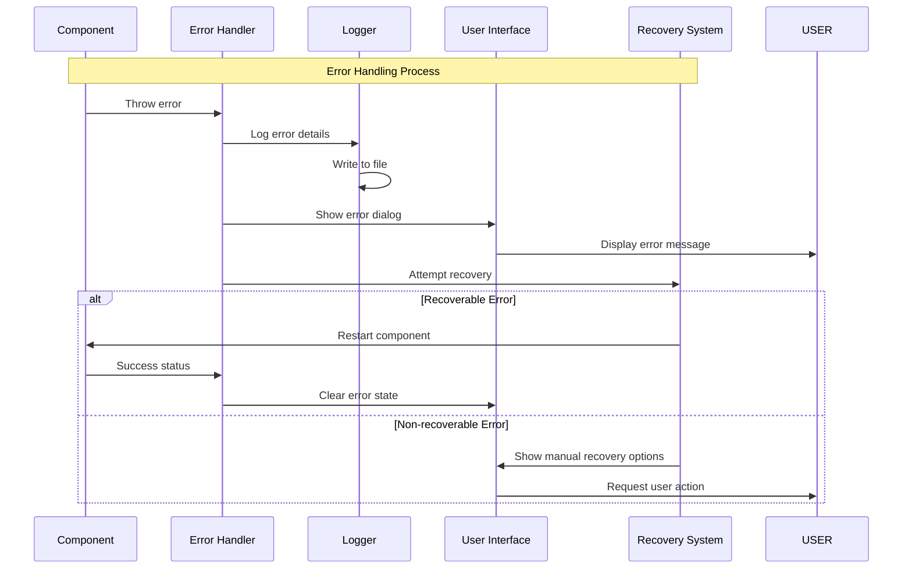
```mermaid
sequenceDiagram
    participant COMP as Component
    participant ERR as Error Handler
    participant LOG as Logger
    participant UI as User Interface
    participant RECOVERY as Recovery System
    
    Note over COMP,RECOVERY: Error Handling Process
    
    COMP->>ERR: Throw error
    ERR->>LOG: Log error details
    LOG->>LOG: Write to file
    ERR->>UI: Show error dialog
    UI->>USER: Display error message
    ERR->>RECOVERY: Attempt recovery
    
    alt Recoverable Error
        RECOVERY->>COMP: Restart component
        COMP->>ERR: Success status
        ERR->>UI: Clear error state
    else Non-recoverable Error
        RECOVERY->>UI: Show manual recovery options
        UI->>USER: Request user action
    end
```

## Server Process Management

### Server Lifecycle Management

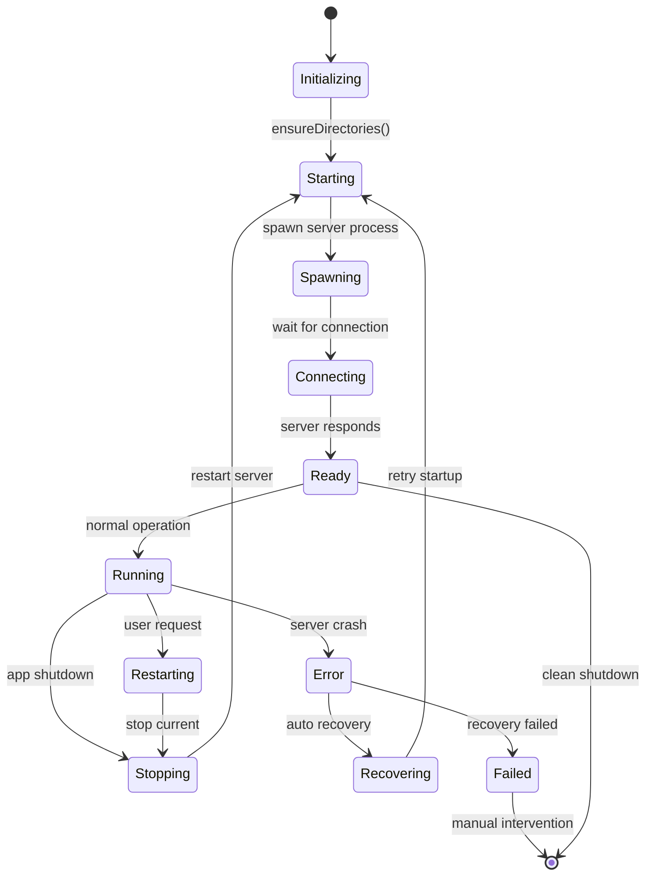
```mermaid
stateDiagram-v2
    [*] --> Initializing
    Initializing --> Starting : ensureDirectories()
    Starting --> Spawning : spawn server process
    Spawning --> Connecting : wait for connection
    Connecting --> Ready : server responds
    Ready --> Running : normal operation
    
    Running --> Restarting : user request
    Running --> Stopping : app shutdown
    Running --> Error : server crash
    
    Restarting --> Stopping : stop current
    Stopping --> Starting : restart server
    
    Error --> Recovering : auto recovery
    Error --> Failed : recovery failed
    
    Recovering --> Starting : retry startup
    Failed --> [*] : manual intervention
    
    Ready --> [*] : clean shutdown
```

### Cross-Platform Process Management

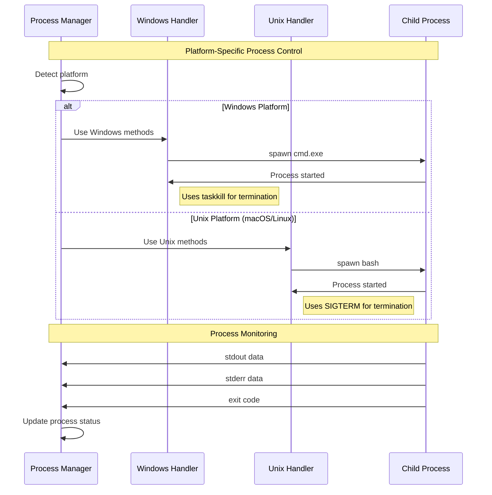
```mermaid
sequenceDiagram
    participant PM as Process Manager
    participant WIN as Windows Handler
    participant UNIX as Unix Handler
    participant PROC as Child Process
    
    Note over PM,PROC: Platform-Specific Process Control
    
    PM->>PM: Detect platform
    
    alt Windows Platform
        PM->>WIN: Use Windows methods
        WIN->>PROC: spawn cmd.exe
        PROC->>WIN: Process started
        Note right of WIN: Uses taskkill for termination
        
    else Unix Platform (macOS/Linux)
        PM->>UNIX: Use Unix methods
        UNIX->>PROC: spawn bash
        PROC->>UNIX: Process started
        Note right of UNIX: Uses SIGTERM for termination
    end
    
    Note over PM,PROC: Process Monitoring
    
    PROC->>PM: stdout data
    PROC->>PM: stderr data
    PROC->>PM: exit code
    PM->>PM: Update process status
```

## Window Management Orchestration

### Multi-Window Coordination

```mermaid
sequenceDiagram
    participant WM as Window Manager
    participant SW as Splash Window
    participant MW as Main Window
    participant PM as Process Manager
    participant SERVER as Server Process
    
    Note over WM,SERVER: Window Lifecycle
    
    WM->>SW: Create splash window
    SW->>SW: Show loading interface
    WM->>PM: Start background processes
    PM->>SERVER: Initialize server
    
    parallel
        SW->>SW: Update loading status
    and
        SERVER->>PM: Server progress updates
        PM->>WM: Relay status updates
        WM->>SW: Update splash content
    end
    
    SERVER->>PM: Server ready
    PM->>WM: Server ready signal
    WM->>MW: Create main window
    MW->>MW: Load ERPNext interface
    MW->>WM: Window ready
    WM->>SW: Close splash window
    
    Note over MW: Application Ready
```

### Window State Management

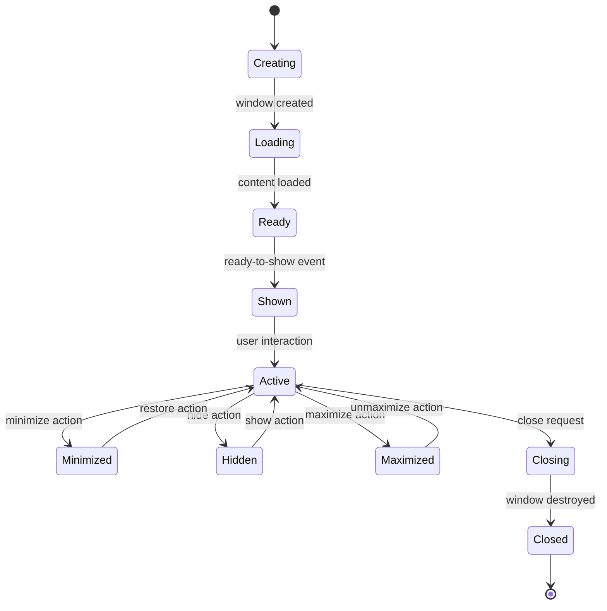
```mermaid
stateDiagram-v2
    [*] --> Creating
    Creating --> Loading : window created
    Loading --> Ready : content loaded
    Ready --> Shown : ready-to-show event
    Shown --> Active : user interaction
    
    Active --> Minimized : minimize action
    Active --> Hidden : hide action
    Active --> Maximized : maximize action
    
    Minimized --> Active : restore action
    Hidden --> Active : show action
    Maximized --> Active : unmaximize action
    
    Active --> Closing : close request
    Closing --> Closed : window destroyed
    Closed --> [*]
```

## Update Management Process

### Auto-Update Orchestration

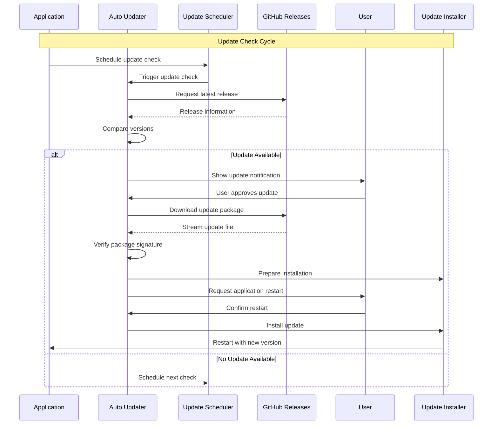
```mermaid
sequenceDiagram
    participant APP as Application
    participant AU as Auto Updater
    participant SCHEDULER as Update Scheduler
    participant GITHUB as GitHub Releases
    participant USER as User
    participant INSTALLER as Update Installer
    
    Note over APP,INSTALLER: Update Check Cycle
    
    APP->>SCHEDULER: Schedule update check
    SCHEDULER->>AU: Trigger update check
    AU->>GITHUB: Request latest release
    GITHUB-->>AU: Release information
    AU->>AU: Compare versions
    
    alt Update Available
        AU->>USER: Show update notification
        USER->>AU: User approves update
        AU->>GITHUB: Download update package
        GITHUB-->>AU: Stream update file
        AU->>AU: Verify package signature
        AU->>INSTALLER: Prepare installation
        AU->>USER: Request application restart
        USER->>AU: Confirm restart
        AU->>INSTALLER: Install update
        INSTALLER->>APP: Restart with new version
    else No Update Available
        AU->>SCHEDULER: Schedule next check
    end
```

### Update Channel Management

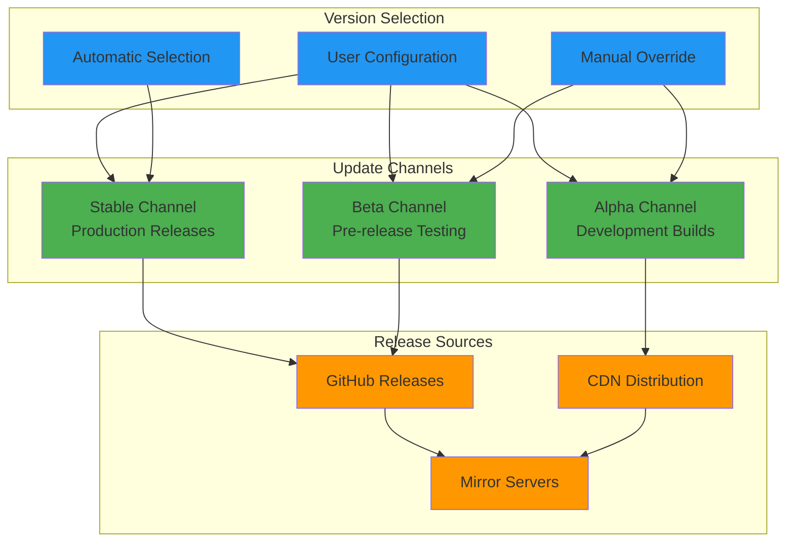
```mermaid
graph TB
    subgraph "Update Channels"
        STABLE[Stable Channel<br/>Production Releases]
        BETA[Beta Channel<br/>Pre-release Testing]
        ALPHA[Alpha Channel<br/>Development Builds]
    end
    
    subgraph "Version Selection"
        CONFIG[User Configuration]
        AUTO[Automatic Selection]
        MANUAL[Manual Override]
    end
    
    subgraph "Release Sources"
        GITHUB[GitHub Releases]
        CDN[CDN Distribution]
        MIRROR[Mirror Servers]
    end
    
    CONFIG --> STABLE
    CONFIG --> BETA
    CONFIG --> ALPHA
    AUTO --> STABLE
    MANUAL --> BETA
    MANUAL --> ALPHA
    
    STABLE --> GITHUB
    BETA --> GITHUB
    ALPHA --> CDN
    GITHUB --> MIRROR
    CDN --> MIRROR
    
    classDef channel fill:#4caf50
    classDef selection fill:#2196f3
    classDef source fill:#ff9800
    
    class STABLE,BETA,ALPHA channel
    class CONFIG,AUTO,MANUAL selection
    class GITHUB,CDN,MIRROR source
```

## Build Process Orchestration

### Development Build Flow

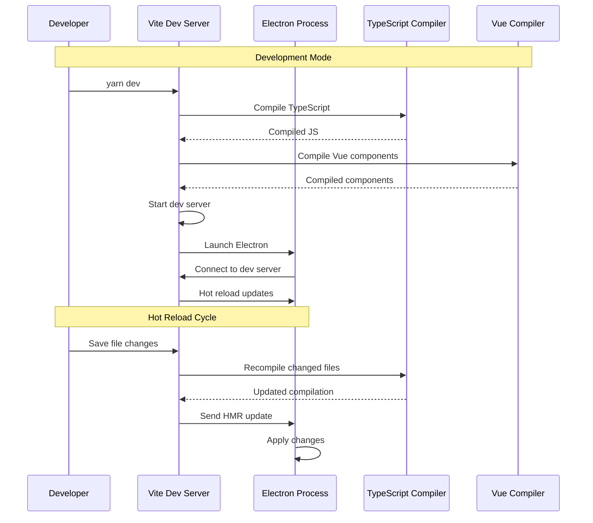
```mermaid
sequenceDiagram
    participant DEV as Developer
    participant VITE as Vite Dev Server
    participant ELECTRON as Electron Process
    participant TS as TypeScript Compiler
    participant VUE as Vue Compiler
    
    Note over DEV,VUE: Development Mode
    
    DEV->>VITE: yarn dev
    VITE->>TS: Compile TypeScript
    TS-->>VITE: Compiled JS
    VITE->>VUE: Compile Vue components
    VUE-->>VITE: Compiled components
    VITE->>VITE: Start dev server
    VITE->>ELECTRON: Launch Electron
    ELECTRON->>VITE: Connect to dev server
    VITE->>ELECTRON: Hot reload updates
    
    Note over DEV,ELECTRON: Hot Reload Cycle
    
    DEV->>VITE: Save file changes
    VITE->>TS: Recompile changed files
    TS-->>VITE: Updated compilation
    VITE->>ELECTRON: Send HMR update
    ELECTRON->>ELECTRON: Apply changes
```

### Production Build Flow

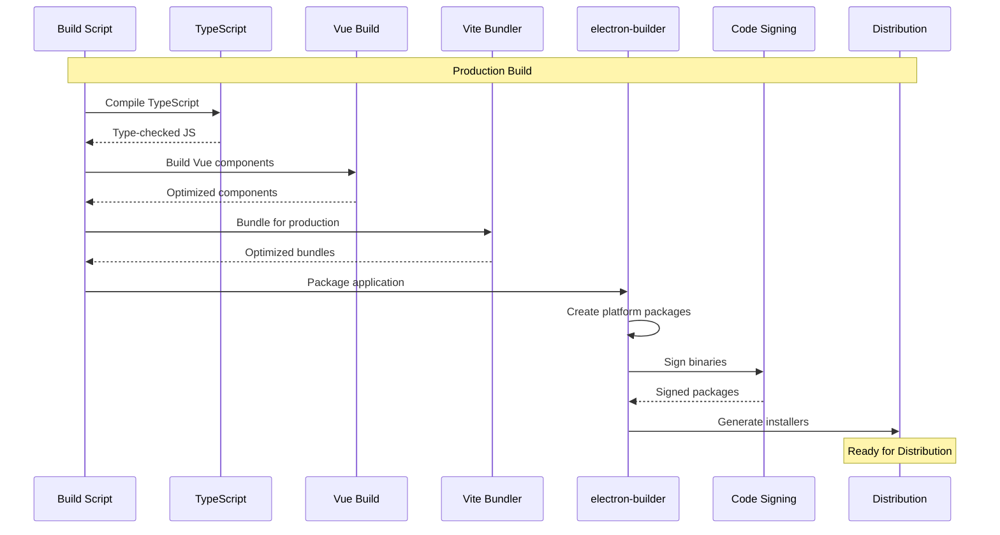
```mermaid
sequenceDiagram
    participant BUILD as Build Script
    participant TS as TypeScript
    participant VUE as Vue Build
    participant VITE as Vite Bundler
    participant ELECTRON as electron-builder
    participant SIGN as Code Signing
    participant DIST as Distribution
    
    Note over BUILD,DIST: Production Build
    
    BUILD->>TS: Compile TypeScript
    TS-->>BUILD: Type-checked JS
    BUILD->>VUE: Build Vue components
    VUE-->>BUILD: Optimized components
    BUILD->>VITE: Bundle for production
    VITE-->>BUILD: Optimized bundles
    BUILD->>ELECTRON: Package application
    ELECTRON->>ELECTRON: Create platform packages
    ELECTRON->>SIGN: Sign binaries
    SIGN-->>ELECTRON: Signed packages
    ELECTRON->>DIST: Generate installers
    
    Note over DIST: Ready for Distribution
```

## Resource Management

### Memory Management Strategy

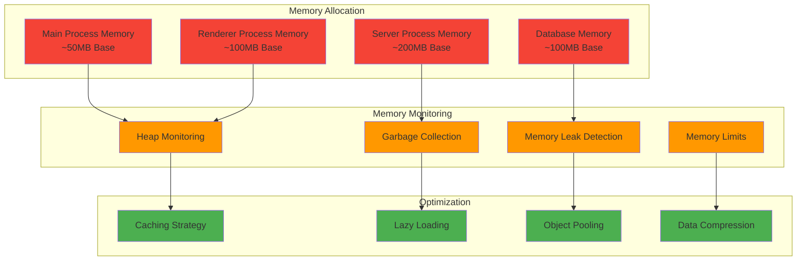
```mermaid
graph TB
    subgraph "Memory Allocation"
        MAIN[Main Process Memory<br/>~50MB Base]
        RENDERER[Renderer Process Memory<br/>~100MB Base]
        SERVER[Server Process Memory<br/>~200MB Base]
        DATABASE[Database Memory<br/>~100MB Base]
    end
    
    subgraph "Memory Monitoring"
        HEAP[Heap Monitoring]
        GC[Garbage Collection]
        LEAK[Memory Leak Detection]
        LIMIT[Memory Limits]
    end
    
    subgraph "Optimization"
        CACHE[Caching Strategy]
        LAZY[Lazy Loading]
        POOL[Object Pooling]
        COMPRESS[Data Compression]
    end
    
    MAIN --> HEAP
    RENDERER --> HEAP
    SERVER --> GC
    DATABASE --> LEAK
    HEAP --> CACHE
    GC --> LAZY
    LEAK --> POOL
    LIMIT --> COMPRESS
    
    classDef memory fill:#f44336
    classDef monitor fill:#ff9800
    classDef optimize fill:#4caf50
    
    class MAIN,RENDERER,SERVER,DATABASE memory
    class HEAP,GC,LEAK,LIMIT monitor
    class CACHE,LAZY,POOL,COMPRESS optimize
```

### File System Operations

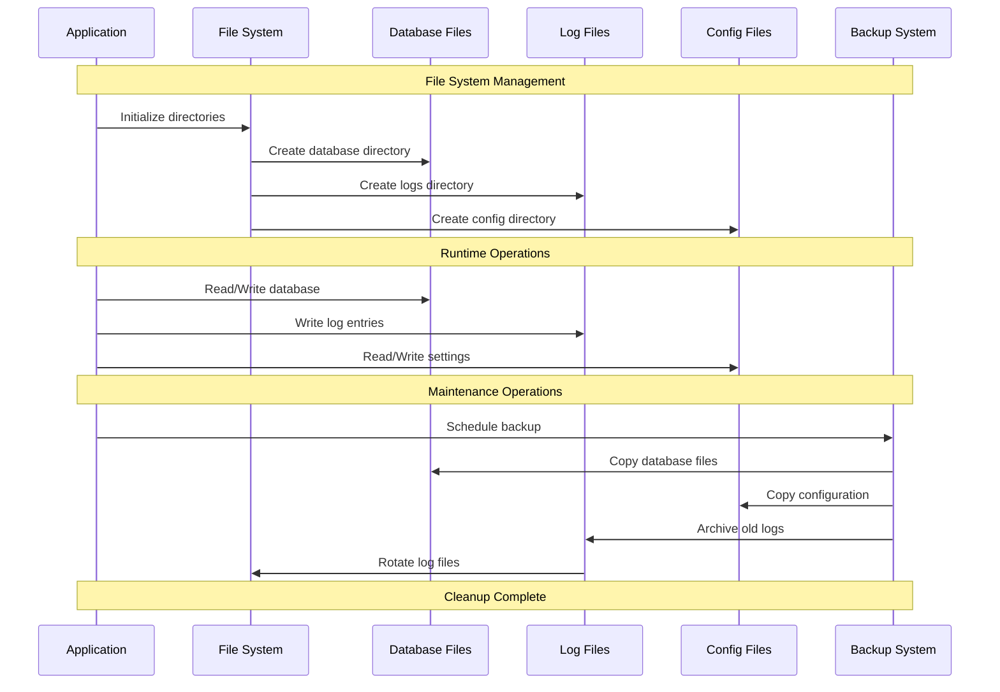
```mermaid
sequenceDiagram
    participant APP as Application
    participant FS as File System
    participant DB as Database Files
    participant LOGS as Log Files
    participant CONFIG as Config Files
    participant BACKUP as Backup System
    
    Note over APP,BACKUP: File System Management
    
    APP->>FS: Initialize directories
    FS->>DB: Create database directory
    FS->>LOGS: Create logs directory
    FS->>CONFIG: Create config directory
    
    Note over APP,BACKUP: Runtime Operations
    
    APP->>DB: Read/Write database
    APP->>LOGS: Write log entries
    APP->>CONFIG: Read/Write settings
    
    Note over APP,BACKUP: Maintenance Operations
    
    APP->>BACKUP: Schedule backup
    BACKUP->>DB: Copy database files
    BACKUP->>CONFIG: Copy configuration
    BACKUP->>LOGS: Archive old logs
    LOGS->>FS: Rotate log files
    
    Note over APP,BACKUP: Cleanup Complete
```

## Event System Architecture

### Event Flow Orchestration

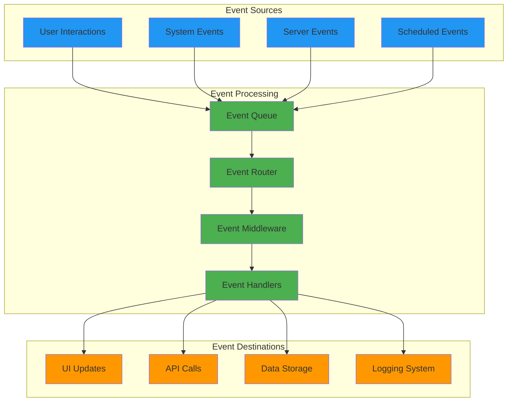
```mermaid
graph TB
    subgraph "Event Sources"
        USER[User Interactions]
        SYSTEM[System Events]
        SERVER[Server Events]
        TIMER[Scheduled Events]
    end
    
    subgraph "Event Processing"
        QUEUE[Event Queue]
        ROUTER[Event Router]
        HANDLER[Event Handlers]
        MIDDLEWARE[Event Middleware]
    end
    
    subgraph "Event Destinations"
        UI[UI Updates]
        API[API Calls]
        STORAGE[Data Storage]
        LOG[Logging System]
    end
    
    USER --> QUEUE
    SYSTEM --> QUEUE
    SERVER --> QUEUE
    TIMER --> QUEUE
    QUEUE --> ROUTER
    ROUTER --> MIDDLEWARE
    MIDDLEWARE --> HANDLER
    HANDLER --> UI
    HANDLER --> API
    HANDLER --> STORAGE
    HANDLER --> LOG
    
    classDef source fill:#2196f3
    classDef process fill:#4caf50
    classDef destination fill:#ff9800
    
    class USER,SYSTEM,SERVER,TIMER source
    class QUEUE,ROUTER,HANDLER,MIDDLEWARE process
    class UI,API,STORAGE,LOG destination
```

### Async Operation Management

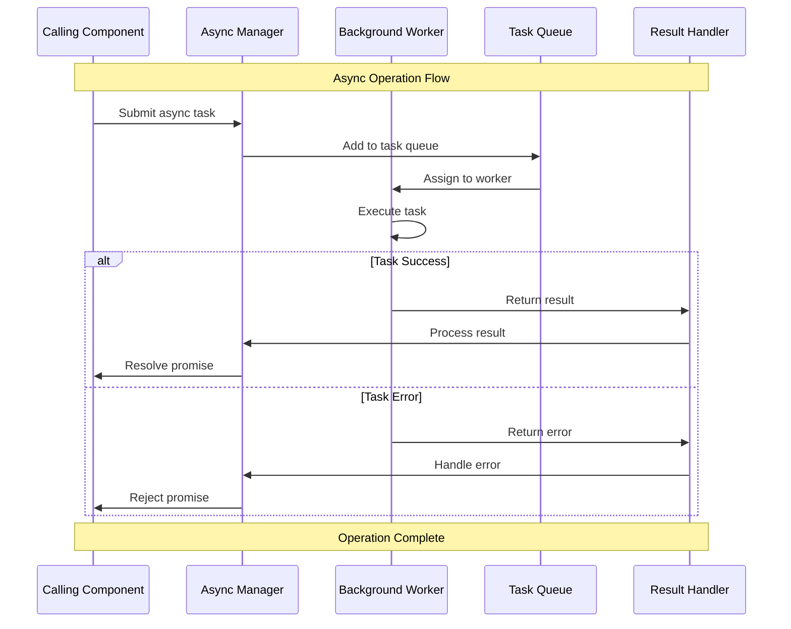
```mermaid
sequenceDiagram
    participant CALLER as Calling Component
    participant ASYNC as Async Manager
    participant WORKER as Background Worker
    participant QUEUE as Task Queue
    participant RESULT as Result Handler
    
    Note over CALLER,RESULT: Async Operation Flow
    
    CALLER->>ASYNC: Submit async task
    ASYNC->>QUEUE: Add to task queue
    QUEUE->>WORKER: Assign to worker
    WORKER->>WORKER: Execute task
    
    alt Task Success
        WORKER->>RESULT: Return result
        RESULT->>ASYNC: Process result
        ASYNC->>CALLER: Resolve promise
    else Task Error
        WORKER->>RESULT: Return error
        RESULT->>ASYNC: Handle error
        ASYNC->>CALLER: Reject promise
    end
    
    Note over CALLER,RESULT: Operation Complete
```

## Performance Monitoring

### Real-time Performance Tracking

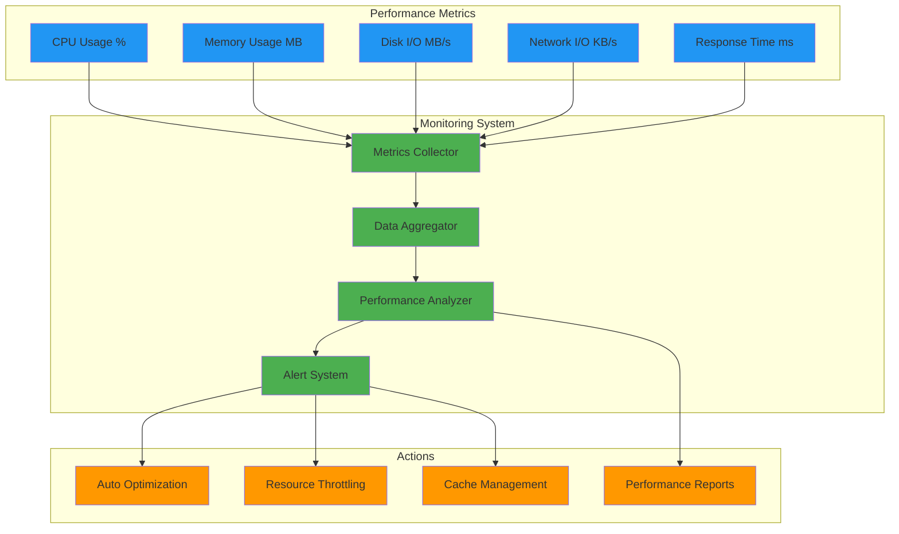
```mermaid
graph TB
    subgraph "Performance Metrics"
        CPU[CPU Usage %]
        MEMORY[Memory Usage MB]
        DISK[Disk I/O MB/s]
        NETWORK[Network I/O KB/s]
        RESPONSE[Response Time ms]
    end
    
    subgraph "Monitoring System"
        COLLECTOR[Metrics Collector]
        AGGREGATOR[Data Aggregator]
        ANALYZER[Performance Analyzer]
        ALERTER[Alert System]
    end
    
    subgraph "Actions"
        OPTIMIZE[Auto Optimization]
        THROTTLE[Resource Throttling]
        CACHE[Cache Management]
        REPORT[Performance Reports]
    end
    
    CPU --> COLLECTOR
    MEMORY --> COLLECTOR
    DISK --> COLLECTOR
    NETWORK --> COLLECTOR
    RESPONSE --> COLLECTOR
    COLLECTOR --> AGGREGATOR
    AGGREGATOR --> ANALYZER
    ANALYZER --> ALERTER
    ALERTER --> OPTIMIZE
    ALERTER --> THROTTLE
    ALERTER --> CACHE
    ANALYZER --> REPORT
    
    classDef metric fill:#2196f3
    classDef monitor fill:#4caf50
    classDef action fill:#ff9800
    
    class CPU,MEMORY,DISK,NETWORK,RESPONSE metric
    class COLLECTOR,AGGREGATOR,ANALYZER,ALERTER monitor
    class OPTIMIZE,THROTTLE,CACHE,REPORT action
```

## Summary

The ERPNext Desktop Application implements sophisticated process orchestration through:

1. **Sequential Startup**: Coordinated initialization of all components
2. **Secure IPC**: Type-safe communication between processes
3. **Robust Error Handling**: Comprehensive error recovery mechanisms
4. **Resource Management**: Efficient memory and file system operations
5. **Performance Monitoring**: Real-time performance tracking and optimization
6. **Event-Driven Architecture**: Scalable event processing system

This orchestration ensures reliable, performant, and maintainable desktop application operation across all supported platforms.