# Security Model & Considerations

## Overview

ERPNext Desktop implements a comprehensive security model designed to protect user data, ensure process isolation, and maintain system integrity while providing a seamless desktop experience.

## Security Architecture Overview

```mermaid
graph TB
    subgraph "Security Layers"
        subgraph "Application Security"
            CSP[Content Security Policy]
            CI[Context Isolation]
            SAND[Process Sandboxing]
            API[Secure API Bridge]
        end
        
        subgraph "Data Security"
            ENC[Data Encryption]
            AUTH[Authentication]
            PERM[File Permissions]
            BACKUP[Secure Backups]
        end
        
        subgraph "Network Security"
            LOCAL[Local-only Communication]
            TLS[TLS Encryption]
            CORS[CORS Protection]
            VALID[Input Validation]
        end
        
        subgraph "System Security"
            PRIV[Privilege Separation]
            SIGN[Code Signing]
            UPDATE[Secure Updates]
            AUDIT[Security Auditing]
        end
    end
    
    subgraph "External Threats"
        XSS[XSS Attacks]
        RCE[Remote Code Execution]
        CSRF[CSRF Attacks]
        MITM[Man-in-the-Middle]
        MALWARE[Malware Injection]
    end
    
    CSP --> XSS
    CI --> RCE
    SAND --> RCE
    API --> XSS
    ENC --> MITM
    AUTH --> CSRF
    LOCAL --> MITM
    TLS --> MITM
    SIGN --> MALWARE
    UPDATE --> MALWARE
    
    classDef security fill:#4caf50
    classDef threat fill:#f44336
    
    class CSP,CI,SAND,API,ENC,AUTH,PERM,BACKUP,LOCAL,TLS,CORS,VALID,PRIV,SIGN,UPDATE,AUDIT security
    class XSS,RCE,CSRF,MITM,MALWARE threat
```

## Process Isolation & Sandboxing

### Electron Security Model

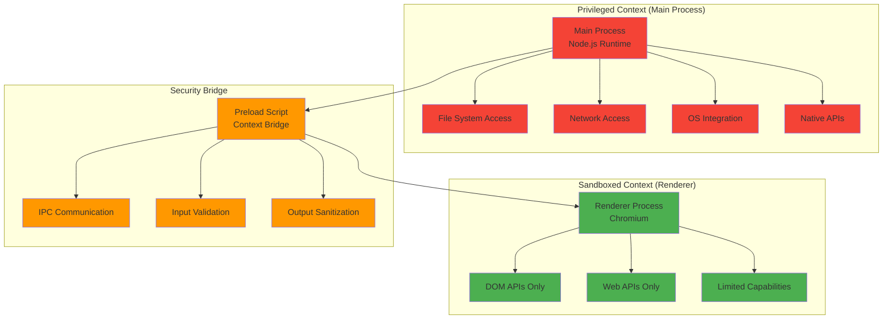

### Security Configuration

```javascript
// webPreferences security settings
const securityConfig = {
  nodeIntegration: false,        // Disable Node.js in renderer
  contextIsolation: true,        // Enable context isolation
  sandbox: false,                // Partial sandbox (preload script needs access)
  webSecurity: true,             // Enable web security
  allowRunningInsecureContent: false, // Block mixed content
  experimentalFeatures: false,   // Disable experimental features
  enableBlinkFeatures: '',       // No additional features
  disableBlinkFeatures: 'Auxclick' // Disable potential attack vectors
};
```

## Content Security Policy (CSP)

### CSP Implementation

```html
<!-- Strict CSP header for security -->
<meta http-equiv="Content-Security-Policy" content="
  default-src 'self' http://localhost:* https://localhost:*;
  script-src 'self' 'unsafe-inline';
  style-src 'self' 'unsafe-inline';
  img-src 'self' data: http://localhost:* https://localhost:*;
  connect-src 'self' http://localhost:* https://localhost:* ws://localhost:*;
  font-src 'self';
  object-src 'none';
  media-src 'self';
  frame-src 'none';
  worker-src 'none';
  child-src 'none';
  form-action 'self';
  base-uri 'self';
">
```

### CSP Violation Handling

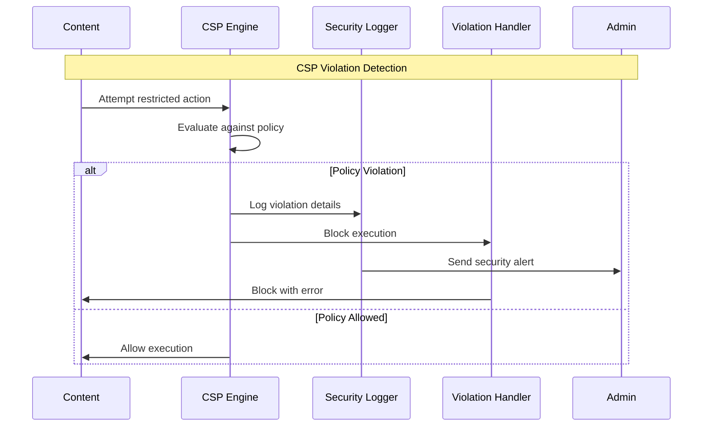

## API Security Bridge

### Secure API Exposure Pattern

```typescript
// Preload script security implementation
import { contextBridge, ipcRenderer } from 'electron';

// Define allowed IPC channels
const ALLOWED_CHANNELS = {
  'check-server-status': true,
  'restart-server': true,
  'update-database-config': true,
  'open-external-url': true,
  'show-open-dialog': true,
  'show-save-dialog': true
} as const;

// Input validation functions
function validateChannel(channel: string): boolean {
  return channel in ALLOWED_CHANNELS;
}

function sanitizeInput(input: any): any {
  // Remove dangerous properties and methods
  if (typeof input === 'object' && input !== null) {
    const sanitized = {};
    for (const [key, value] of Object.entries(input)) {
      if (typeof value !== 'function' && !key.startsWith('__')) {
        sanitized[key] = sanitizeInput(value);
      }
    }
    return sanitized;
  }
  return input;
}

// Secure API bridge
contextBridge.exposeInMainWorld('erpnextAPI', {
  server: {
    checkStatus: () => ipcRenderer.invoke('check-server-status'),
    restart: () => ipcRenderer.invoke('restart-server')
  },
  config: {
    updateDatabase: (config: any) => 
      ipcRenderer.invoke('update-database-config', sanitizeInput(config))
  },
  system: {
    openExternal: (url: string) => {
      // URL validation
      if (typeof url === 'string' && (url.startsWith('http://') || url.startsWith('https://'))) {
        return ipcRenderer.invoke('open-external-url', url);
      }
      throw new Error('Invalid URL');
    }
  }
});
```

### IPC Security Validation

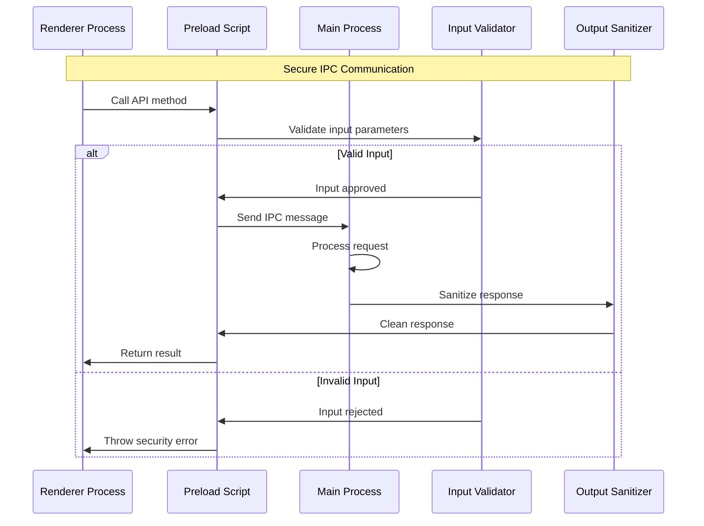

## Data Protection & Encryption

### Database Security

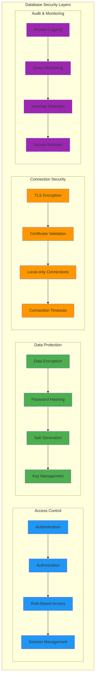

### File System Security

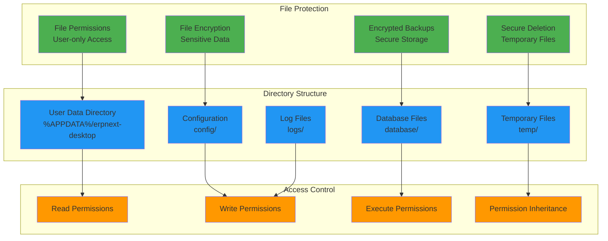

## Network Security

### Local Communication Security

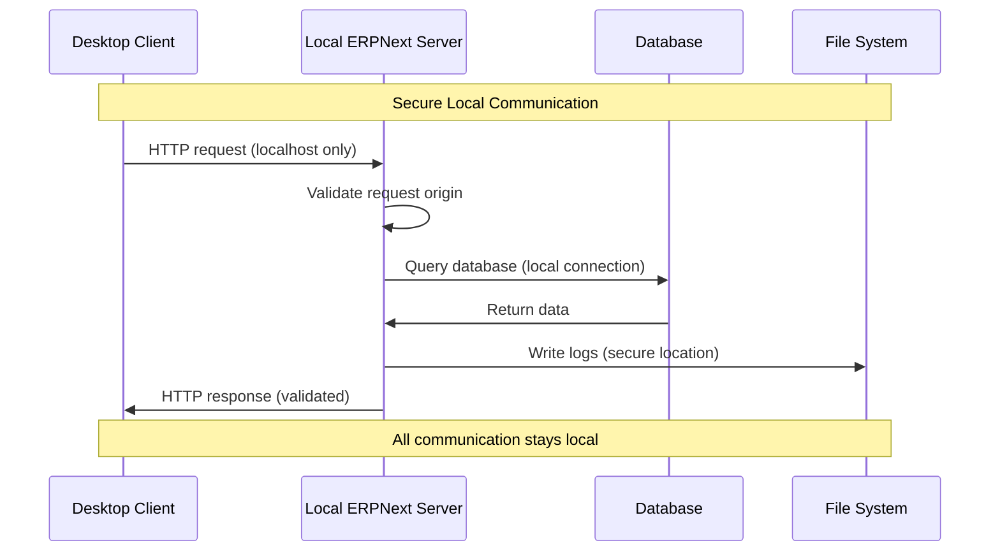

### Network Isolation Strategy

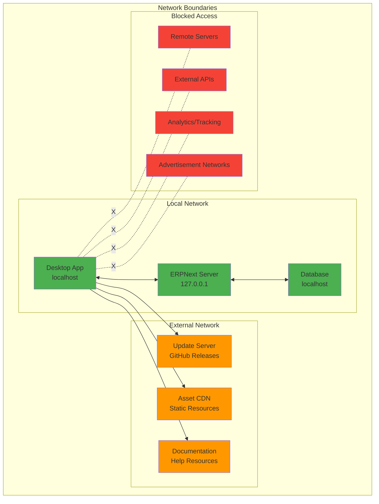

## Code Signing & Update Security

### Code Signing Process

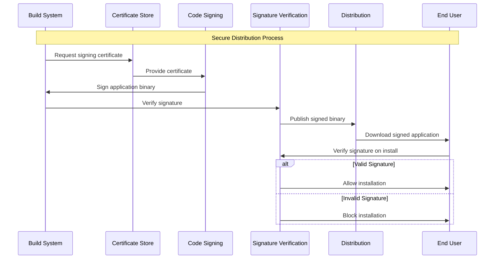

### Update Security Protocol

```mermaid
graph TB
    subgraph "Update Security Chain"
        subgraph "Source Verification"
            GITHUB[GitHub Releases<br/>Official Source]
            HASH[SHA256 Checksums<br/>Integrity Verification]
            SIG[Digital Signatures<br/>Authenticity Verification]
        end
        
        subgraph "Download Security"
            TLS[TLS Encryption<br/>Transport Security]
            CERT[Certificate Pinning<br/>MITM Prevention]
            RETRY[Retry Logic<br/>Availability Protection]
        end
        
        subgraph "Installation Security"
            VERIFY[Signature Verification<br/>Before Installation]
            BACKUP[System Backup<br/>Rollback Protection]
            ATOMIC[Atomic Updates<br/>Consistency Protection]
        end
    end
    
    GITHUB --> HASH
    HASH --> SIG
    SIG --> TLS
    TLS --> CERT
    CERT --> RETRY
    RETRY --> VERIFY
    VERIFY --> BACKUP
    BACKUP --> ATOMIC
    
    classDef source fill:#2196f3
    classDef download fill:#4caf50
    classDef install fill:#ff9800
    
    class GITHUB,HASH,SIG source
    class TLS,CERT,RETRY download
    class VERIFY,BACKUP,ATOMIC install
```

## Security Monitoring & Auditing

### Security Event Logging

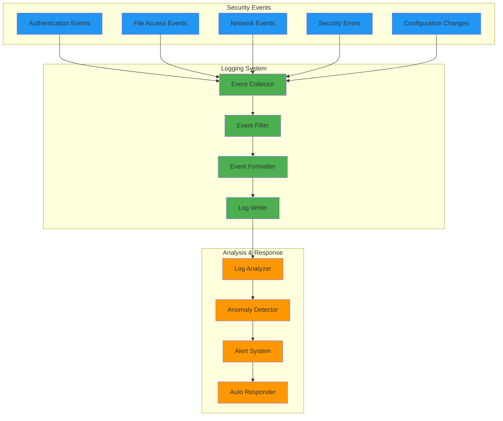

### Security Metrics Dashboard

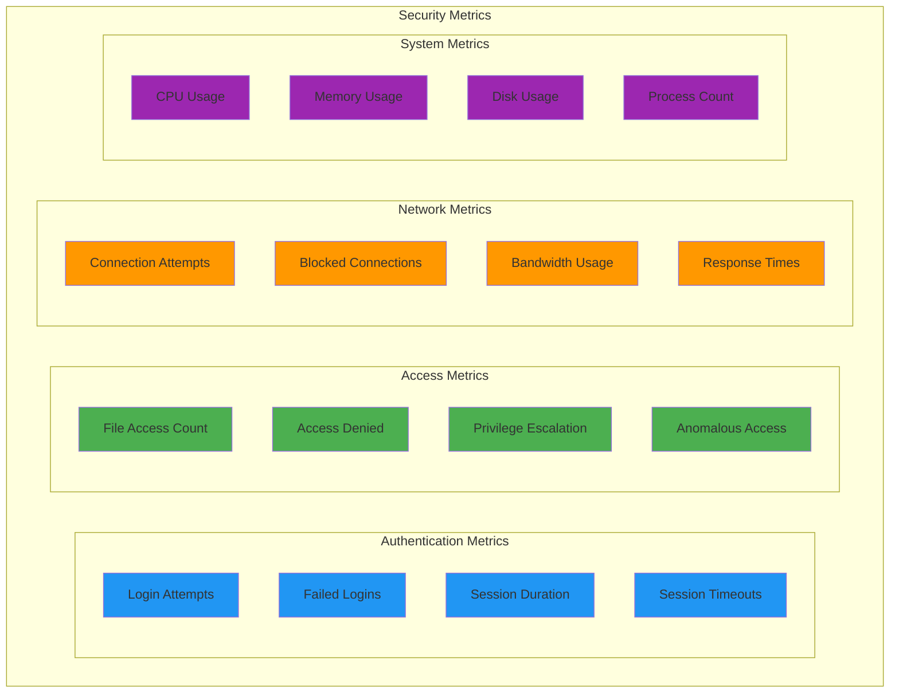

## Vulnerability Management

### Security Vulnerability Assessment

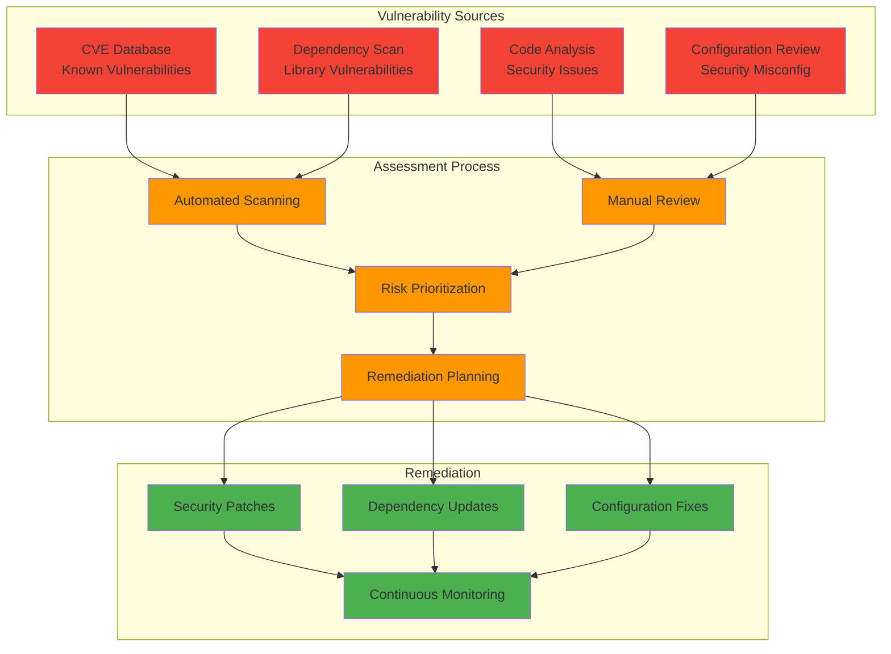

## Incident Response

### Security Incident Workflow

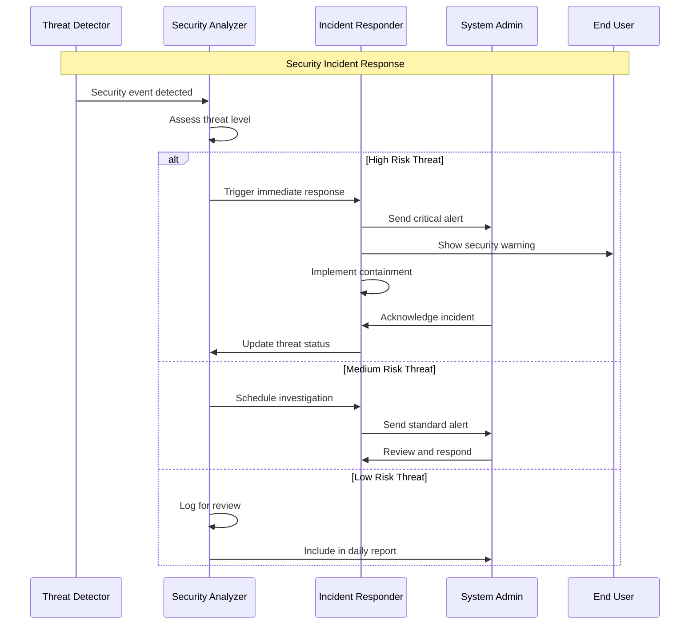

## Privacy Protection

### Data Privacy Framework

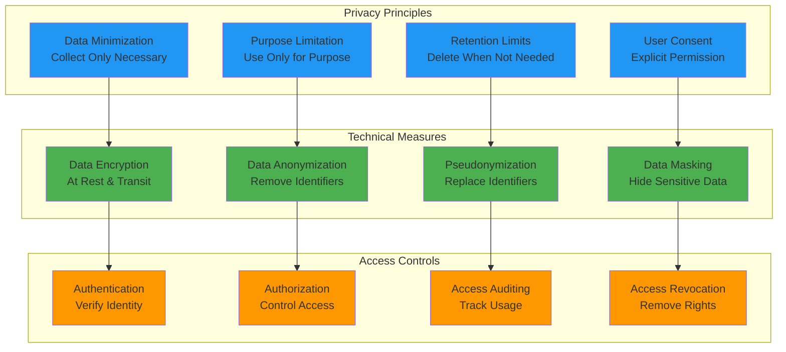

## Security Best Practices

### Implementation Guidelines

1. **Principle of Least Privilege**
   - Grant minimum necessary permissions
   - Regular permission audits
   - Automatic privilege expiration

2. **Defense in Depth**
   - Multiple security layers
   - Redundant security controls
   - Fail-safe defaults

3. **Security by Design**
   - Security requirements from start
   - Threat modeling
   - Security testing

4. **Continuous Security**
   - Regular security updates
   - Ongoing vulnerability assessment
   - Security monitoring

### Security Checklist

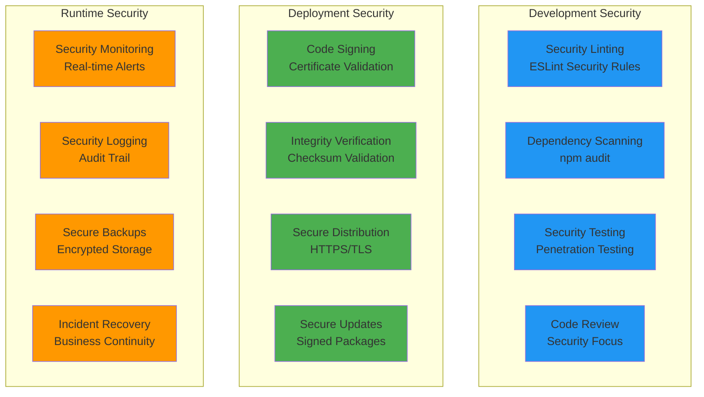

## Summary

The ERPNext Desktop Application implements a comprehensive security model that includes:

1. **Process Isolation**: Electron's sandboxing and context isolation
2. **Secure Communication**: Protected IPC with input validation
3. **Data Protection**: Encryption, secure storage, and access controls
4. **Network Security**: Local-only communication with external update verification
5. **Code Integrity**: Digital signatures and secure update mechanisms
6. **Monitoring & Response**: Security logging, anomaly detection, and incident response
7. **Privacy Protection**: Data minimization and user consent mechanisms

This multi-layered approach ensures that user data remains secure while maintaining the usability and functionality expected from a desktop ERP application.