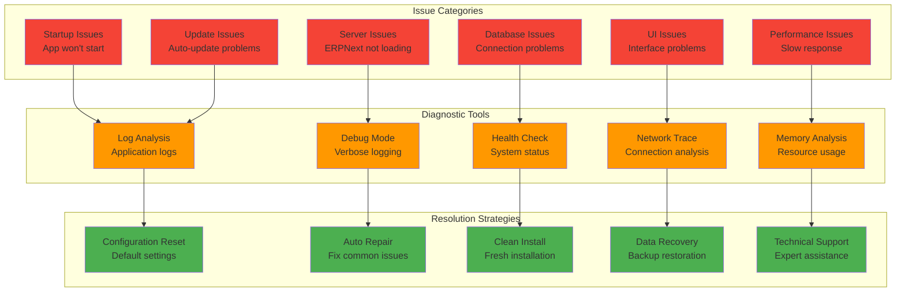
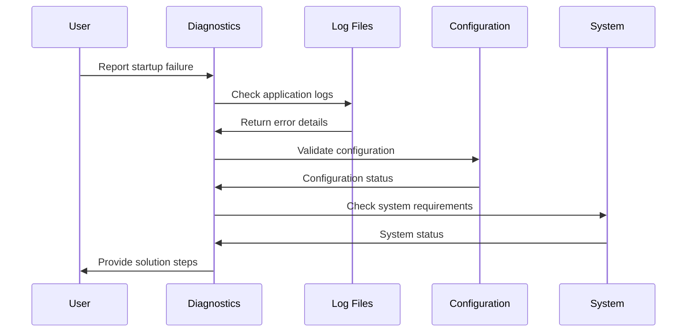

# Troubleshooting Guide

## Overview

This comprehensive troubleshooting guide provides solutions for common issues, diagnostic procedures, and recovery strategies for ERPNext Desktop Application.

## Diagnostic Framework



## Common Issues & Solutions

### Application Startup Issues

#### Issue: Application Won't Start

**Symptoms:**
- Application fails to launch
- Splash screen appears but main window doesn't load
- Process exits immediately after launch

**Diagnostic Steps:**



**Solution Steps:**

1. **Check Application Logs**
   ```bash
   # Windows
   %APPDATA%\erpnext-desktop\logs\application.log
   
   # macOS
   ~/Library/Application Support/erpnext-desktop/logs/application.log
   
   # Linux
   ~/.config/erpnext-desktop/logs/application.log
   ```

2. **Verify System Requirements**
   ```typescript
   // System requirements check
   const systemCheck = {
     node: process.versions.node,
     electron: process.versions.electron,
     platform: process.platform,
     arch: process.arch,
     memory: Math.round(require('os').totalmem() / 1024 / 1024 / 1024) + 'GB'
   };
   
   console.log('System Information:', systemCheck);
   ```

3. **Reset Configuration**
   ```bash
   # Backup current configuration
   cp config.json config.json.backup
   
   # Delete configuration to force defaults
   rm config.json
   
   # Restart application
   ```

4. **Check Port Conflicts**
   ```bash
   # Windows
   netstat -ano | findstr :8000
   
   # macOS/Linux
   lsof -i :8000
   ```

5. **Run in Safe Mode**
   ```bash
   # Start with minimal configuration
   erpnext-desktop --safe-mode
   ```

#### Issue: Slow Startup Performance

**Symptoms:**
- Application takes longer than 30 seconds to start
- Splash screen shows for extended time
- High CPU usage during startup

**Solutions:**

1. **Enable Fast Startup Mode**
   ```json
   // config.json
   {
     "fastStartup": true,
     "preloadModules": false,
     "backgroundServerStart": true
   }
   ```

2. **Optimize Database Configuration**
   ```json
   // For SQLite
   {
     "sqliteConfig": {
       "journalMode": "memory",
       "synchronous": "off",
       "cacheSize": 20000
     }
   }
   ```

3. **Check Antivirus Interference**
   - Add ERPNext Desktop to antivirus exceptions
   - Temporarily disable real-time scanning

### Server Issues

#### Issue: ERPNext Server Won't Start

**Symptoms:**
- Server process fails to start
- Connection refused errors
- Server status shows as stopped

**Diagnostic Commands:**

```typescript
// Server diagnostics utility
class ServerDiagnostics {
  static async runDiagnostics(): Promise<DiagnosticResult> {
    const result: DiagnosticResult = {
      serverProcess: await this.checkServerProcess(),
      portAvailability: await this.checkPortAvailability(),
      databaseConnection: await this.checkDatabaseConnection(),
      logFiles: await this.analyzeLogs(),
      systemResources: await this.checkSystemResources()
    };
    
    return result;
  }
  
  static async checkServerProcess(): Promise<ProcessStatus> {
    try {
      // Check if server process is running
      const processes = await this.getProcessList();
      const serverProcess = processes.find(p => p.name.includes('erpnext'));
      
      return {
        isRunning: !!serverProcess,
        pid: serverProcess?.pid,
        memory: serverProcess?.memory,
        cpu: serverProcess?.cpu
      };
    } catch (error) {
      return { isRunning: false, error: error.message };
    }
  }
  
  static async checkPortAvailability(): Promise<PortStatus> {
    try {
      const net = require('net');
      const server = net.createServer();
      
      return new Promise((resolve) => {
        server.listen(8000, () => {
          server.close();
          resolve({ available: true, port: 8000 });
        });
        
        server.on('error', () => {
          resolve({ available: false, port: 8000, inUse: true });
        });
      });
    } catch (error) {
      return { available: false, port: 8000, error: error.message };
    }
  }
  
  static async checkDatabaseConnection(): Promise<DatabaseStatus> {
    try {
      // Test database connection
      const config = await this.getDatabaseConfig();
      
      if (config.type === 'mariadb') {
        return await this.testMariaDBConnection(config.mariadb);
      } else {
        return await this.testSQLiteConnection(config.sqlite);
      }
    } catch (error) {
      return { connected: false, error: error.message };
    }
  }
}
```

**Solution Steps:**

1. **Check Server Logs**
   ```bash
   # View recent server logs
   tail -f logs/server.log
   
   # Search for specific errors
   grep -i "error\|exception\|failed" logs/server.log
   ```

2. **Verify Database Connection**
   ```typescript
   // Test database connection
   async function testDatabaseConnection() {
     try {
       const result = await window.erpnextAPI.database.query('SELECT 1 as test');
       console.log('Database connection successful');
       return true;
     } catch (error) {
       console.error('Database connection failed:', error);
       return false;
     }
   }
   ```

3. **Check Frappe Bench Setup**
   ```bash
   # Verify bench directory structure
   ls -la frappe-bench/
   
   # Check site configuration
   cat frappe-bench/sites/erpnext.localhost/site_config.json
   
   # Verify Python environment
   frappe-bench/env/bin/python --version
   ```

4. **Fix Common Server Issues**
   ```bash
   # Rebuild Python environment
   cd frappe-bench
   ./env/bin/pip install --upgrade -r requirements.txt
   
   # Clear cache
   bench clear-cache
   
   # Rebuild assets
   bench build
   ```

#### Issue: Server Performance Problems

**Symptoms:**
- Slow page loading
- High CPU usage
- Memory leaks
- Request timeouts

**Performance Monitoring:**

```typescript
class PerformanceMonitor {
  private metrics: Map<string, number[]> = new Map();
  
  startMonitoring(): void {
    setInterval(() => {
      this.collectMetrics();
    }, 5000); // Collect every 5 seconds
  }
  
  private collectMetrics(): void {
    const usage = process.memoryUsage();
    const cpuUsage = process.cpuUsage();
    
    // Memory metrics
    this.addMetric('memory.rss', usage.rss / 1024 / 1024); // MB
    this.addMetric('memory.heapUsed', usage.heapUsed / 1024 / 1024);
    this.addMetric('memory.heapTotal', usage.heapTotal / 1024 / 1024);
    
    // CPU metrics
    this.addMetric('cpu.user', cpuUsage.user / 1000); // ms to µs
    this.addMetric('cpu.system', cpuUsage.system / 1000);
    
    // Check for memory leaks
    if (usage.heapUsed > 500 * 1024 * 1024) { // 500MB
      console.warn('Possible memory leak detected');
      this.triggerGarbageCollection();
    }
  }
  
  private addMetric(name: string, value: number): void {
    if (!this.metrics.has(name)) {
      this.metrics.set(name, []);
    }
    
    const values = this.metrics.get(name)!;
    values.push(value);
    
    // Keep only last 100 measurements
    if (values.length > 100) {
      values.shift();
    }
  }
  
  private triggerGarbageCollection(): void {
    if (global.gc) {
      global.gc();
    }
  }
  
  getMetrics(): Record<string, any> {
    const result: Record<string, any> = {};
    
    for (const [name, values] of this.metrics) {
      result[name] = {
        current: values[values.length - 1],
        average: values.reduce((a, b) => a + b, 0) / values.length,
        min: Math.min(...values),
        max: Math.max(...values)
      };
    }
    
    return result;
  }
}
```

**Optimization Steps:**

1. **Database Optimization**
   ```sql
   -- Analyze database performance
   SHOW PROCESSLIST;
   SHOW ENGINE INNODB STATUS;
   
   -- Optimize tables
   OPTIMIZE TABLE tabUser, tabItem, tabSales Invoice;
   
   -- Update statistics
   ANALYZE TABLE tabUser, tabItem, tabSales Invoice;
   ```

2. **Server Configuration Tuning**
   ```json
   // Optimized server configuration
   {
     "serverTimeout": 60000,
     "maxConnections": 100,
     "keepAliveTimeout": 5000,
     "bodyParser": {
       "limit": "50mb"
     },
     "compression": {
       "level": 6,
       "threshold": 1024
     }
   }
   ```

3. **Memory Management**
   ```javascript
   // Enable garbage collection monitoring
   process.env.NODE_OPTIONS = '--max-old-space-size=2048 --expose-gc';
   
   // Monitor memory usage
   setInterval(() => {
     const usage = process.memoryUsage();
     console.log('Memory usage:', {
       rss: Math.round(usage.rss / 1024 / 1024) + 'MB',
       heapUsed: Math.round(usage.heapUsed / 1024 / 1024) + 'MB',
       heapTotal: Math.round(usage.heapTotal / 1024 / 1024) + 'MB'
     });
   }, 30000);
   ```

### Database Issues

#### Issue: Database Connection Failures

**Symptoms:**
- "Connection refused" errors
- Database timeout errors
- Authentication failures

**Connection Diagnostics:**

```typescript
class DatabaseDiagnostics {
  static async diagnoseDatabaseIssue(config: DatabaseConfig): Promise<DiagnosticReport> {
    const report: DiagnosticReport = {
      timestamp: new Date().toISOString(),
      databaseType: config.type,
      tests: []
    };
    
    if (config.type === 'mariadb') {
      report.tests.push(await this.testMariaDBService());
      report.tests.push(await this.testMariaDBCredentials(config.mariadb));
      report.tests.push(await this.testMariaDBPermissions(config.mariadb));
    } else {
      report.tests.push(await this.testSQLiteFile(config.sqlite));
      report.tests.push(await this.testSQLitePermissions(config.sqlite));
    }
    
    return report;
  }
  
  static async testMariaDBService(): Promise<TestResult> {
    try {
      const { exec } = require('child_process');
      
      return new Promise((resolve) => {
        exec('mysqladmin ping', (error, stdout, stderr) => {
          if (error) {
            resolve({
              test: 'MariaDB Service',
              passed: false,
              error: 'MariaDB service is not running',
              suggestion: 'Start MariaDB service: sudo systemctl start mariadb'
            });
          } else {
            resolve({
              test: 'MariaDB Service',
              passed: true,
              message: 'MariaDB service is running'
            });
          }
        });
      });
    } catch (error) {
      return {
        test: 'MariaDB Service',
        passed: false,
        error: error.message
      };
    }
  }
  
  static async testMariaDBCredentials(config: MariaDBConfig): Promise<TestResult> {
    try {
      const mysql = require('mysql2/promise');
      
      const connection = await mysql.createConnection({
        host: config.host,
        port: config.port,
        user: config.user,
        password: config.password
      });
      
      await connection.end();
      
      return {
        test: 'MariaDB Credentials',
        passed: true,
        message: 'Authentication successful'
      };
    } catch (error) {
      return {
        test: 'MariaDB Credentials',
        passed: false,
        error: error.message,
        suggestion: 'Check username and password in configuration'
      };
    }
  }
  
  static async testSQLiteFile(config: SQLiteConfig): Promise<TestResult> {
    try {
      const fs = require('fs');
      const path = require('path');
      
      const dbPath = config.filename;
      const dbDir = path.dirname(dbPath);
      
      // Check if directory exists
      if (!fs.existsSync(dbDir)) {
        return {
          test: 'SQLite File Access',
          passed: false,
          error: `Database directory does not exist: ${dbDir}`,
          suggestion: `Create directory: mkdir -p ${dbDir}`
        };
      }
      
      // Check if file exists and is readable
      if (fs.existsSync(dbPath)) {
        try {
          fs.accessSync(dbPath, fs.constants.R_OK | fs.constants.W_OK);
          return {
            test: 'SQLite File Access',
            passed: true,
            message: 'Database file is accessible'
          };
        } catch (error) {
          return {
            test: 'SQLite File Access',
            passed: false,
            error: 'Insufficient permissions for database file',
            suggestion: `Fix permissions: chmod 664 ${dbPath}`
          };
        }
      } else {
        return {
          test: 'SQLite File Access',
          passed: true,
          message: 'Database file will be created on first use'
        };
      }
    } catch (error) {
      return {
        test: 'SQLite File Access',
        passed: false,
        error: error.message
      };
    }
  }
}
```

**Solution Steps:**

1. **MariaDB Connection Issues**
   ```bash
   # Check MariaDB service status
   sudo systemctl status mariadb
   
   # Start MariaDB service
   sudo systemctl start mariadb
   
   # Test connection manually
   mysql -h localhost -P 3306 -u root -p
   
   # Check MariaDB error log
   sudo tail -f /var/log/mysql/error.log
   ```

2. **SQLite Permission Issues**
   ```bash
   # Check file permissions
   ls -la erpnext.db
   
   # Fix permissions
   chmod 664 erpnext.db
   chown $USER:$USER erpnext.db
   
   # Check directory permissions
   ls -ld database/
   chmod 755 database/
   ```

3. **Database Recovery**
   ```sql
   -- Check database integrity
   CHECK TABLE tabUser;
   
   -- Repair corrupted tables
   REPAIR TABLE tabUser;
   
   -- Rebuild indexes
   ALTER TABLE tabUser ENGINE=InnoDB;
   ```

### UI Issues

#### Issue: Interface Not Loading

**Symptoms:**
- Blank white screen
- JavaScript errors in console
- CSS not loading properly

**Frontend Diagnostics:**

```typescript
class UIDebugger {
  static enableDebugging(): void {
    // Enable verbose console logging
    window.debug = {
      // API testing
      testAPI: async () => {
        try {
          const status = await window.erpnextAPI.server.checkStatus();
          console.log('Server status:', status);
          return status;
        } catch (error) {
          console.error('API test failed:', error);
          return false;
        }
      },
      
      // Performance monitoring
      monitorPerformance: () => {
        const observer = new PerformanceObserver((list) => {
          list.getEntries().forEach((entry) => {
            console.log(`${entry.name}: ${entry.duration}ms`);
          });
        });
        observer.observe({ entryTypes: ['navigation', 'resource'] });
      },
      
      // Memory monitoring
      checkMemory: () => {
        if ('memory' in performance) {
          console.log('Memory usage:', (performance as any).memory);
        }
      },
      
      // Network monitoring
      monitorNetwork: () => {
        window.addEventListener('online', () => {
          console.log('Network: Online');
        });
        
        window.addEventListener('offline', () => {
          console.log('Network: Offline');
        });
      }
    };
    
    // Global error handler
    window.addEventListener('error', (event) => {
      console.error('Global error:', {
        message: event.message,
        filename: event.filename,
        lineno: event.lineno,
        colno: event.colno,
        error: event.error
      });
    });
    
    // Unhandled promise rejection handler
    window.addEventListener('unhandledrejection', (event) => {
      console.error('Unhandled promise rejection:', event.reason);
    });
  }
  
  static generateDiagnosticReport(): DiagnosticReport {
    return {
      timestamp: new Date().toISOString(),
      userAgent: navigator.userAgent,
      url: window.location.href,
      viewport: {
        width: window.innerWidth,
        height: window.innerHeight
      },
      performance: this.getPerformanceMetrics(),
      errors: this.getErrorLog(),
      console: this.getConsoleLog()
    };
  }
  
  private static getPerformanceMetrics(): any {
    const navigation = performance.getEntriesByType('navigation')[0] as any;
    
    return {
      domContentLoaded: navigation.domContentLoadedEventEnd - navigation.navigationStart,
      loadComplete: navigation.loadEventEnd - navigation.navigationStart,
      firstPaint: performance.getEntriesByType('paint')
        .find(entry => entry.name === 'first-paint')?.startTime,
      firstContentfulPaint: performance.getEntriesByType('paint')
        .find(entry => entry.name === 'first-contentful-paint')?.startTime
    };
  }
}
```

**Solution Steps:**

1. **Clear Application Cache**
   ```bash
   # Windows
   rd /s /q "%APPDATA%\erpnext-desktop\cache"
   
   # macOS
   rm -rf ~/Library/Application Support/erpnext-desktop/cache
   
   # Linux
   rm -rf ~/.config/erpnext-desktop/cache
   ```

2. **Reset Renderer Process**
   ```javascript
   // In main process
   if (mainWindow) {
     mainWindow.reload();
   }
   
   // Or create new window
   createWindow();
   ```

3. **Check CSS and Asset Loading**
   ```javascript
   // Verify asset loading
   const links = document.querySelectorAll('link[rel="stylesheet"]');
   links.forEach(link => {
     if (link.sheet === null) {
       console.error('Failed to load CSS:', link.href);
     }
   });
   
   // Check for JavaScript errors
   const scripts = document.querySelectorAll('script[src]');
   scripts.forEach(script => {
     script.addEventListener('error', (e) => {
       console.error('Failed to load script:', script.src);
     });
   });
   ```

### Performance Issues

#### Issue: High Memory Usage

**Symptoms:**
- Application using more than 1GB RAM
- System becoming sluggish
- Out of memory errors

**Memory Optimization:**

```typescript
class MemoryOptimizer {
  private memoryThreshold = 800 * 1024 * 1024; // 800MB
  private cleanupInterval: NodeJS.Timeout | null = null;
  
  startMonitoring(): void {
    this.cleanupInterval = setInterval(() => {
      this.checkMemoryUsage();
    }, 30000); // Check every 30 seconds
  }
  
  stopMonitoring(): void {
    if (this.cleanupInterval) {
      clearInterval(this.cleanupInterval);
      this.cleanupInterval = null;
    }
  }
  
  private checkMemoryUsage(): void {
    const usage = process.memoryUsage();
    
    if (usage.heapUsed > this.memoryThreshold) {
      console.warn('High memory usage detected:', {
        heapUsed: Math.round(usage.heapUsed / 1024 / 1024) + 'MB',
        heapTotal: Math.round(usage.heapTotal / 1024 / 1024) + 'MB',
        rss: Math.round(usage.rss / 1024 / 1024) + 'MB'
      });
      
      this.performCleanup();
    }
  }
  
  private performCleanup(): void {
    // Force garbage collection if available
    if (global.gc) {
      global.gc();
    }
    
    // Clear caches
    this.clearCaches();
    
    // Emit memory warning event
    process.emit('memory-warning' as any, {
      usage: process.memoryUsage(),
      timestamp: Date.now()
    });
  }
  
  private clearCaches(): void {
    // Clear require cache (development only)
    if (process.env.NODE_ENV === 'development') {
      Object.keys(require.cache).forEach((key) => {
        if (key.includes('node_modules')) return;
        delete require.cache[key];
      });
    }
    
    // Clear internal caches
    if (typeof global !== 'undefined' && global.clearCache) {
      global.clearCache();
    }
  }
  
  getMemoryReport(): MemoryReport {
    const usage = process.memoryUsage();
    
    return {
      timestamp: new Date().toISOString(),
      memory: {
        rss: usage.rss,
        heapUsed: usage.heapUsed,
        heapTotal: usage.heapTotal,
        external: usage.external,
        arrayBuffers: usage.arrayBuffers
      },
      formatted: {
        rss: Math.round(usage.rss / 1024 / 1024) + 'MB',
        heapUsed: Math.round(usage.heapUsed / 1024 / 1024) + 'MB',
        heapTotal: Math.round(usage.heapTotal / 1024 / 1024) + 'MB'
      },
      thresholdExceeded: usage.heapUsed > this.memoryThreshold
    };
  }
}
```

### Update Issues

#### Issue: Auto-Update Failures

**Symptoms:**
- Update check fails
- Download errors
- Installation failures

**Update Diagnostics:**

```typescript
class UpdateDiagnostics {
  static async diagnoseUpdateIssue(): Promise<UpdateDiagnosticReport> {
    const report: UpdateDiagnosticReport = {
      timestamp: new Date().toISOString(),
      currentVersion: app.getVersion(),
      updateChannel: this.getUpdateChannel(),
      connectivity: await this.testConnectivity(),
      permissions: await this.checkPermissions(),
      diskSpace: await this.checkDiskSpace(),
      suggestions: []
    };
    
    // Analyze issues and provide suggestions
    if (!report.connectivity.github) {
      report.suggestions.push('Check internet connection and firewall settings');
    }
    
    if (!report.permissions.canWrite) {
      report.suggestions.push('Run application as administrator to allow updates');
    }
    
    if (report.diskSpace.available < 500 * 1024 * 1024) { // 500MB
      report.suggestions.push('Free up disk space for update installation');
    }
    
    return report;
  }
  
  static async testConnectivity(): Promise<ConnectivityStatus> {
    try {
      const response = await fetch('https://api.github.com/repos/Zone-Enterprise/erpnextfact/releases/latest');
      
      return {
        github: response.ok,
        status: response.status,
        latestVersion: response.ok ? (await response.json()).tag_name : null
      };
    } catch (error) {
      return {
        github: false,
        error: error.message
      };
    }
  }
  
  static async checkPermissions(): Promise<PermissionStatus> {
    try {
      const fs = require('fs');
      const path = require('path');
      const appPath = app.getAppPath();
      
      // Test write permissions
      const testFile = path.join(appPath, '..', 'update-test.tmp');
      
      try {
        fs.writeFileSync(testFile, 'test');
        fs.unlinkSync(testFile);
        
        return {
          canWrite: true,
          location: appPath
        };
      } catch (error) {
        return {
          canWrite: false,
          location: appPath,
          error: error.message
        };
      }
    } catch (error) {
      return {
        canWrite: false,
        error: error.message
      };
    }
  }
  
  static async checkDiskSpace(): Promise<DiskSpaceStatus> {
    try {
      const fs = require('fs');
      const stats = fs.statSync(app.getAppPath());
      
      return {
        available: stats.free || 0,
        total: stats.size || 0,
        formatted: {
          available: Math.round((stats.free || 0) / 1024 / 1024) + 'MB',
          total: Math.round((stats.size || 0) / 1024 / 1024) + 'MB'
        }
      };
    } catch (error) {
      return {
        available: 0,
        total: 0,
        error: error.message
      };
    }
  }
}
```

## Recovery Procedures

### Complete Application Reset

```bash
#!/bin/bash
# reset-erpnext-desktop.sh

echo "ERPNext Desktop Complete Reset Utility"
echo "This will reset all application data and settings."
echo ""

read -p "Are you sure you want to continue? (y/N): " confirm

if [[ $confirm != [yY] ]]; then
    echo "Reset cancelled."
    exit 0
fi

echo "Creating backup..."
backup_dir="erpnext-desktop-backup-$(date +%Y%m%d_%H%M%S)"
mkdir -p "$backup_dir"

# Determine platform-specific paths
case "$(uname -s)" in
    Darwin)
        APP_DATA="$HOME/Library/Application Support/erpnext-desktop"
        ;;
    Linux)
        APP_DATA="$HOME/.config/erpnext-desktop"
        ;;
    MINGW*|CYGWIN*)
        APP_DATA="$APPDATA/erpnext-desktop"
        ;;
    *)
        echo "Unsupported platform"
        exit 1
        ;;
esac

# Backup current configuration
if [ -d "$APP_DATA" ]; then
    echo "Backing up current data to $backup_dir..."
    cp -r "$APP_DATA" "$backup_dir/"
fi

# Stop application if running
echo "Stopping ERPNext Desktop..."
pkill -f "erpnext-desktop"

# Remove application data
echo "Removing application data..."
rm -rf "$APP_DATA"

# Clear system caches
echo "Clearing system caches..."
case "$(uname -s)" in
    Darwin)
        rm -rf "$HOME/Library/Caches/com.zone-enterprise.erpnext-desktop"
        ;;
    Linux)
        rm -rf "$HOME/.cache/erpnext-desktop"
        ;;
esac

echo "Reset complete!"
echo "Backup saved to: $backup_dir"
echo "You can now restart ERPNext Desktop."
```

### Database Recovery

```sql
-- Database repair and recovery procedures

-- Check database integrity
CHECK TABLE 
  `tabUser`,
  `tabCompany`, 
  `tabItem`,
  `tabCustomer`,
  `tabSupplier`,
  `tabSales Invoice`,
  `tabPurchase Invoice`;

-- Repair corrupted tables
REPAIR TABLE 
  `tabUser`,
  `tabCompany`, 
  `tabItem`,
  `tabCustomer`,
  `tabSupplier`,
  `tabSales Invoice`,
  `tabPurchase Invoice`;

-- Rebuild indexes
ALTER TABLE `tabUser` ENGINE=InnoDB;
ALTER TABLE `tabItem` ENGINE=InnoDB;
ALTER TABLE `tabSales Invoice` ENGINE=InnoDB;

-- Update table statistics
ANALYZE TABLE 
  `tabUser`,
  `tabCompany`, 
  `tabItem`,
  `tabCustomer`,
  `tabSupplier`;

-- Optimize tables
OPTIMIZE TABLE 
  `tabUser`,
  `tabCompany`, 
  `tabItem`,
  `tabCustomer`,
  `tabSupplier`;
```

## Support Resources

### Log Collection Script

```python
#!/usr/bin/env python3
"""
ERPNext Desktop Log Collector
Collects all relevant logs and system information for support.
"""

import os
import sys
import zipfile
import platform
import subprocess
from datetime import datetime
from pathlib import Path

def get_app_data_path():
    """Get platform-specific application data path."""
    system = platform.system()
    
    if system == 'Windows':
        return Path(os.environ['APPDATA']) / 'erpnext-desktop'
    elif system == 'Darwin':
        return Path.home() / 'Library' / 'Application Support' / 'erpnext-desktop'
    else:  # Linux
        return Path.home() / '.config' / 'erpnext-desktop'

def collect_system_info():
    """Collect system information."""
    info = {
        'platform': platform.platform(),
        'system': platform.system(),
        'version': platform.version(),
        'architecture': platform.architecture(),
        'processor': platform.processor(),
        'python_version': platform.python_version(),
        'timestamp': datetime.now().isoformat()
    }
    
    # Get memory information
    try:
        if platform.system() == 'Linux':
            with open('/proc/meminfo', 'r') as f:
                meminfo = f.read()
                info['memory'] = meminfo
        elif platform.system() == 'Darwin':
            result = subprocess.run(['vm_stat'], capture_output=True, text=True)
            info['memory'] = result.stdout
        elif platform.system() == 'Windows':
            result = subprocess.run(['wmic', 'OS', 'get', 'TotalVisibleMemorySize'], 
                                  capture_output=True, text=True)
            info['memory'] = result.stdout
    except Exception as e:
        info['memory_error'] = str(e)
    
    return info

def collect_logs():
    """Collect all log files."""
    app_data = get_app_data_path()
    logs_dir = app_data / 'logs'
    
    log_files = []
    
    if logs_dir.exists():
        for log_file in logs_dir.glob('*.log'):
            log_files.append(log_file)
    
    return log_files

def create_support_package():
    """Create a support package with all diagnostic information."""
    timestamp = datetime.now().strftime('%Y%m%d_%H%M%S')
    package_name = f'erpnext-desktop-support-{timestamp}.zip'
    
    with zipfile.ZipFile(package_name, 'w') as zip_file:
        # Add system information
        system_info = collect_system_info()
        zip_file.writestr('system_info.json', 
                         json.dumps(system_info, indent=2))
        
        # Add log files
        log_files = collect_logs()
        for log_file in log_files:
            zip_file.write(log_file, f'logs/{log_file.name}')
        
        # Add configuration (excluding sensitive data)
        app_data = get_app_data_path()
        config_file = app_data / 'config.json'
        
        if config_file.exists():
            # Load and sanitize configuration
            with open(config_file, 'r') as f:
                config = json.load(f)
            
            # Remove sensitive information
            if 'mariadbConfig' in config:
                config['mariadbConfig']['password'] = '[REDACTED]'
            
            zip_file.writestr('config.json', 
                             json.dumps(config, indent=2))
    
    print(f"Support package created: {package_name}")
    print("Please attach this file when contacting support.")

if __name__ == '__main__':
    import json
    create_support_package()
```

## Contact Support

### Before Contacting Support

1. **Check this troubleshooting guide**
2. **Search existing issues**: [GitHub Issues](https://github.com/Zone-Enterprise/erpnextfact/issues)
3. **Collect diagnostic information**:
   - Application logs
   - System information
   - Error messages
   - Steps to reproduce

### Support Channels

1. **GitHub Issues**: For bug reports and feature requests
2. **Community Forum**: For general questions and discussions
3. **Email Support**: For critical issues and enterprise support

### Creating Effective Bug Reports

```markdown
## Bug Report Template

### Environment
- OS: [Windows 10/macOS 12.6/Ubuntu 22.04]
- ERPNext Desktop Version: [1.0.0]
- Database Type: [MariaDB/SQLite]
- Database Version: [10.6.8]

### Description
Brief description of the issue.

### Steps to Reproduce
1. Step one
2. Step two
3. Step three

### Expected Behavior
What should happen.

### Actual Behavior
What actually happens.

### Screenshots/Videos
[If applicable]

### Error Messages
```
Paste error messages here
```

### Additional Context
Any other relevant information.

### Diagnostic Information
[Attach support package from log collector]
```

## Summary

This troubleshooting guide provides:

1. **Comprehensive Diagnostics**: Tools and procedures for identifying issues
2. **Common Solutions**: Step-by-step solutions for frequent problems
3. **Recovery Procedures**: Complete reset and data recovery options
4. **Performance Optimization**: Memory and server performance tuning
5. **Support Resources**: Log collection and effective bug reporting

Following these procedures should resolve most common issues with ERPNext Desktop Application.